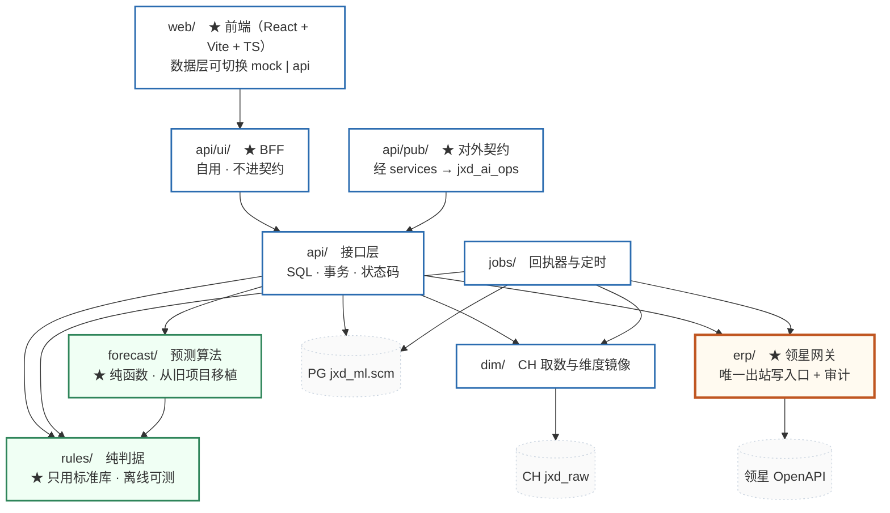

# 架构设计 — service_supplychain

> **这份文档要做什么**
>
> 定下**边界**与**不可协商的规则**：谁能调谁、谁能写什么、什么必须硬失败。
>
> ★ **本文不含认证与授权** —— 作为内部 service，本服务**只记录 actor，不校验权限**，
> 权限由上层逻辑控制。

| | |
|---|---|
| 版本 | v1 草案 |
| 日期 | 2026-09-16 |
| 状态 | **待确认** |
| 上游 | `02` 本体 · `03` 表清单 · `04` 状态流转 · `09` 用例 |

---

## 1. 这个服务是什么

> **一句话：它把「运营想卖多少」变成「领星里真实存在的采购单与发货单」，并且全程可追溯。**

它**不是**库存预测模型的新版本 —— 预测只是它内部的一个纯函数。
它是一个**完整的供应链服务**，所以放在 `jxd_service_group/` 而不是 `jxd_model_group/`。

### 1.1 它独有的两样东西

`02` §3.2 的矩阵有一行是结论：**本服务独有的只有 ②需求 与 ⑤排货 两个域。**

```
需求的表达        领星没有「销售计划」这个东西
排货的统一抽象     领星的 FBA 与海外仓是两套完全不同的东西
两条承重墙映射     领星永远不知道这 300 件是从哪张计划的哪个月来的
```

★ **其余五个域我们要么只读、要么只持映射。越界去持有它们，就是在造第二个真相。**

### ★★ 1.1b 同库还有一套在跑 —— `inv`

| | `inv`（旧项目 `model_inventory_forecast`） | `scm`（本仓） |
|---|---|---|
| 状态 | ★ **已上线、有数据**：5 条计划单记录 · 3,085 行排货 · 5 张备货表 | ★ **零代码** |
| 它有的 | `sales_plan` · `sales_plan_month` · `replenishment_sheet` · `replenishment_dispatch` | `plan` · `plan_cell` · `sheet` · `consignment` |

★ **E-1 裁定的「命名不撞」解决的是技术冲突，不是语义重复。**
两套表都记「销售计划」和「备货/排货表」—— 于是有三个问题**文档里一个字都没写**：

```
① 谁是真相？两边同时在跑时，同一个 msku 会不会被两套「认领」各占一次
② 上线时 inv 的数据迁不迁过来
③ ★ 迁移的具体障碍：inv 那 3,085 行排货**全无计划来源**，
   而 scm 的 B4 判据是「没有计划单记录禁止排货」—— 会被全部挡住
```

★ ③ 不是理论风险：B4 这条判据是对的（保留），所以**迁移方案必须先回答
「这 3,085 行的来源从哪补」**，否则第一次迁移就会全军覆没。
⚠️ **未裁定** —— 记在 `00-待裁定清单`。

---

### 1.2 明确不做的事

| 不做 | 为什么 |
|---|---|
| **认证与授权** | ★ **暂不做，内网裸跑**（Q-5）。★ 原因变了：以前「权限在上层」指 jxd_ai_ops；前端并入本仓后**上层没人了**，所以这是一条**带风险的取舍，不是无所谓** —— 留痕可伪造、不可逆操作无主。★ **四个重新裁定的触发条件见 `00d` §3** |
| **告警系统** | 负责人裁定（A-4）：留给后续独立的可观测阶段 |
| **全局日批预测** | 预测改为**按需纯函数** —— 没进计划的货号没人算它，这是已接受的取舍 |
| **向 CH 写任何东西** | ★ CH 是 jxd 数据中心的地盘，我们只 SELECT |
| **持有领星已有的对象** | 只持**单号 + 快照 + 来源映射** |
| 多租户 | 单租户，不留抽象 |

---

## 2. 三个系统与两条路径

```
写 → 领星 OpenAPI     实时 · 可写 · 慢
读 → CH jxd_raw       快 · 只读 · ★ 三种不同的病，处置相反（见下）
本地 → PG jxd_ml.scm  我们的真相
```

★ **铁律：写走领星，读走 CH。**
同一个对象**两条访问路径、两种时延** —— 我们用 API 建出一张备货单，
却要等**第二天**才能从 CH 看到它的状态。

★ **「我方进度」与「领星进度」分成两轴，根子就在这里。**
压成一个字段，等于假装这两条路是同一条。

### ★★ CH 的三种病 —— 别归结成「有延迟」

| # | 病 | 实测 | 怎么处置 |
|---|---|---|---|
| 1 | **延迟** | 日采，最近 1~2 天不全 | 算「今天 −2 天」；掉档检测有效 |
| 2 | ★ **覆盖型 · 无历史快照** | `lingxing_purchase_order_list` **09-19 起按 `order_sn` 覆盖** | ★ **不能做认知时间回放**；★ 「相邻两日行数比对」**无从比对，会静默空转** |
| 3 | ★ **起采晚于业务** | 质检单 09-07 起采，业务 08-06 起 → **只覆盖近 6 周**；采购计划 09-20 起，**只有 4 批** | ★ 窗口外的**不是 0，是没采到** —— 结论必须回显采集窗口 |

★ 把三者归结成「延迟 ≥ 1 天」，就会拿掉档检测去测② ——
而覆盖型表上那条断言**永远不报警**。

★ **CH 不是第三个数据源，是领星的采集副本。**
当成独立来源，就会问出「以领星为准还是以 CH 为准」这种**没有答案的问题**。

---

## 3. 分层



### 3.1 依赖规则 —— ★ 由测试强制，不是口头约定

`tests/test_layering.py` 必须失败，如果：

| # | 违规 | 为什么 |
|---|---|---|
| L1 | `rules/` import 了任何 DB 客户端 / `erp/` / `api/` / `dim/` | 判据必须**离线可测**，否则测一条判据要起一套环境 |
| L2 | `forecast/` import 了 `rules/` 以外的任何本项目模块 | ★ 它是从旧项目移植的算法，**保持可独立回归** |
| L3 | `dim/` import 了 `api/` / `erp/` | 取数不该知道接口和出站写的存在 |
| L4 | `erp/` import 了 `api/` | 网关不该知道「人要不要点确认」 |
| L5 | ★ **出站 HTTP 写出现在 `erp/` 之外** | 唯一出站写入口 |
| L6 | ★ **`psycopg` 连接出现在 `api/` 与 `jobs/` 之外** | 事务边界只在这两层 |
| L7 | 任何模块出现 `INSERT`/`UPDATE` 到 ClickHouse | ★ CH 只读 |
| ★ **L8** | `web/` 里出现 PG / CH / 领星的客户端或连接串 | ★ 前端直连数据库 = 事务边界与网关全部失效 |
| ★ **L9** | `web/` 打了 `api/ui/` 之外的路径 | BFF 是前端的唯一入口；打 `api/pub/` 会让**契约被界面改动牵着走** |
| ★ **L10** | `api/pub/` import 了 `api/ui/` | 同上的反向：契约不许依赖自用层 |

★ **L8~L10 是这次前端并入本仓（Q 组）加的**，判据一句话：
**`api/ui/` 随界面一起变，`api/pub/` 是给别人的承诺** ——
两者混在一起，就会出现「改个界面把 jxd_ai_ops 打挂了」。

★ **L5 在库层还有第二道**：`ext_ref.call_id NOT NULL REFERENCES erp_call` ——
**绕过网关的写入根本插不进来**，不需要事后对账。

### 3.2 为什么 `rules/` 与 `forecast/` 必须是纯的

判据写在能连库的模块里，就只能用「起一套库 + 造数据」来测。
于是测试变慢、变脆，**最后没人写那些最该被证伪的用例** ——
而这套系统的成败全在那些判据上（确认闸 6 项、状态迁移、补齐量公式）。

---

## 4. 五条不可协商的规则

### 规则一 · 命名隔离

★ 领星占用的词 `inbound` / `shipment` / `shipment_plan` / `allocation` **一律不得使用**；
`order` 只给采购单，`plan` 只给销售计划。

> 两边同名不同义的错**不会报错，只会对错账**。

### 规则二 · 一个字段只能有一个写入者

| 字段族 | 谁写 |
|---|---|
| `our_stage`、`state` 等 | 只有我们，且**只能经事件表** |
| `ext_*`、`*_snapshot`、`*_observation` | 只从领星 / CH 读回 |

★ 两者**不一致本身就是信号**，不是要消除的噪声。

### 规则三 · 所有出站写集中在网关

每次调用留一行 `erp_call`，**必须能回答三问**：

```
打的谁    host + path
多久      elapsed_ms
怎么 failed 的   lx_code / lx_message，或 e.cause.code + 打的哪个 IP:port
```

★ **「连不上」与「真超时」签名互斥、处置相反**：

```
真超时  → TimeoutError: The operation was aborted due to timeout   → 必须先查重
连不上  → TypeError: fetch failed，真凶在 e.cause.code            → 可安全重试
```

只看 `e.message` 会把后者误读成前者，进而去调大超时 —— **那是一行都不会生效的改动**。
反过来把真超时当连不上直接重试，就是**重复下单**。

★ **重试「成功」的那次抖动同样要留痕**（`erp_call.retry_of`）——
否则重试成功后没有任何地方记得它抖过，下次再抖也查不出规律。

### 规则四 · 约束在库层，不在应用层

`04` §7.7 的 12 条机制里 **10 条在库层**。理由：
★ **应用层的约束只对「记得调它的那条路径」有效，而漏掉的那条不会报错。**

### 规则五 · 静默兜底是最坏的一种

| 反例 | 正确做法 |
|---|---|
| `try/catch` 里的回退分支不留日志 | ★ **回退可以，但必须有声** —— 否则「代理挂了」和「接口本身就错」长得一模一样 |
| 认不出的仓名落进 `else ''` | ★ **硬失败**。仓名改了要的是报错，不是悄悄少一批货 |
| 海外仓「取得货件号」写成空实现 | ★ 显式返回 `NOT_APPLICABLE` —— 否则「该做没做」和「本来就不用做」长得一模一样 |
| 过滤 / join 掉了一批数据不统计 | ★ **必须同时统计被丢弃的那一侧**，并对未预期的排除硬失败 |

---

## 5. 事务边界

| 场景 | 边界 |
|---|---|
| 改一个格子 | **一格一事务**；★ 重算预测在事务外（预测慢不该把行锁攥着） |
| 提交计划 | **一个事务**铸出全部记录 —— 半铸的计划单无法解释 |
| 组单 / 撤组单 | 一个事务：写映射 + 触发再评估 |
| 确认排货表 | 一个事务：跑 6 项闸 → 全过才提交，任一不过 ROLLBACK |
| **投送** | ★ **不是一个事务** —— 见下 |
| 回执 | 按 `ext_ref` 分批，失败不影响其它批 |

### 5.1 ★ 投送为什么不能包在一个事务里

投送是多步出站调用（建单 → 锁库存 → [取货件号] → 发货）。
**数据库事务管不住外部副作用**：事务回滚了，领星那边的单还在。

所以：

| 做法 | |
|---|---|
| ★ **每一步成功就立刻落 `ext_ref`，各自一个短事务** | 断在哪一步，表里看得出来 |
| ★ 幂等键先于调用写入 | 超时后能查重 |
| ★ 跨不可逆点后，我方进度**没有退回边** | 见 `04` §7.6b |

★ **把多步出站写包进一个长事务，是这类系统最典型的错误**：
它给人「要么全成要么全不成」的错觉，而实际上**外部副作用已经发生了**。

---

## 6. 可观测

| 要求 | 落点 |
|---|---|
| 出站调用三问 | `erp_call` 表（`03` §8） |
| 采集面留痕 | `capture_window` 表；★ 掉档超阈值 → **整批不可用** |
| 配置类错误 | ★ **启动钩子**硬失败，不等第一个请求 |
| 维度镜像陈旧 | ★ **拒绝服务**（E-4），`v_mirror_freshness` 供启动钩子与就绪探针共用 |
| 品类镜像陈旧 | 显式标注「已 N 天未刷新」，不是安静给一个过期分组 |
| 告警 | ⚠️ **本期只写日志**（A-4），留给后续可观测阶段 |

★ **配置类错误往启动钩子放** —— 在启动日志第一屏可见，
胜过淹没在访问日志里的一片 500。

---

## 7. 目录结构

照 `jxd_service_group/service_social` 的房子规矩：

```
service_supplychain/
├── service.toml            ★ 必须在仓库根目录（jxd_services 硬性要求）
├── config.toml             ★ 领星凭证 · PG · CH · PM
├── config.example.toml
├── web/                    ★ 前端（React + Vite + TS）
│   ├── src/pages/          按角色分：运营 · 采购员 · 排货员
│   ├── src/api/            ★ 数据层：mock | api 可切换（Q-6）
│   ├── src/styles/         ★ 墨迹设计系统（纯 CSS，从原型原样带过来）
│   └── dist/               构建产物 → 由 FastAPI StaticFiles 托管
├── api/                    接口层
│   ├── ui/                 ★ BFF：自用，不进契约
│   └── pub/                ★ 对外契约：经 services → jxd_ai_ops
├── jobs/                   回执器与定时
├── erp/                    ★ 领星网关（唯一出站写入口）
├── dim/                    CH 取数与维度镜像
├── rules/                  ★ 纯判据
├── forecast/               ★ 预测算法（移植）
├── shared/                 契约与公共类型
├── sql/                    外置 SQL
├── migrations/pg/          ★ 迁移文件，一次且仅一次
├── tests/
└── docs/                   本目录
```

★ **`service.toml` 必须在仓库根目录** —— 旧项目曾埋在两层深，
导致「文档说在根目录、实际不在」，接手的人 `ls` 找不到。

---

## 8. 关键决策记录

### ★ 2026-09-21 · 前端并入本仓（Q 组）

| | |
|---|---|
| 原方案 | 本仓只做后端；前端由 jxd_ai_ops 实现 |
| 实践结果 | ★ **周期太长**：实现 → services 暴露 → jxd_ai_ops 调用，才看到效果 |
| 现方案 | ★ 前后端分离**在仓内**；jxd_ai_ops 降为**下游的数据查询分析 + AI 操作** |
| 关键手段 | ★ 前端数据层 `mock \| api` 可切换 —— 前端先跑通交互，后端接口逐个到位逐个切，**不用等** |
| 连带代价 | ★ 组内第一门前端工具链（node）；★ 认证从「上层负责」变成「暂不做 + 已知风险」 |
| 计划 | `00d-前端并入本仓改造计划.md` |

| # | 决策 | 理由 | 出处 |
|---|---|---|---|
| D1 | 新建服务而非改造旧项目 | 排货从「事后关联」翻成「事前驱动」，不是增量 | 09-16 |
| D2 | 只搬预测算法，其余重新设计 | 算法是纯函数、有门禁守着；流程形状变了 | 09-16 |
| D3 | ★ **取数的实测结论以守卫测试形式继承**，不搬代码 | **代码可以重写，判断不能重新发现** | 09-16 |
| D4 | 预测改为按需纯函数 | 砍掉 `run_id` / 分区 / 保留策略整族复杂度 | A |
| D5 | 领星是采购单真相，我们只持映射 | 避免两个真相 | A |
| D6 | FBA 驱动到发货，STA 段加硬闸 | 解决「关联货件太麻烦」的真实痛点 | A |
| D7 | 状态**事实驱动**，只有撤销/取消/放弃手动 | 手动状态是「人记得去点」的，忘了不报错 | C1 |
| D8 | 状态机做成**数据**（白名单表 + 外键） | 写在 `if` 里的状态机，改错了只有跑到那条分支才知道 | `04` §7.1 |
| D9 | 约束在库层 | 应用层只对记得调它的路径有效 | `04` §7.7 |
| D10 | 界面与模型统一叫「排货单」 | 同名不同义只会对错账 | A10 |
| D11 | ★ **旧服务不并行，直接停** | 消掉「两套同时写同一批数据」整类风险 | D-4 |
| D12 | ★ 移植验收**先搬（绿）再修（红）** | 「搬对了」与「算得准」是两件事，不能用同一个测试 | D-3 |

---

## 9. 悬而未决

> ★ **未决项只在 `00-待裁定清单.md` 一处维护，本文只引用。**

| # | 问题 | 状态 |
|---|---|---|
| F-1 | `service.toml` 的 `path_prefix` 与健康探测 | ★ **已定**（`00` D-1）：`path_prefix = "/v1"`，`health.path = "/health"` 不加前缀 |
| D-3 | 预测算法移植的验收口径 | ★ **已定**：先搬 fixture（绿）→ 再修 `base_rate` 偏差（红） |
| D-4 | 旧服务怎么退 | ★ **已定**：**不并行，直接停**；前端按新服务重新设计 |
| ~~C-1~~ | ~~审批流~~ | ★ **已被实测打掉**（`17`）：`auditor_time` **143/143 为空**，无 121/122/124 → 该租户**未开审批流** |
| C-2~C-9 | 领星实调项 | ★ P0；★ **C-6 已由采集侧回答**（`00c` §3） |

★ **除 P0 实调 5 条外，全部设计决策已裁定。**
