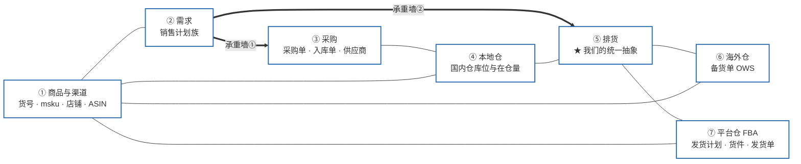
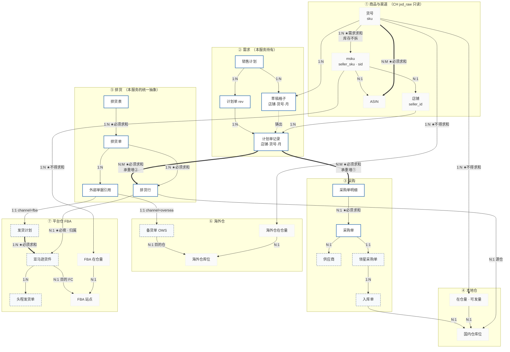
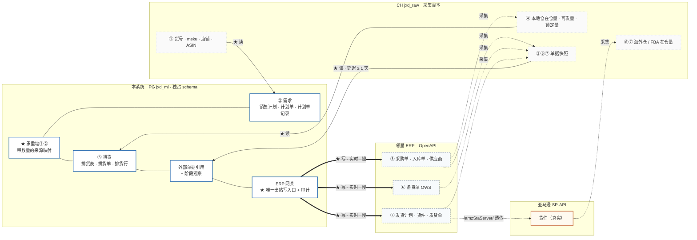
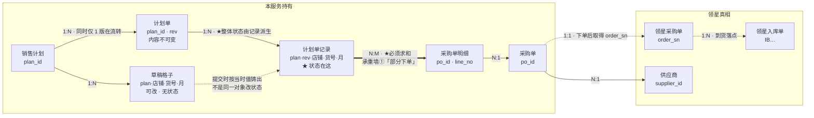
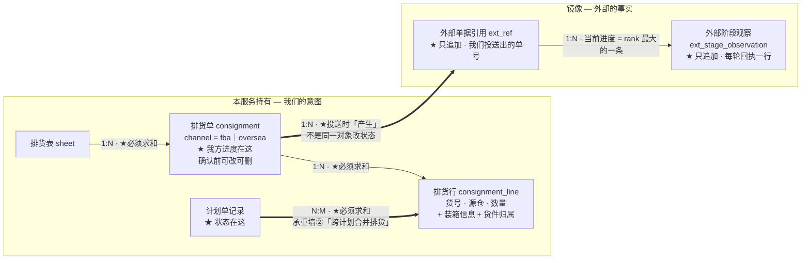
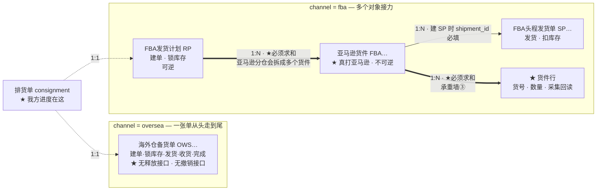
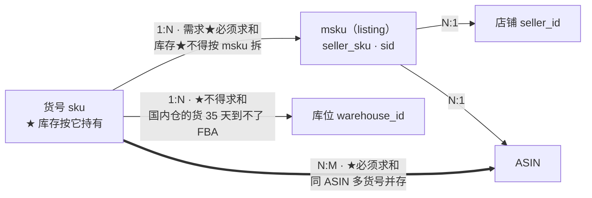

# 本体实体关系 — service_supplychain

> **这份文档要做什么**
>
> 把整条供应链业务拆进**本体式四层**，并把 ①对象 ②关系 画出来。
> **实体错了后面全错，逻辑错了还能调** —— 所以这张图必须先对，后面 11 份文档都长在它上面。
>
> **判据：能被「描述」的是对象，只能被「执行」的是动作。**
> 「采购单」是对象（有编号、状态、供应商，人会去查它）；「下采购单」是动作。

| | |
|---|---|
| 版本 | v1 草案 |
| 日期 | 2026-09-16 |
| 状态 | **待确认** |
| 上游 | 负责人 2026-09-16 的流程说明（运营侧销售计划 / 供应链侧销售计划 / 供应链侧排货 / 预测库存） |

**本文不画 ER 图。** ER 图会把一切画成表，于是「提交」「审核记录」「明细行」这些**动作及其留痕**
被画成和「货号」「仓位」同级，看图时就无法确认对象对不对。

---

## ★ 全局实体图 —— 先看这张

> **本图只有①对象与②关系。**
> 边上只标**基数**与**★聚合语义**，不标任何动作 ——
> 「下单」「投送」「发货」是④动作层，**动作一进来，对象图就变成流程图了**。

### 〇、先说清一个词：什么是「承重墙」

> 这个词后面会反复出现，**它不是比喻性的形容，是两张具体的表**。

#### 用一个例子

运营张三建了一张计划，里面有一行：

```
美国店A · 货号 DCC1800264 · 11月 · 300 件
```

供应链李四来下单，但甲供应商只能做 200，剩下 100 得找乙供应商。他开了两张采购单：

```
PO-001   甲供应商   DCC1800264   200 件
PO-002   乙供应商   DCC1800264   100 件
```

**问题：系统凭什么知道 PO-001 那 200 件是为张三这条计划准备的？**

凭一张**专门记这件事的第三张表**：

| 计划单记录 | 采购单明细 | 件数 |
|---|---|---|
| 张三 · 美国店A · DCC1800264 · 11月 | PO-001 第 1 行 | **200** |
| 张三 · 美国店A · DCC1800264 · 11月 | PO-002 第 1 行 | **100** |

★ **这张表就是「承重墙①」。**
说白了它就是一张 **「多少件是为谁准备的」的记账表**。

**承重墙② 一模一样，只是换到排货侧**：

```
计划A 要 货号X 发到美国店   200 件
计划B 也要 货号X 发到美国店  300 件
        ↓ 合并成一次发货，只发一批
排货行：货号X · 从上海仓发 · 500 件
```

那张记「这 500 件里，计划A 占 200、计划B 占 300」的表，就是承重墙②。

#### 没有它会怎样

| 缺承重墙① | 缺承重墙② |
|---|---|
| 只能给记录打个「已下单」标签 —— **下了 200 还是 300，不知道** | 同一批货**被排两次** |
| 张三问「我 11 月那 300 件订了没有」，**答不上来** | 发完了**不知道消耗了谁的需求** |
| 甲的 200 件到货了，系统**不知道该销掉谁的需求** | 跨计划合并之后**无法还原份额** |

★ **旧系统正是这样**：「已下单」只是个人手点的标签，
系统**不知道单号、不知道数量、不知道分了几个供应商**。

#### 为什么必须是独立的表，不能用外键

| 方向 | 为什么是「多」 |
|---|---|
| 一条计划记录 → 多条采购单明细 | **分供应商下单** |
| 一条采购单明细 → 多条计划记录 | 11 月和 12 月**合并成一次采购**，一张 500 件的单同时满足两个月 |

**两边都是「多」，这就是 N:M —— 而外键只能表达 1:N。**

而且关系上**必须挂着「200」这个数**：不是「有没有关系」，是「**关系上挂多少件**」。
★ **外键挂不了数。**

#### 为什么叫「承重墙」

因为**整栋楼的重量压在这两张表上** ——
所有「走到哪一步了、还差多少」的问题，答案都来自它们的求和：

```
已确认量 · 已下单量      ← 承重墙① 求和
已排未发量 · 已投送量     ← 承重墙② 求和
待排量 = 总量 − 已排未发量 − 已投送量
```

★ **拆掉它们，系统照样能跑，但所有数都是假的** —— 而且不会报错。

---

### 一、七个域



★ **⑤排货域是唯一同时挨着 ⑥海外仓 和 ⑦平台仓 的域** ——
这就是「平台仓与非平台仓合成同一套排货操作」在本体上的位置：
**统一发生在⑤，差异留在⑥⑦。**

### 二、域内实体与跨域关系



| 线型 | 归属 |
|---|---|
| 实线蓝框 | **OWN** —— 本服务持有，我们是唯一真相 |
| 虚线灰框 | **MIRROR** —— 领星是真相，我们持单号 + **来源映射** |
| 点线浅框 | **DIM** —— CH `jxd_raw` 只读 |

### 三、三个系统 —— 与七个域正交

> ★ **业务域和系统归属是两个正交的维度**，一张图只能分一次，所以分开画。
> 而且第二维比第一维更承重：**域划错了是理解问题，系统划错了是数据会错。**

#### 3.1 三个系统

| 系统 | 是什么 | 我们怎么用 | 代价 |
|---|---|---|---|
| **本系统** PG `jxd_ml` · 独占 schema | 我们的真相 | 读写 | — |
| **领星 ERP** OpenAPI | **单据的真相** | ★ **只写**（建单 · 锁库存 · 发货 · 下采购单） | 实时但**慢**，不适合高频读 |
| **CH** `jxd_raw` | ★ **领星与亚马逊的采集副本** | ★ **只读** | **延迟 ≥ 1 天**；会整天缺、会掉档、会有重复行 |

★ **CH 不是第三个数据源，是领星的副本。**
把它当成独立来源，就会问出「以领星为准还是以 CH 为准」这种没有答案的问题 ——
**永远以领星为准，CH 只是一份看得快的旧拷贝。**

★ **一条铁律：写走领星，读走 CH。**
同一个对象**两条访问路径**，这是本服务最反直觉的一条：
我们用 API 建出一张备货单，却要等**第二天**才能从 CH 看到它的状态。
「我方进度」与「领星进度」要分成两轴，根子就在这里。

#### 3.2 域 × 系统 矩阵

| 域 ＼ 系统 | 本系统 PG | 领星 ERP（写） | CH jxd_raw（读） |
|---|---|---|---|
| ① 商品与渠道 | 维表镜像（仅为外键） | — | ★ 货号 · msku · 店铺 · ASIN |
| **② 需求** | ★ **全部，独有** | — | — |
| ③ 采购 | 采购单草稿 + **承重墙①** | ★ 采购单 · 入库单 · 供应商 | 采购单 / 入库单快照 |
| ④ 本地仓 | — | 库位 | ★ 在仓量 · 可发量 · 锁定量 |
| **⑤ 排货** | ★ **全部，独有** | — | — |
| ⑥ 海外仓 | 外部单据引用 | ★ 备货单 OWS | 备货单快照 · 在仓量 |
| ⑦ 平台仓 FBA | 外部单据引用 | ★ 发货计划 · 货件 · 发货单 | 快照 · FBA 在仓量 |

★ **本系统独有的只有两个域：②需求 与 ⑤排货。**
这一行就说清了这个服务到底加了什么：

```
需求的表达（领星没有「销售计划」这个东西）
排货的统一抽象（领星的 FBA 与海外仓是两套完全不同的东西）
两条承重墙映射（领星永远不知道这 300 件是从哪张计划的哪个月来的）
```

**其余五个域我们要么只读、要么只持映射。** 越界去持有它们，就是在造第二个真相。

#### 3.3 系统边界与访问路径

> ★ 这张是**访问路径视图**，不是对象图 —— 所以边上允许出现「写 / 读 / 采集」。
> 对象图（图二）里一个动作都没有，两者不要混看。



#### 3.4 这张图上有四条硬约束

| # | 约束 | 在图上的形态 |
|---|---|---|
| 1 | ★ **所有出站写只经 ERP 网关一个节点** | 从蓝框指向灰框的粗箭头**只有 3 条，且都从 `OG` 出发** |
| 2 | ★ **CH 永远只出不进** | 没有任何箭头指向 `CHDB`，除了「采集」那几条虚线 |
| 3 | ★ **亚马逊只经领星透传，我们不直连** | `AMZ` 只有一条入边，来自 `L7` |
| 4 | ★ **写路径与读路径永不相交** | `OG →领星` 与 `CH → 我们` 是两条独立的环 |

★ 第 4 条是「我方进度 / 领星进度」两轴并置的**图形化证明**：
写出去和读回来走的是**两条不同的路、不同的时延**，
所以「我们以为投送了」和「领星那边确实动了」**本来就是两件事** ——
**压成一个字段，等于假装这两条路是同一条。**

---

### 四、这张图要核对的六件事

| # | 在图上看什么 | 错了会怎样 |
|---|---|---|
| 1 | **每条边都标了基数与聚合语义** | 缺一个就是「基数相同而聚合相反」那类 bug 的温床 |
| 2 | **两条 ⇒ 粗边（承重墙①②）是仅有的 N:M 带数量关系** | 用外键实现 = 强行 1:N，而 1:N 恰恰是错的基数 |
| 3 | **在仓量按「能不能互相顶」分组求和** | ★ FBA + 海外仓 = **可售库存**，可求和；★ **本地仓单列**，它是生产后的临时仓，短时间调不到目的仓 —— 算进可售就是虚报 |
| 4 | **⑤排货域同时连着 ⑥ 和 ⑦，且只经 `外部单据引用` 一个出口** | 多一个出口就意味着绕过了统一抽象 |
| 5 | **⑦ 的在仓量挂在 msku 上，其余挂在货号上** | FBA 库存按 listing 记，混用会串店 |
| 6 | **图里没有任何动作** | 出现「下单 / 投送 / 发货」就说明④层漏进了①②层 |

★ 第 6 条是本图的**自检项**：
「采购单」是对象（有编号、状态、供应商，人会去查它），**「下采购单」是动作**。
动作进了对象图，看图的人就无法确认对象对不对 —— 而**实体错了后面全错**。

---

## 0. 先看业务流程 —— 对象是从这里长出来的

四段，串成一条链。每段末尾括注的是**这一段新长出来的对象**。

### 0.1 运营：把「要卖多少」变成一张可被消费的单

```
建计划（标题 / 周期月 / 跨几月，默认未来 3 个月）
  → 选货号 → 认领 msku（认领即占用）
  → 系统按 店铺 × 货号 × 月 给销量预估建议值
  → 「计划销量」列默认复制系统预估；运营只改要改的格子
  → 改了计划销量 → 重算该 货品×店铺 的逐月库存预测
  → 提交 → 冻结整张计划 → 铸出一张计划单（rev）
```
> 长出：**销售计划**、**草稿格子**、**计划单**、**计划单记录**

### 0.2 供应链·采购：把「要卖多少」变成「要下多少单」

```
按状态筛出近期「已提交」的计划
  → 勾选多份 → 联合到一张表里，按 货品 / 品类 / 年月 分组检查
  → 按 货品 · 数量 · 供应商 整理成采购单（草稿）
     ↳ 被整理进去的计划单记录 → 转「已确认」
  → 下单（调领星 CreatePurchaseOrder）
     ↳ 对应记录 → 转「已下单」；采购单此后不可变更
  → 工厂生产 → 领星入库单 → 本地仓库存补充
```
> 长出：**采购单**、**采购单明细**、**采购来源映射**

### 0.3 供应链·排货：把「本地仓的货」变成「发到目的仓的单」

```
两种找货方式，★ 都必须落到计划单记录上（没有记录禁止排货）：
  A 从采购计划入口 —— 计划单（已下单 / 准备排货）→ 订单 → 入库单 → 本地仓库存
  B 从本地仓库存入口 —— 直接筛货品数量，再反查它服务哪条计划单记录
  → 选货品（确认从哪个仓发）+ 选目标（FBA 选店铺/站点，海外仓选 wid）
  → 建排货表（待配货）
  → ★ 在**排货网格**上安排发货（哪个本地仓、多少件）—— 排货单由安排派生（N-3）
  → 形成 N 张排货单草稿 → 此时「已排未发」
  → 确认排货表（两道闸）
  → 逐一执行发货动作（领星）→ 待收货 → 已完成
```
> 长出：**排货表**、**排货单**、**排货行**、**外部单据引用**、**排货来源映射**

### 0.4 预测：一个被调用的函数，不是一个每天跑的批

```
输入：N 个 (货号 × 店铺) + 月份区间
需求 = 该 货号×店铺 的历史真实销量 + 计划格子里的计划销量
供给 = 该 货号×店铺 的在库 / 在途（实际数据）
输出：逐周库存消耗、断货日、可售天数
```
> **不长出任何对象。** 预测结果是③层的「状态·事实」，不升格成对象。

---

## 1. ① 对象层

### 1.1 归属三分 —— 这是本服务最重要的一条架构事实

| 归属 | 含义 | 后果 |
|---|---|---|
| **OWN** 本服务持有 | 我们是唯一真相，领星与 CH 都没有 | 我们负责建、改、审计 |
| **MIRROR** 领星是真相 | 领星那边有权威副本，我们持有**单号 + 快照 + 来源映射** | **不许在本地改状态**；进度一律读回 |
| **DIM** CH 只读维表 | jxd 数据中心的地盘 | 只 SELECT；本地留镜像仅为外键完整性 |

**MIRROR 类对象的价值不在副本，在「来源映射」** —— 领星那边永远不知道「这张采购单的这 300 件是从哪张销售计划的哪个月来的」。那层映射只有我们有，也只有我们能有。

### 1.2 对象清单

量级一律标注**实测来源与日期**；**没实测过的量级不写**。

#### OWN — 本服务持有

| # | 对象 | 主键 | 实测量级 | 说明 |
|---|---|---|---|---|
| 1 | **销售计划** | `plan_id` | 新建，无数据 | 运营工作区，**活的、可改**。标题 / 起始月 / 跨几月 / 归属运营 |
| 2a | ★ **期望销量格子** | `(plan_id, seller_id, seller_sku, period_start)` | 新建，无数据 | **可改、无状态**。持 `系统预估` / `期望销量` / `外推标记` |
| 2b | ★ **计划采购量格子** | ★ `(plan_id, sku, period_start)` —— **不带店铺** | 新建，无数据 | **可改、无状态**。采购不关心店铺（见 §3.1b） |
| 3 | **计划单** | `(plan_id, rev)` | 新建，无数据 | **内容不可变、状态可变**。带「当前使用」标记 |
| 4 | **计划单记录** | ★ `(plan_id, rev, sku, period_start)` —— **不带店铺** | 新建，无数据 | ★ **独立状态挂在这一层**；冻结 `计划采购量` + 当时各店期望销量 |
| 5 | **采购单** | `po_id` | 新建，无数据 | 草稿阶段是我们的；下单后退化为领星镜像的锚 |
| 6 | **采购单明细** | `(po_id, line_no)` | 新建，无数据 | 货号 · 数量 · 单价 · 期望到货 |
| 7 | **排货表** | `sheet_id` | 新建，无数据 | 一次排货规划；**由 N 张排货单构成** |
| 8 | **排货单** | `consignment_id` | 新建，无数据 | ★ 统一抽象，`channel ∈ fba \| oversea`；★ **键 = 我们能决定的最细粒度**：oversea `(r_wid)` · fba `(sid)`，**FBA 没有 FC**（O-1）。**确认前全可改可删，投送后冻结** |
| 9 | **排货行** | ★ `(consignment_id, sku, seller_id, from_wid)` | 新建，无数据 | 从哪个仓、★ **发给哪个店**、多少件 + **装箱信息**（A-8 人工填）；★ **货件归属不在这一行上** —— 一条行的量会被亚马逊拆到多个 FC，见**承重墙③** |
| 10 | **外部单据引用** | `ext_ref_id` | 新建，无数据 | ★ **只追加，永不 UPDATE**。记「我们投送产生了哪个单号」；FBA 一次投送产生 RP / 货件 / SP 三行 |
| 10b | **外部阶段观察** | `(ext_ref_id, observed_on)` | 新建，无数据 | ★ 只追加。记「某轮回执观察到它处于什么阶段」。**当前进度 = rank 最大的那条，不是最新的那条** |
| 11 | **网关调用审计** | `call_id` | 新建，无数据 | ★ 只追加。请求指纹 · 响应 · 耗时 · `cause code` |
| 12 | **操作人** | `actor_id` | 新建，无数据 | ★ **只记录、不鉴权**（权限在上层）。用于「谁的计划还没提交」 |

#### MIRROR — 领星是真相

| # | 对象 | 主键 | 实测量级 | 说明 |
|---|---|---|---|---|
| 13 | **领星采购单** | `order_sn` | ★ **143 单 / 2,434 行 / 194 货号**（CH，★ **09-19 起按 `order_sn` 覆盖，无历史快照**） | 状态 `3待提交/1待下单/2待到货/9完成/-1作废`；★ 到货是**独立维度** `status_shipped`，不在主状态里 |
| 14 | **供应商** | `supplier_id` | ★ 实测 **3 家**（78 / 38 / 27 张）· ★ **没有独立表**，只在 PO / IB 的 `supplier_id` / `_name` 上 | 只引用，不维护 |
| 15 | **海外仓备货单** | `overseas_order_no`（OWS…） | 实测 `status∈{30,40}`：**7 单 / 5,175 件** | 一张单从头走到尾；★ **无释放接口、无撤销接口** |
| 16 | **FBA 发货计划** | `plan_sn`（RP） | **几乎空** —— 供应链目前不建发货计划 | 领星本地对象，可逆（有 `FbaPlanStorageRelease`） |
| 17 | **亚马逊货件** | `shipment_id`（FBA…） | 实测 `WORKING/READY_TO_SHIP`：**32 货件 / 790 行 / 11,169 件**；**880/880 货件 `is_synchronous=1`** | ★ 真实亚马逊对象，`confirmPlacementOption` 处产生 |
| ★ 17b | **货件行** | `(shipment_id, sku)` | 实测 `lingxing_fba_shipment_list_items`：**16,930 行 / 893 货件 / 440 货号**（09-01~09-21，**10 个采集日**） | ★ **采集回读**，非同步返回；带 `quantity_shipped` / `quantity_received` / `ware_house_storage_id` |
| 18 | **FBA 头程发货单** | `order_sn`（SP…） | **392 张全为「已发货」；`-1`/`0` 恒为 0** | ★ 该租户不用它做事前排货 |
| 19 | **领星入库单** | `order_sn`（IB…） | ★ 实测 **3,826 单**（采购入库 1,076）/ 14,573 行（采购入库 1,214 行 **135,187 件**）；`status` 40 完成 1,074 · ★ **50 已撤销 2** | 采购到货的落点；★ **加库存时刻就是它完成**（不是收货单） |
| ★ 19b | **领星收货单** | `order_sn`（CR…） | ★ 实测 **1,031 单 / 1,210 行**；每张 PO 中位 **4.5** 张、最多 **119**（分批交货）；`status` 40 全部 | ★ **不动库存** —— 只把采购单的「待到货」变成「待检」 |
| ★ 19c | **领星质检单** | `order_sn`（QC…） | ★ 实测 **444 单**；已质检 316 / 已免检 128；`qc_bad_num` 全为 0 | ★ **无写接口，只能查**；实测**晚于入库** 403/410 → 是入库后的账面动作，不是入库前的闸 |

#### DIM — CH `jxd_raw` 只读

| # | 对象 | 主键 | 实测量级 | 说明 |
|---|---|---|---|---|
| 20 | **货号** | `sku` | fba_detail 每日全量 **21 店 / 1,000 货号** | ★ **库存按它持有** |
| 21 | **msku（listing）** | `(seller_sku, sid)` | 桥表全店铺 **7,838 行** | ★ 同一字符串跨店是**不同 listing** |
| 22 | **店铺** | `seller_id` | — | 全字段**字符串**（18 位，JS 会精度丢失） |
| 23 | **ASIN** | `asin` | 两美国店 **880 个** | 只是查找 / 展示标签 |
| 24 | **仓** | `warehouse_id` | **58 个仓 + 7 个 FBA 站点**；38 个国内仓 `country_code` **几乎全为空**（只 1 个有值） | ★ 国内仓的市场归属**只存在于中文仓名里** |

---

### 1.3 ★ 命名隔离 —— 我们的对象一律不用领星词汇

两边同名不同义的错**不会报错，只会对错账**。下列词已被领星占用，本服务的对象、表、字段、接口路径**一律不得使用**：

| 领星占用 | 指什么 | 我们用什么 |
|---|---|---|
| `inbound` | 海外仓备货单 / 本地入库单 | — |
| `shipment` | FBA 头程发货单 **和** 亚马逊货件（它自己就一词两义） | — |
| `shipment_plan` | FBA 发货计划 | — |
| `order` | 采购单 `order_sn` **和** 发货单 `order_sn` | ★ 留给**采购单** |
| `allocation` | 调拨单 | — |
| `plan` | 采购计划 | ★ 留给**销售计划** |

本服务的排货族沿 `排货` 这条线命名（`排货` 不是领星的词）：

```
排货表 sheet  →  排货单 consignment  →  排货行 consignment_line
```

## 2. ② 关系层

**每画一条关系必须问两句：基数是多少？能不能求和？**
基数相同而聚合语义相反是常态 —— **ER 图表达不了这一层，而 bug 全长在这里。**

### 2.1 计划 → 采购



### 2.2 排货 → 发货

#### 2.2.1 我们这一侧的对象



> ★ **草稿不会「变成」领星单，它*产生*领星单。**
> 这与「草稿格子铸出计划单记录」是同一个模式。一旦当成「同一条记录改个状态」，
> 就必然出现「这条记录代表我们的意图，还是领星那边的事实？改它安不安全？」
> —— **而这个问题没有答案的时候，代码里每个分支都得猜。**
>
> `ext_ref` **只追加**是硬约束：FBA 一次投送产生 RP / 货件 / SP 三个单号分三行，重试也留痕。
> 一旦允许 UPDATE，「这张单被投了几次」就永远查不出来了。

#### 2.2.2 统一抽象的着力点是**阶段**，不是单据

> **两条链的不对称不在阶段上，在对象数上。**
> **海外仓：1 个对象走完全部阶段**（`SendInbound` 的参数只有 `overseas_order_no`，是同一张单 `40 → 50`）。
> **FBA：多个对象接力**（发货要 `createReadySendOrder` **新建**一张 SP 单，再 `SendGoods`）。
>
> 所以 **阶段轴是统一的** —— 这是「平台仓与非平台仓合成同一套排货操作」成立的全部依据。

**但阶段有两套，并置、永不合并** —— 判据是 **一个字段只能有一个写入者**：

| 字段族 | 谁写 | 含义 |
|---|---|---|
| 「我方进度」 | **只有我们** | 我们的**意图**：草稿 → 已确认 → 已投送 → 已归档 |
| 「领星进度」 | **只从领星 / CH 读回** | 外部的**事实**：待配货 / 待发货 / 待收货 / 已完成 / 已撤销 |

★ 两者**不一致本身就是告警**（最常见的成因是 allocate 失败）。
把它们压成一个字段，「我们以为投送了、领星那边还停在 30」这个最有价值的信号就消失了。

| 阶段 | 我方进度 | 海外仓 | FBA | 库存动作 |
|---|---|---|---|---|
| 编辑草稿 | 草稿 | — | — | 不动 |
| 确认排货表 | 已确认 | — | — | 不动 |
| 建单 | 已投送 | `CreateInbound` → **OWS…** | `CreateShipmentPlan` → **RP** | 不动 |
| 锁库存 | 已投送 | `overseaStockOrderAllocate`（**同一张** OWS） | `FbaPlanStorageAllocate`（**同一张** RP） | **锁定** |
| **取得货件号** | 已投送 | ★ **无此物** → 显式 `NOT_APPLICABLE`；★ 但**目的地明细有落点**：恒 1 份 `dest_wid`（O-8） | STA → **N 个货件 FBA…**，各自一个 FC | 不动 |
| **发货** | 已投送 | `SendInbound`（**同一张** OWS → 50） | `createReadySendOrder`（**新建** SP…）→ `SendGoods` | ★ **扣减** |
| 收货 | 已投送 | `batchesReceipt` → `completeReceipt` | 亚马逊 FC 入库 | — |
| 完成 | 已归档 | OWS → 60 | 货件 `CLOSED` | — |
| 撤销 | 已归档 | ★ **无撤销接口**，仅 `DeleteOverSeaStockOrder`（限 10/20/30/40） | `FbaPlanStorageRelease` / `outboundOrderReleaseStock` | 解锁 |

⚠️ **海外仓的「取得货件号」是 no-op，但不许写成空实现** ——
no-op 会让「该做没做」和「本来就不用做」长得一模一样。driver 必须显式返回
`NOT_APPLICABLE`。**静默兜底是最坏的一种。**

**唯一多出来的阶段是「取得货件号」** —— 海外仓的目的仓是自有 / 三方仓，不需要亚马逊指定货位。
而**这一个阶段的差异，恰好就是不可逆边界所在**：`confirmPlacementOption` 产生真实亚马逊货件，
失败重试会建出重复货件，且 STA 一族**无客户侧幂等键**。

#### 2.2.3 外部锚点（不对称的那一层）



★ **`createReadySendOrder` 的 `list>>shipment_id` 是必填** —— 所以建 SP 之前**货件必须已存在**。

★ 但这**不等于**「排货时就得知道归属」，也**不等于一条排货行只进一个货件**：

```
排货时        只知道 (fba, sid) —— 连 FC 都还没有
STA 之后      亚马逊给出 N 个货件 + 各自的 FC
建 SP 时      按货件逐张建 —— 所以是「货件已存在」，不是「排货时已归属」
归属的明细    ★ 采集回读 lingxing_fba_shipment_list_items（承重墙③）
```

★ **不能事后按单号平摊** —— 平摊出来的归属没人能证伪。
同一接口的 `box_list` / `box_skus`
（箱数、箱规长宽高、单箱重量、单箱数量，且要与 `list` 一致）**同样必填**。
**这才是运营口中「关联货件操作太麻烦」的真正来源** —— 不是流程绕，是装箱数据量大。

#### 2.2.4 ★ 两条链最要命的差异不是状态机，是**幂等**

| | 客户侧幂等键 | 回查接口 |
|---|---|---|
| 海外仓 | `inbound_order_no` **必填且唯一**，由我们生成 | `listOrderNos`（客户参考号 → 系统单号） |
| FBA `CreateSendedOrder` | `request_flag`（可选） | `searchProcessResult` |
| FBA `createReadySendOrder` | **无** | — |
| FBA STA 建货件 | **无** | 只能事后 `Operate` 凭 `taskId` 轮询 |

**海外仓天然幂等；FBA 必须我们自建** —— 本地 `idem_key` + 调用前查
`ShipmentPlanLists` / `searchProcessResult` 查重。

这比状态机差异危险得多：**超时重试一次，就多一个真货件**，而 `confirmPlacementOption` 不可逆。
而且「真超时」与「连不上」签名互斥、处置相反 —— 只看 `e.message` 会把后者误读成前者：

```
真超时（AbortSignal.timeout）→ TimeoutError: The operation was aborted due to timeout
连不上（建连失败）           → TypeError: fetch failed，真凶在 e.cause.code
```

投送器**必须能分辨这两者**：连不上可以安全重试，真超时必须先查重。

### 2.3 基础维度



### 2.4 关系全表

| 关系 | 基数 | ★ 聚合语义 | 判据 |
|---|---|---|---|
| 销售计划 → 草稿格子 | 1:N | — | |
| 销售计划 → 计划单 | 1:N | — | 同时仅 1 版在流转；另有 1 版标「当前使用」 |
| 计划单 → 计划单记录 | 1:N | **整体状态由记录派生** | 见 §3.2 |
| 草稿格子 ⇢ 计划单记录 | 铸造，非同一对象 | — | **提交是铸出新记录，不是给格子改状态** |
| **计划单记录 ↔ 采购单明细** | **N:M** | **必须求和** | 同货号可分供应商分开下单 = 部分下单 |
| 采购单明细 → 采购单 | N:1 | **必须求和** | |
| 采购单 → 供应商 | N:1 | — | 一张采购单对一个供应商 |
| 采购单 ⇢ 领星采购单 | 1:1 | — | 下单后取得 `order_sn`，此后领星是真相 |
| 排货表 → 排货单 | 1:N | **必须求和** | |
| 排货单 → 排货行 | 1:N | **必须求和** | |
| **计划单记录 ↔ 排货行** | **N:M** | **必须求和** | 跨计划按 店铺×货号 累加。★ **NOT NULL** —— 没有计划单记录**禁止排货** |
| **排货单 ⇒ 外部单据引用** | **1:N** | — | ★ 投送时**产生**，只追加；FBA 一次投送产生 3 行 |
| 外部单据引用 ⇢ 海外仓备货单 | 1:1 | — | `channel=oversea` |
| 外部单据引用 ⇢ FBA 发货计划 | 1:1 | — | `channel=fba` |
| **FBA 发货计划 → 亚马逊货件** | **1:N** | **必须求和** | ★ 亚马逊分仓会把一个计划拆成多个货件 |
| 亚马逊货件 → FBA 头程发货单 | 1:N | — | 实测 **140 张货件里 18 张（12%）没有对应领星发货单** |
| ★ **排货行 ↔ 亚马逊货件** | ★ **N:M** | ★ **必须求和** | ★ **原写 N:1 是错的**（数据部门 09-21 指出，P16）。实测：货件含多货号 **814** 个 · ★ 货号进多货件 **414** 个 —— 一条行的量会被拆到多个 FC。数量由**货件行**承载，见**承重墙③** |
| **亚马逊货件 → 货件行** | **1:N** | **必须求和** | ★ 采集回读；`createReadySendOrder` 是**按货件**建发货单，所以「发货前必须已归属」说的是**货件已存在**，不是「排货时就得知道」 |
| 排货行 → 库位（源仓） | N:1 | — | |
| 排货单 → 库位 / 店铺（目的地） | N:1 | — | ★ 两条链**不是同一种东西**：oversea 是**一个固定地址** `r_wid`；fba 是**一个店铺** `sid`，发往哪个 FC 由亚马逊投送时动态分配（见 §3.5） |
| 货号 → msku | 1:N | 需求**必须求和**；库存**不得按 msku 拆** | 库存按货号持有，msku 只是销售面 |
| **货号 ↔ ASIN** | **N:M** | **必须求和** | 实测 880 ASIN 中 63 个（7.2%）挂多货号，涉 133 货号 / 3,958 件 |
| msku → 店铺 | N:1 | — | |
| **货号 → 库位** | **1:N** | ★ **分组求和，见 §3.1a** | 目的仓（FBA + 海外仓）**可求和**；★ **本地仓不进可售** —— 国内仓的货 35 天到不了 FBA，不能互相顶 |

### 2.5 三面承重墙

这三条 **N:M 且必须求和**的关系是整个系统的承重墙。
★ ①② 正是旧系统缺失的那两块；★ ③ 是 2026-09-21 由**数据部门**指出来的（P16）。

#### 承重墙① 计划单记录 ↔ 采购单明细

没有它，「已下单」只是一个人手点的标签 —— 系统不知道单号、不知道数量、不知道分了几个供应商。
**有了它，「部分下单」自然表达**：某记录 300 件，A 供应商下了 200、B 还在等报价，
已下单量 = 200（求和），差额 100 一目了然，不需要发明「部分已下单」这种新状态值。

#### 承重墙② 计划单记录 ↔ 排货行

没有它，跨计划的同一 货号×店铺 会被排两次。
**有了它，排货候选按 店铺 × 货号 跨计划累加**，且每一件货能回答「这是谁的需求」。

★ **这条映射 NOT NULL**（裁定 B4，2026-09-16）：**没有计划单记录的禁止排货**，
正确做法是先补销售计划，否则**无法确认目标**。
所以入口 B（本地仓库存直接筛）**不是绕过计划的入口，只是换一种找货方式** ——
找到货之后照样要指明它服务哪条记录，指不出来就 `409 no_plan_line_for_demand`。

> 允许「无来源」的行存在，等于允许一批货被排出去而**永远对不上账** ——
> 而对账只认有来源的那些，于是它看起来像凭空发出去的。

#### ★ 承重墙③ 排货行 ↔ 亚马逊货件

没有它，一条排货行的量被亚马逊拆到多个 FC 时，**归属全错，而屏幕上看不出来**。

**恒等式**

```
Σ 货件行.quantity_shipped (sku, seller) == 排货行.units (sku, seller)
```

★ **它与 ①② 有一处根本不同：数据不是我们写的，是回读来的。** 由此三条约束：

| # | 约束 | 违反的后果 |
|---|---|---|
| 1 | ★ **允许「已投送 · 归属未知」这一态** —— 投送成功与拿到归属不是同一时刻 | 用一个字段掩盖窗口，就会把「还没采到」读成「没拆」 |
| 2 | ★ 恒等式按 `quantity_shipped` 立（我们投出去的量）；`quantity_received` 是**外部物理事实**，用**下限判据** | 到货一件就当全到 |
| 3 | ⚠️ **残留缺口**：排货行的键含 `from_wid`，货件明细里只有 `ware_house_storage_id`。同货号从两个本地仓发货时可能对不回去 —— ★ **不许猜分摊** | 平摊出来的归属没人能证伪 |

★ 三条都必须是 **N:M 带数量的具体化关系（独立表）**，不是外键。
用外键就等于强行 1:N，而 1:N 恰恰是错的那个基数 —— ③ 就是这么错的。

### 2.6 被具体化成表的关系

这些是关系不是对象（没有独立身份，没人会说「第 123 号认领」），但需要属性和审计：

| 关系 | 携带 | 为什么不建成对象 |
|---|---|---|
| **msku 认领占用** | `claimed_by/at`, `released_by/at` | 人查的是「这个 msku 被谁占了」，不是「查一下第 N 号认领」 |
| 采购来源映射 | `units` | 承重墙① |
| 排货来源映射 | `units` | 承重墙② |

> ★ 原先列在这里的「发货单 ↔ 领星单据」**已升格为对象**（`ext_ref`，见 §1.2 #10）。
> 理由：它需要**只追加 + 幂等键 + 投送留痕**，人也确实会去查「这张单投了几次、拿回哪几个单号」。
> 能被描述的是对象。

> ★ 同理，**货件不是排货行的一个字段**（原先 `ext_shipment_no` 就挂在行上）。
> 它有身份（`shipment_id`）、有状态、有自己的明细，人会去查它 —— 是对象。
> **把对象降格成字段，等于把 1:N 压成 1:1**，而那个 1 是猜的。

---

## 3. ③ 状态·事实层

> **状态·事实一律不升格成对象** —— 否则会出现「在仓量对象」和「货号对象」两个真相。

### 3.1 量

| 事实 | 挂在 | provenance | 实测 / 硬约束 |
|---|---|---|---|
| ★ **可售库存** | 店铺 × 货号 | CH：FBA 在仓 + 海外仓在仓 | ★ **库存预测扣的是它**。见 §3.1a |
| 本地仓在仓量 | 货号 × 国内仓 | CH `_captured_date` | ★ **不进可售库存**；日报会整天缺 / 掉档 / 重复行，必须先去重再比对覆盖面 |
| 可发量 | 货号 × 库位 | CH `product_valid_num` | ★ **只读这一列，禁止自行用总量相减**。实测 `wid=36782` 锁 3,320 / 可用 978 |
| 锁定量（领星侧） | 货号 × 库位 | CH `product_lock_num` | 实测 7,854 行中 206 行有锁定，合计 5,132 件 |
| 在途 | 货号 × 目的库位 | CH 单据 | |
| **已排未发** | 排货行 | **本服务自己的账** | ★ 建单接口**全部不锁库存**，A 区必须由我们兜住 |
| 历史真实销量 | msku × 日 | CH `purchase_date` | ★ 订单**滞后采集**，近 1~4 天不完整 |
| 系统预估销量 | ★ **msku × 月** | 本服务算出 | 作为期望销量的建议值 |
| ★ **期望销量** | ★ **msku × 月** | 运营填（默认取系统预估） | **减**当月库存。见 §3.1b |
| ★ **计划采购量** | ★ **货号 × 月** | 运营填 | **加** `下单月 + 生产 + 货运`（按天），经四段管道。见 §3.1b |
| 已下单量 | 计划单记录 | 承重墙①求和 | |
| **已排未发量** | 计划单记录 | 承重墙②求和，排货单 ∈ {草稿, 已确认} | 防重复排 |
| **已投送量** | 计划单记录 | 承重墙②求和，排货单 ∈ {已投送, 已归档} | ★ 「已排货」只认这个 |
| **待排量** | 计划单记录 | 总量 − 已排未发量 − 已投送量 | 需求侧还欠多少 |
| **到货量 · 到货库位** | ★ **采购单** | 📥 入库单 → `order_sn` | ★ **不摊回记录**（裁定 C4）。一张采购单**分多笔入库** |
| 可发量 | ★ **库存** | CH `product_valid_num` | 物理上真有多少 |

> ★ **需求侧的量在记录上，物理侧的量在库存上，两者不混、不相减。**
> 它们**量纲不同**：一个是「这条需求还欠多少」，一个是「仓里真有多少」。
> 合成一个「可排量」，就等于替人做了一个我们已决定不做的分摊。
| 到货进度 | 领星采购单 | CH `status_shipped` | 1 未到货 / 2 部分到货 / 3 全部到货 |
| **预测库存曲线 · 断货日** | (货号 × 店铺) × 请求参数 | **按需算出** | ★ 不落库成台账；它是函数返回值 |

### ★ 3.1a 「库存」有两个，用途不同，不许混

> 裁定（负责人 2026-09-17）：**库存算的是 FBA 和海外仓，不是本地仓。**
> 本地仓是**生产后的临时存储仓**，按需要发往目的地；能确定的只有 FBA 与海外仓。

| | 是什么 | 粒度 | 用在哪 |
|---|---|---|---|
| ★ **可售库存** | **FBA 在仓 ＋ 海外仓在仓** | 店铺 × 货号 | **库存预测 · 断货判断** |
| ★ **可发量** | 本地仓 `product_valid_num` | 货号 × 国内仓 | **排货确认闸 G3**（发得出去吗） |

★ **本地仓再多货也不进可售库存** —— 国内仓的货 35 天到不了 FBA，
算进去就是虚报可用，人会以为不会断货。

#### 求和规则（订正 §2.4 中过宽的那条）

```
可售库存[店铺, 货号] = Σ(该店铺该货号各 msku 的 FBA 在仓)      ← msku 级，求和到货号
                     + 该市场海外仓的该货号在仓                ← 货号级
```

| 能不能求和 | |
|---|---|
| ★ FBA ＋ 海外仓（**同一市场**） | **可以** —— 海外仓能较快补 FBA，互相顶得上 |
| ★ 本地仓 ＋ 目的仓 | **不可以** —— 35 天到不了 |
| ★ 跨市场的目的仓 | **不可以** —— 英国仓补不了美国 FBA |

★ **没有 FBA 的平台**（Walmart 等）只有海外仓那一项 ——
界面上要**显式显示「该平台无 FBA」**，不是显示 0。0 和「不适用」是两回事。

⚠️ **待定**：海外仓是**共享池**（一个仓服务同市场多个店铺）。
同一批海外仓库存**不许在多个店铺的可售库存里重复计算** —— 怎么归属，见 `00-待裁定清单`。

### ★ 3.1b 计划里有**两个**可填的数，粒度不同、方向相反

> 裁定（负责人 2026-09-17）。**这一节是库存预测算法的依据，改它等于改算法。**

#### 两个数

| | 粒度 | 谁填 | 对库存的作用 |
|---|---|---|---|
| **期望销量** | ★ **msku × 月** | 运营（系统给预估作建议） | ★ **减** 当月，该 listing 的货架 |
| **计划采购量** | ★ **货号 × 月** | 运营 | ★ **加** `下单月 + 生产 + 货运`（按天算），经管道进**目的仓可售** |

★ **它们不是同一个数。**
曾经把两者合并过一次（「计划卖这么多不就是要备这么多吗」）——
那句话**在整期总量上成立，逐月不成立**，因为 **下单的月份 ≠ 能卖的月份**：

```
10 月下单 10 件  →  生产 + 海运走完  →  12 月才到
```

合并之后模型就退化成「当月下单当月到货」，会得出「**越买当月库存越多**」这种与现实相反的结论。

#### 为什么粒度不同 —— 这正是业务的分水岭

```
运营层    msku 级    期望销量 —— 跟着店铺的 listing 走
   ↓ 求和  ← ★ 分水岭
供应链    货号级    计划采购量 —— 不关心店铺，只关心整体备多少
   ↓ 到货（进本地仓）
排货                 ★ 这时才决定发给哪个店铺
```

★ **采购不关心店铺**：同一种产品，供应链按同样方式生产，备的是**总量**。
★ **「这批货给谁」由排货决定**，计划阶段还不知道 —— 这正是 C4「**不自动分摊**」的直接后果。

#### 算法

> ★ **完整模型见 `14-库存预测数学模型.md`。** 这里只写它对本体的要求。

```
可售库存[店铺, 货号] = FBA 在仓（该店铺各 msku 之和） + 海外仓在仓（该市场共享池，单列）
                      ★ 不含本地仓

★ 主公式   期末[m] = 期初[m] − 期望销量[m] + 当期入库量[m]
```

★ **加项是「当期入库量」，不是「计划采购量」。** 采购的货要穿过一条**四段管道**
才变成某个店铺的可售库存：

```
计划采购量 ─▶【生产中】─▶【本地仓在库】─▶【排货中】─▶【货运中】─▶ 入库 ─▶ 可售
              货号          货号×仓       ★ 店铺      ★ 店铺
              └──── 无店铺归属 ────┘      └──── 已定向 ────┘
```

★ **那条分界线是「排货」这个动作画的** —— 线以下的量物理上还不属于任何店。

| 要求 | 为什么 |
|---|---|
| ★ 管道阶段 = **业务真实阶段** | `排货中` 就是「已排未发」，`货运中` 就是领星发货单已发未签收。预测自建一套阶段，两边永远对不上账 |
| ★ 入库拆 **`已确认` / `按计划推算`** 两个数 | 一个数不能既是事实又是假设；混成一行，运营分不清「货真在路上」和「我假设它会到」 |
| ★ 提前期按**天**配，是**用户的变量** | 换供应商、航线、旺季、切国内环境全不一样；月为单位表达不了「国内调拨 3 天」 |
| ★ 天→月**锚在月中** | 计划只说「10 月下单」没说几号；下单日当月均匀分布，**期望值就是月中** |
| ★ 计划周期也是变量（1~24 月） | 它是**这张计划自己的属性**，不是全局配置 |

#### ★ 「不自动分摊」管的是执行，不是预测

原先这一节写的是「采购量到的是本地仓，**不进期末公式**」—— 那条已经**作废**。

| | C4 管的 | 模型做的 |
|---|---|---|
| 对象 | **执行** —— 真实排货怎么发 | **预测** —— 照计划走预期会怎样 |
| 裁定 | 不替人分摊，人看真实的数自己定 | ★ 必须假设一条规则，否则算不出来 |

★ **不做这个假设的代价，是整列采购量变成死数** —— 原型实测：改采购量，
任何一个店铺的库存都不动，于是运营看不到「这么买够不够」。

模拟出来的分配**不写任何表、不产生任何动作**，且假设本身要显示出来（用了哪条规则、
各店缺口多少、池子多大）。排货时人照样自己决定发多少给谁。

| 判据 | 为什么 |
|---|---|
| ★ 扣的是**期望销量**，不是系统预估 | 运营改了数，就以他改的为准 |
| ★ **空 ≠ 0** | 空是「需求未知」；当 0 会算出「库存只涨不跌」，与现实相反 |
| ★ 到货月落在计划周期**之外**的，必须显式列出 | 默认参数下**每一笔都在周期外**，不说破运营会以为白填了 |
| ★ 系统预估覆盖不到的月份要标**外推** | 当 null 整条曲线作废；不标就是把外推冒充成预估 |
| ★ 缺口由系统算 | 「还差多少」不该让运营心算 |

#### 提交时冻结什么

| 冻结进 `plan_line` | 说明 |
|---|---|
| `total_units` = **计划采购量** | ★ 供应链要下单的就是它（承重墙①按它组单） |
| `demand_at_submit` = 当时的期望销量 | 供回溯「当时是按卖多少算的」 |

★ **已定**（原型验证带回）：`库存预估` 显示在 **msku 行**；货号主行显示**管道四段**
（生产中 / 本地仓 / 排货中 / 货运中）。仍开着的见 `00-待裁定清单` M 组。

### 3.2 状态

| 状态 | 挂在 | 取值 |
|---|---|---|
| 计划单记录状态 | 计划单记录 | 已提交 → 已确认 → 已下单 → 准备排货 → 已排货 → 已完结；任意非终态 → 已撤销 |
| 计划单整体状态 | 计划单 | **派生**，不独立存储（详见 04-状态流转） |
| 排货表状态 | 排货表 | **独立于销售计划状态**：草稿 → 已确认 |
| **我方进度** `our_stage` | 排货单 | ★ **只有我们写**：`draft → confirmed → dispatched → closed` |
| **领星进度** `lingxing_stage` | 外部单据引用 | ★ **只从领星/CH 读回，永不本地推进**：待配货 / 待发货 / 待收货 / 已完成 / 已撤销 |
| 采购单本地状态 | 采购单 | 草稿 → 已下单（此后不可变更） |
| 采购单外部状态 | 领星采购单 | 读回：`3 / 1 / 2 / 9 / -1` + 独立的 `status_shipped`、`pay_status` |

> ★ **三套状态互不混用**：「销售计划的状态」「排货表的状态」「外部单据的阶段」。
> ★ **一个字段只能有一个写入者。** `local_*` 我们写，`ext_*` 只读回。
> 两者不一致**本身就是告警**，不是需要被消除的噪声。

---

## 3.5 ★★ 一条贯穿全系统的判据：一个步骤的产出，后续不许可空

> 这条是被一个真 bug 逼出来的（负责人 2026-09-19）：排货表头写「已编排 3 行 / 52 件」，
> 而排货网格上**每一格都是「已安排 0 件」**。货在表里，网格上一件都看不见。

**根因**：`排货行` 上**没有店铺归属** —— 而本文档此前也漏了这一列，
所以这不是实现走样，是**文档欠定义**。

「这批货给哪个店」正是**排货这一步的产出**（裁定 C4：计划不带店铺，排货时才定）。
归属丢了，这笔货就落不到按 `货号 × 店铺` 组织的网格里的任何一格。

★ **「已安排 0 件」和「这批货没被算进来」长得一模一样。**

### 判据

```
★ 凡是某一步的产出，在后续每一步的对象上都必须**必填**。
```

**为什么必须是「必填」而不是「运行时检查」**：可空就等于**允许下游把它丢掉**，
而丢掉之后没有任何东西会报错 —— 下游只会少一笔，而「少一笔」和「本来就没有」
在任何界面上都是同一个样子。必填把它变成**写不进去**。

★ 这与 `line_id 必填`（B4：没有计划记录的排货行写不进去）是同一条判据的两次应用。

### 全部落点

| 步骤 | 它的产出 | 落在哪个对象 | 必填？ |
|---|---|---|---|
| 提交销售计划 | 计划采购量（★ 货号级，不带店铺） | 计划单记录 | 是 |
| ★ **组采购单** | 「消耗的是哪个店那份需求」 | 承重墙① | ★ **是** |
| ★ **排货** | 「这批货给哪个店」 | ★ **排货行** | ★ **是** |
| 排货 | 「从哪个仓出」 | 排货行 | 是 |
| ★ **投送 · 取得货件号** | 亚马逊返回的货件号 | 排货行 | ★ **否**，见下 |

★ **最后一行恰好证明这条判据**：货件号是**投送**的产出，而排货行在投送**之前**
就已经存在 —— 所以它在行建出来的那一刻**必然为空**。

⚠️ 把它当成「排货的产出」来要求（放进确认闸），就会得到一个**没人填得出来的输入框**。
负责人 2026-09-19 也撞上了这个，根因是把 A-8「**装箱数据**人工填写」的适用范围
错误地扩到了货件归属上。

### ★ 用这条判据之前先问一句：这个东西是哪一步的产出？

答错了，**两个方向的错都会犯**：

| 答错的方向 | 后果 | 实例 |
|---|---|---|
| 该必填的判成可空 | ★ 货**悄悄消失**，界面显示成「一件都没有」 | 排货行缺 `seller_id` |
| 不该必填的判成必填 | ★ 要一个**还不存在**的东西，流程卡死 | 确认闸要 FBA 货件号 |

★ 两种错都不会报错，都只会「看起来正常」。

### 恒等式

```
Σ 排货网格上各格的已安排量  ≡  Σ 该排货表里所有待编排量与排货行的量
```

★ 有了「排货行必带店铺」，这条恒等式**结构上不可能被破坏**。
留着它作为断言，是为了挡住**另一类**错：网格的分组口径写错了。

---

## 4. ④ 动作层

> **动作不进对象图。** 它们产生 edit + 审计留痕。

| 动作 | 作用于 | 产生 |
|---|---|---|
| 建计划 / 认领 msku / 释放 | 计划、认领关系 | 占用变更 + 审计 |
| 改格子（计划销量） | 草稿格子 | 触发该 货号×店铺 重算预测 |
| **提交** | 计划 → 计划单 | **铸出一批计划单记录**（不是改格子状态） |
| 标记「当前使用版本」 | 计划单 | ★ 发货前按当前使用版本算；**发货后快照冻结、不可改** |
| 撤销（管理员，理由必填） | 计划单 / 记录 | 审计 |
| 联合查看 | 多份计划单 | 只读视图，不产生对象 |
| **组采购单** | 计划单记录 → 采购单明细 | 承重墙①映射 + 记录转「已确认」 |
| **下单** | 采购单 → 领星 | `CreatePurchaseOrder` → `order_sn`；记录转「已下单」 |
| 建排货表 / 加行 / 编辑 | 排货表、排货单、排货行 | 承重墙②映射 + 「已排未发」记账。★ **零外部副作用** |
| **确认排货表** | 排货表、排货单 | ★ 过**确认闸**（见下）；「我方进度」→ 已确认 |
| **投送** | 排货单 → 领星 | ★ 产生 `ext_ref` 行 + `erp_call` 审计；「我方进度」→ 已投送 |
| ├ 建单 | | `CreateInbound` / `CreateShipmentPlan` |
| ├ 锁库存 | | `overseaStockOrderAllocate` / `FbaPlanStorageAllocate` |
| ├ 取得货件号 | | ★ 仅 FBA；海外仓显式 `NOT_APPLICABLE` |
| └ **发货** | | `SendInbound` / `SendGoods` — ★ **不可逆点，扣减库存** |
| 回执对账 | 外部单据引用 | 从 CH 读回填 「领星进度」，报漂移 |
| 查询逐周消耗 / 断货日 | — | 函数调用，无留痕 |

### ★ 确认闸 —— 「搞错了不会直接发出」的真正实现

> 它是**排货表确认时**跑的一组**可证伪检查**，不是一个状态位。
> 必须在**确认时硬失败**，而不是发货时才炸 —— 那时已经跨过不可逆边界了。

| 检查 | 不做的后果 |
|---|---|
| 装箱数据齐不齐（`box_list` / `box_skus` 必填且与 `list` 一致） | `createReadySendOrder` 吃 500，人已经以为排完了 |
| ~~FBA 行是否已归属货件~~ | ★ **作废**（O-2）：那时货件还不存在，且归属是 N:M。改查「FBA 排货单有 `sid`」 |
| 可发量够不够（★ **只读 `product_valid_num`**，禁止总量相减） | 实测 `wid=36782` 锁 3,320 / 可用 978，按总量排必然重复发送 |
| 有没有跟别的排货表撞「已排未发」 | 两张草稿先后确认 → **重复排** |
| 「疑似未关联的发货」是否清零 | 在「在途」和「已排未发」各扣一次 → **少发** |
| 目的地是否合法（oversea 有 `r_wid`；★ fba 有 `sid`，**不含 FC**） | 建单失败或发错仓 |

---

## 5. 刻意不建的对象（以及为什么）

| 不建 | 理由 |
|---|---|
| **用户 / 角色 / 权限** | 本服务是内部 service，**只记录 actor 留痕**，鉴权在上层 |
| **工厂交货批次** | 采购在途（工厂→国内仓）只有到货记录，无独立单据 |
| **提交 / 审核 / 确认** | 是动作，不是对象 |
| **预测结果台账** | 按需函数的返回值，升格成对象就会出现「两个断货日」 |
| **品类** | PM 系统持有真实品类树，我们只引用 |
| **全局推演轮次（run）** | ★ 预测改为按需窄范围后，`run_id` / 分区 / 保留策略整族消失 |

---

## 6 悬而未决

> ★ **未决项只在 `00-待裁定清单.md` 一处维护，本文只引用。**
> 两处维护必然分叉 —— 本文曾经就出现过「已裁定但这里还写着待定」。

本文相关的未决项，**只剩 P0 实调 4 条**：

| # | 问题 | 猜错的代价 |
|---|---|---|
| ~~**C-1**~~ | ~~采购审批流~~ | ★ **已答（`17` 实测）**：`auditor_time` **143/143 空**，无 121/122/124，`order_time == create_time`（中位 0 天）→ **建单即下单，直接落 2 待到货**。⚠️ 「今天未开」≠「不会开」—— 读回枚举仍要容得下 121/122/124 |
| **C-2** | 草稿阶段是否**立即锁库存** | 不锁 → A 区敞口；锁了 → 海外仓**无释放接口** |
| **C-3** | `CreateInbound` 默认 `status=60` 是否**当场扣减**库存 | 建单即扣 → 排货状态机整体错位 |
| **C-4** | `DeleteOverSeaStockOrder` 删单是否**释放**锁定 | 库存被永久占住，无接口可解 |

本文原先列的 A1 / A6~A10 **已全部裁定**，见 `00-待裁定清单`。
## 附：与旧项目（model_inventory_forecast）的差异

| | 旧 | 新 |
|---|---|---|
| 状态粒度 | 计划单整单 | **店铺 × 货号 × 月** |
| 采购单 | **不存在**，「已下单」只是标签 | 一等对象 + 承重墙① |
| 排货与领星 | 人在领星操作 → 我们采集 → 人回填单号 | **我们驱动**建单 / 锁库存 / 发货 |
| 预测 | 日批全局一轮（105,000 行 ≈ 48.8 MB） | **按需纯函数**，无批、无分区、无保留策略 |
| 草稿 / 单 | rev 是留痕 | **草稿格子与计划单记录是两个对象** |
| 本地 / 外部 | 单据状态混在一个字段里 | **「我方进度」与「领星进度」两轴并置，永不合并** |
| 命名 | `sales_plan_order_state` 把 `order` 花在计划单上 | **命名隔离表**（§1.3），`order` 留给采购单 |

---

## 附二：本文之后的落点

| 本文定下的 | 落到哪份文档 |
|---|---|
| 归属三分（OWN / MIRROR / DIM）、三条隔离 | `01-架构设计` |
| 对象清单 → 表 | `03-数据库表清单` |
| 「我方进度」×「领星进度」两轴、计划单记录状态机、整体派生口径 | `04-状态流转` |
| 装配器 / 编辑器 / 确认闸 / 投送器 / Driver / 回执器 / 网关 | `05-模块组件` |
| §0 的四段流程 | `06-核心业务流程`、`07-核心业务模块时序` |
| 领星接口清单与幂等要求 | `08-后端接口清单` |
