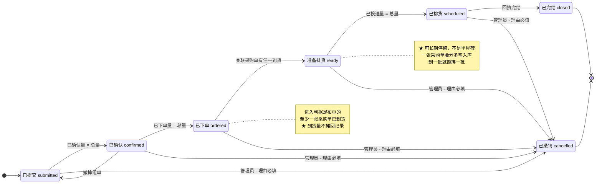
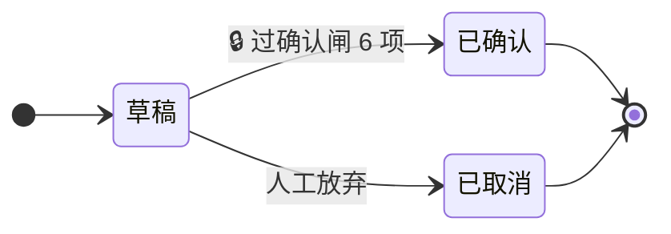
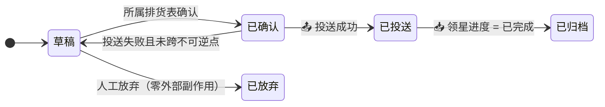

# 状态流转 — service_supplychain

> **这份文档要做什么**
>
> 把系统里**全部**状态机一次列清，并回答三个问题：
> **谁写它 · 什么事实驱动它 · 非法迁移返回什么。**
>
> ★ **一个字段只能有一个写入者。** 这是本文的总判据。
> 违反它的代价不是冲突，是**沉默的分叉** —— 两处都"对"，而数对不上。

| | |
|---|---|
| 版本 | v1 草案 |
| 日期 | 2026-09-16 |
| 状态 | **待确认** |
| 上游 | `02-本体实体关系`（§3.2 状态）、`06-核心业务流程`（§5 全链路状态对照） |

---

## 0. 全部状态一览

| # | 状态 | 挂在 | 谁写 | 存储 |
|---|---|---|---|---|
| **S1** | **计划单记录状态** | 计划单记录（店铺×货号×月） | 本服务 | 事件表 + 物化列 |
| **S2** | 计划单整体状态 | 计划单（plan_id, rev） | — | ★ **派生，不存储** |
| **S3** | 排货表状态（容器） | 排货表 | 本服务 | 列 |
| **S4** | **我方进度** `our_stage` | 排货单 | 本服务 | 事件表 + 物化列 |
| **S5** | **领星进度** `lingxing_stage` | 外部单据引用 | ★ **领星写，我们只读回** | 只追加 |

另有一条**本地采购单状态**（草稿 → 已下单），它只有两态且单向，不单列状态机。

### ★ 为什么排货那一段要三个状态（S3/S4/S5）

不是把简单的事画复杂了 —— **是这一段本来就同时在两个系统里跑**：

| 状态 | 回答的问题 |
|---|---|
| **排货表** | 这一批规划**定了没有** |
| **我方进度** | 这一张单**我们做到哪了**（意图） |
| **领星进度** | 这一张单**领星那边实际走到哪了**（事实） |

**S4 与 S5 并置、永不合并。** 完整例子与「为什么不能压成一套」见 **§4**。

---

## 0.1 ★ 全部迁移一览：谁自动、谁手动

> 先把话说清楚：**「人点一个动作」不等于「人改状态」。**
> 运营点「提交」、供应链点「下单」，他们做的是**业务动作**；
> 状态是这个动作**结果**的记录，值由系统按事实写，**人选不了状态值**。
> 只有「撤销 / 取消 / 放弃」才是人直接指定状态。

三类，全服务共 **19 条**迁移规则：

| 类 | 含义 | 条数 |
|---|---|---|
| **A · 纯自动** | 无人介入。外部事实（📥 回执）或内部事实（事务内联动）触发 | **10** |
| **B · 人发起，系统裁决** | 人点业务动作按钮，系统执行并按**结果**写状态。人选不了状态值 | **6** |
| **C · 纯手动** | 人直接指定状态值 | **3** |

另有 **S5 领星进度**：**全部只从领星读回，一条都不许手动** —— 不在上面 19 条里。

### S1 · 计划单记录（8 条）

| # | 迁移 | 类 | 触发 |
|---|---|---|---|
| 1 | [*] → 已提交 | **B** | 运营点「提交」→ 按当时格子值铸出记录 |
| 2 | 已提交 → 已确认 | **A** | 组单事务内：已确认量 = 总量 |
| 3 | 已确认 → 已提交 | **A** | 撤组单事务内：已确认量 < 总量 |
| 4 | 已确认 → 已下单 | **A** | `CreatePurchaseOrder` 成功回调 |
| 5 | 已下单 → 准备排货 | **A** 📥 | 回执器：关联采购单中有任一已到货 |
| 6 | 准备排货 → 已排货 | **A** | 投送成功且**已投送量** = 总量 |
| 7 | 已排货 → 已完结 | **A** 📥 | 回执器：领星进度 = 已完成 |
| 8 | 任意非终态 → 已撤销 | ★ **C** | 管理员，**理由必填** |

### S3 · 排货表（3 条）

| # | 迁移 | 类 | 触发 |
|---|---|---|---|
| 9 | [*] → 草稿 | **B** | 供应链点「建排货表」 |
| 10 | 草稿 → 已确认 | **B** | 供应链点「确认」，**过闸 6 项**才成 |
| 11 | 草稿 → 已取消 | ★ **C** | 人工放弃 |

### S4 · 我方进度 · 排货单（6 条）

| # | 迁移 | 类 | 触发 |
|---|---|---|---|
| 12 | [*] → 草稿 | **A** | 排货单被创建时 |
| 13 | 草稿 → 已确认 | **A** | 跟随所属排货表确认（**同一事务**） |
| 14 | 已确认 → 已投送 | **B** | 供应链点「投送」，全步成功 |
| 15 | 已确认 → 草稿 | **A** | 投送失败**且未跨不可逆点** |
| 16 | 已投送 → 已归档 | **A** 📥 | 回执器：领星进度 = 已完成 |
| 17 | 草稿 → 已放弃 | ★ **C** | 人工放弃（零外部副作用） |

### 采购单本地状态（2 条）

| # | 迁移 | 类 | 触发 |
|---|---|---|---|
| 18 | [*] → 草稿 | **B** | 供应链点「组单」 |
| 19 | 草稿 → 已下单 | **B** | 供应链点「下单」，`CreatePurchaseOrder` 成功 |

### S5 · 领星进度（不计入 19 条）

| 迁移 | 类 | 触发 |
|---|---|---|
| **全部** | **A** 📥 | 每日回执器从 CH 读回。★ **一条都不许手动写** |

---

### ★ 三条纯手动，全是「否定」

```
S1-8   撤销计划单记录   管理员 · 理由必填
S3-11  取消排货表       人工放弃
S4-17  放弃排货单       人工放弃
```

**正向推进，一条都不靠人点。**

原因很干净：**正向的每一步都有事实**（组了单 · 下了单 · 到了货 · 投送成功 · 回执完结），
而「不做了」**没有事实，只有意志** —— 没有任何外部信号会告诉系统「这个人改主意了」。

> ★ 这也是为什么这三条**理由必填**：
> 别的迁移事后都能从事实反推出原因，只有这三条不能。
> 不写理由，半年后没人知道那批货为什么没发。

### ★ 为什么 B 类不算「手动改状态」

| | 人做的 | 系统做的 |
|---|---|---|
| 提交 | 点「提交」 | 按当时格子值铸出记录，状态一律 `已提交` |
| 确认排货表 | 点「确认」 | **跑 6 项闸**，全过才写 `已确认`，任一不过 ROLLBACK |
| 下单 | 点「下单」 | 调领星，**拿到 `order_sn` 才写** `已下单`；失败停在草稿 |
| 投送 | 点「投送」 | 编排多步，**全步成功才写** `已投送` |

★ **人表达的是意图，状态记的是结果 —— 两者可以不一致，而这正是要点。**
点了「下单」但领星拒了，状态就该停在草稿；
把状态写成「人点了什么」，系统就会把**没成的事记成成了**。

---

## 1. S1 · 计划单记录状态（核心）

### 1.1 状态图



### 1.2 ★ 事实驱动，不是手工点

> **原方案是「全手动流转」，理由是当时领星下单接口没接。**
> 现在接上了，每一步都有**可核验的外部事实**。
>
> **手动流转的真正成本**：状态是「人记得去点」的，不是事实。
> 一旦有人忘了点，看板就是错的 —— **而且没有任何东西会报错。**
> 它和「业务真的卡在那一步」长得一模一样。

| 迁移 | 驱动 | 判据（事实） | 判据类型 | 谁发起 |
|---|---|---|---|---|
| 已提交 → 已确认 | **自动** | 已确认量 **=** 总量（承重墙①求和） | 木桶 | 组草稿的同一事务 |
| 已确认 → 已下单 | **自动** | 已下单量 **=** 总量 | 木桶 | `CreatePurchaseOrder` 成功回调 |
| **已下单 → 准备排货** | **自动** | 📥 关联采购单中**至少一张已到货**（`status_shipped ∈ {2, 3}`）。★ **布尔判据，不是数量判据** | ★ **下限** | 每日回执 |
| 准备排货 → 已排货 | **自动** | **已投送量** **=** 总量 ★ 只认已投送的，不认草稿 | 木桶 | 投送器 |
| 已排货 → 已完结 | **自动** | 📥 领星进度 = **已完成** | 木桶 | 每日回执 |
| 已确认 → 已提交 | **自动** | 组单被撤掉，已确认量 < 总量 | 木桶 | 编辑草稿的同一事务 |
| 任意非终态 → 已撤销 | ★ **手动** | 管理员，**理由必填** | — | 人 |

★ **只有「撤销」是手动的** —— 因为它表达的是人的意志，没有外部事实对应。

### 1.2.1 ★ 木桶用在我们的动作上，下限用在外部事实上

> 这是两类判据，**不能混用**。

| 判据类型 | 用在 | 为什么 |
|---|---|---|
| **木桶**（量 = 总量才推进） | **我们自己的动作** —— 组单 · 下单 · 排完 | 部分组单意味着**这条需求还没被完全承接**。报成「已确认」是虚报 |
| **下限**（有就推进） | **外部的物理事实** —— 到货 | 货是**一批批来的**。一张采购单会分多笔入库，等全到齐再排，货就白躺在仓里 |

**「准备排货」的判据是布尔的，不是数量的**：

> 该记录关联的采购单中，**至少有一张已到货**（`status_shipped ∈ {2 部分到货, 3 全部到货}`）

★ **不摊分到货量** —— 见 §1.2.2。
★ **「准备排货」是一个可长期停留的状态，不是里程碑。**
它的含义是「**本地仓开始有这个货了，可以去排了**」，不是「这条需求的货全到了」。
★ **状态只前进。** 不许因为「这一批排完了」把状态退回「已下单」——
状态来回抖动，下游每个读它的地方都会看到不同的答案，而没有一个是错的。

### 1.2.2 ★ 需求侧的量在记录上，物理侧的量在库存上，两者不混

> **裁定（负责人 2026-09-16 · C4）**：
> 「根据入库单对应的采购单 ID 确认库位，**不需要自动分摊**，排货本来就是人要做的工作。」

**为什么不摊**：一张采购单明细对多条计划单记录时，部分到货按什么摊？按比例？按月份先后？
**任何一种都是凭空发明的规则，没有事实依据。**
而摊错的后果是某条记录显示「可排 40 件」，人照着去排，
**确认闸的 G3 才把他拦下来 —— 那时他已经白排了一遍。**

**正确的做法**：排货界面同时给人看三样**真实的**东西，让人自己判断：

| 看什么 | 从哪来 | 回答 |
|---|---|---|
| **待排量** = 总量 − 已排未发量 − 已投送量 | 记录层（承重墙②求和） | 需求侧还欠多少 |
| **本地仓可发量** | CH `product_valid_num` | 物理上真有多少 |
| **货在哪个仓** | 入库单 → 采购单 `order_sn` → 库位 | 从哪儿发 |

★ 前两个数**不相减、不合成一个「可排量」** —— **它们量纲不同**：
一个是「这条需求还欠多少」，一个是「仓里真有多少」。
**合成一个数，就等于替人做了那个我们刚决定不做的分摊。**

★ **排货候选的筛选判据**：记录状态 ∈ {已下单, 准备排货} **且** 待排量 > 0。
物理够不够由人看库存判断，最终由确认闸 G3 兜底。

### 1.3 ★ 状态用「量」推进，不用「态」表达部分

一条记录 300 件的现实形态：

```
A 供应商  已下单 200 件
B 供应商  还在等报价，未组单
```

**不发明「部分已下单」这种状态值。**

| 量 | 挂在 | 来源 | 单调性 |
|---|---|---|---|
| 总量 | **记录** | 记录自身 | 不变 |
| 已确认量 | **记录** | 承重墙①求和（已组进草稿的明细） | 可增可减（撤组单） |
| 已下单量 | **记录** | 承重墙①求和（草稿已下单的明细） | 只增 |
| **已排未发量** | **记录** | 承重墙②求和，排货单 ∈ {草稿, 已确认} | 可增可减 |
| **已投送量** | **记录** | 承重墙②求和，排货单 ∈ {已投送, 已归档} | 只增 |
| **待排量** | **记录** | 总量 − 已排未发量 − 已投送量 | 可增可减 |
| 到货量 · 到货库位 | ★ **采购单** | 📥 入库单 → `order_sn` | 只增。**不摊回记录** |
| 可发量 | ★ **库存** | 📥 CH `product_valid_num` | 随出入库变化 |

★ **「已排量」必须拆成两个** —— 承重墙②的映射在**排货单还是草稿时就存在了**，
不加区分地求和，会让一条记录在**什么都没发出去的时候就变成「已排货」**。见 §2.5 坑②。

```
已排未发量 + 已投送量 ≤ 总量        （恒等式，可作对账断言）
0 ≤ 已下单量 ≤ 已确认量 ≤ 总量
```

★ **这两条不等式应当写成库层 CHECK 或对账断言。**
违反它们意味着某条承重墙的映射漏了或重了 —— 而那种错**不会报错，只会对错账**。

**推进判据**：我们的动作用**木桶**（量 = 总量），外部到货用**下限**（有就推进）。见 §1.2.1。
不满足时**停在原状态**，界面显示 `已下单 200 / 共 300`。

> ★ **能用量表达的，就不要用态表达。**
> 态回答「到哪一步」，量回答「到什么程度」。
> 混在一起，状态值会爆炸成「部分已确认 / 部分已下单 / 部分已排…」，而每多一个态，
> 下游每个 `if` 都要多一个分支 —— 那些分支没有测试会覆盖到。

### 1.4 非法迁移

| 情形 | 返回 |
|---|---|
| 目标态不在 `allowed_next(from)` 里 | `409 illegal_transition` + `from` / `to` / `allowed[]` |
| 从终态（已完结 / 已撤销）出发 | `409 terminal_state` |
| 撤销未带理由 | `400 reason_required` |
| 未知状态值 | `400 unknown_state` |

★ **`allowed[]` 必须回显。** 只说「不许」而不说「那能去哪」，前端只能猜。

---

## 2. 自动迁移的执行规格

> ★ **只说「自动」而不说「何时检查、检查哪些行」，实现时必然遗漏。**
> 遗漏的形态是最坏的那种：**记录永远停在旧状态，而没有任何东西会报错** ——
> 它和「业务真的卡在那一步」长得一模一样。

### 2.1 防遗漏的根本设计：一个再评估函数，两个调用者

**不要把状态推进逻辑散落在各个动作里。** 散落 = 每加一个动作就要记得补一处，
而「忘了补」不会有任何症状。

```
inv.reevaluate_plan_lines(line_ids[])    ← 唯一实现
        ↑                      ↑
   库层触发器（同步）      回执器（异步）
```

| 调用者 | 何时 | 为什么是它 |
|---|---|---|
| **库层触发器** | 承重墙①/② 的行被 INSERT / UPDATE / DELETE 时，**同一事务内** | 界面要立刻看到；★ **任何写入路径都躲不掉，不依赖应用层记得调** |
| **回执器** | 每日采集后 | 到货、领星进度这些**外部事实**没有写入触发点 |

★ **一个实现，两个调用者。** 两份实现必然分叉，而分叉的症状是「两个地方都对，数对不上」。

### 2.2 触发清单（穷举）

★ **这张表本身就是防遗漏的清单。**
**每新增一条会改变上述任一「量」的写入路径，必须在这里登记** ——
登记不了就说明它绕过了承重墙，那才是真问题。

| 写入动作 | 受影响的记录集 | 触发方式 |
|---|---|---|
| 组单：新增明细 + 承重墙①映射 | 映射涉及的记录 | 触发器 |
| 改明细数量 / 撤掉某行 | 同上 | 触发器 |
| 删整张采购单草稿 | 该草稿全部映射涉及的记录 | 触发器 |
| 下单成功（明细转已下单） | 该采购单全部映射涉及的记录 | 触发器 |
| 排货表「选择添加」重建 → 承重墙②映射 | 映射涉及的记录 | 触发器 |
| 排货单 我方进度 变更（确认 / 投送 / 放弃） | 该排货单全部行涉及的记录 | 触发器 |
| 📥 回执：采购单到货 | 该采购单全部映射涉及的记录 | 回执器 |
| 📥 回执：领星进度 → 已完成 | 该排货单全部行涉及的记录 | 回执器 |
| 撤销记录（C 类） | 该记录 | 直接写终态，**此后不再评估** |

### 2.3 评估算法

```
reevaluate(line):
    if line.state in (已完结, 已撤销):
        return                                  # ★ 终态不动，幂等的第一道保证

    # ① 退回 —— 全服务唯一一条退回规则
    if line.state == 已确认 and 已确认量 < 总量:
        line.state = 已提交

    # ② 前进 —— ★ 必须循环到不动点，一次事件可连跳多级
    while True:
        if line.state == 已提交   and 总量 > 0 and 已确认量 == 总量:  line.state = 已确认;   continue
        if line.state == 已确认   and 已下单量 == 总量:               line.state = 已下单;   continue
        if line.state == 已下单   and 关联采购单有任一已到货:          line.state = 准备排货; continue
        if line.state == 准备排货 and 已投送量 == 总量:               line.state = 已排货;   continue
        if line.state == 已排货   and 关联排货单全部已归档:            line.state = 已完结;   continue
        break
```

★ **循环不是可选的。** 组单与下单可以在很短时间内连续发生，
一次再评估就要从「已提交」连跳到「已下单」。写成单次 `if-else`，记录会卡在中间态，
**而下一次触发可能永远不来**（因为量已经不再变化了）。

### 2.4 精确判据

| # | 迁移 | 判据（精确） | 谁触发 |
|---|---|---|---|
| 2 | 已提交 → 已确认 | `总量 > 0 AND 已确认量 = 总量` | 触发器（承重墙①） |
| 3 | 已确认 → 已提交 | `已确认量 < 总量` | 触发器（承重墙①） |
| 4 | 已确认 → 已下单 | `已下单量 = 总量` | 触发器（承重墙①） |
| 5 | 已下单 → 准备排货 | `EXISTS`（该记录经承重墙①关联的采购单中，`status_shipped ∈ {2,3}`）★ **布尔** | 回执器 |
| 6 | 准备排货 → 已排货 | `已投送量 = 总量` | 触发器（承重墙② / 我方进度） |
| 7 | 已排货 → 已完结 | 该记录关联的**全部**排货单 我方进度 = 已归档 | 回执器 |

### 2.5 ★ 三个会被漏掉的坑

#### 坑① `总量 = 0` 会让空记录直接跳到「已确认」

`0 = 0` 恒真。没有 `总量 > 0` 这个守卫，一条量为 0 的记录**一诞生就是已确认**，
然后一路自动跑到已下单 —— 而它从来没被任何人组过单。

#### 坑② ★ 「已排量」必须区分投送前后 —— 这是我上一版写错的

承重墙②的映射在**排货单还是草稿时就存在了**。若 `已排量` 不加区分地求和，
**一条记录会在什么都没发出去的时候就变成「已排货」**。

所以是**两个量，不是一个**：

| 量 | 定义 | 用途 |
|---|---|---|
| **已排未发量** | 承重墙②求和，排货单 我方进度 ∈ {草稿, 已确认} | 进补齐量公式 X，防重复排 |
| **已投送量** | 承重墙②求和，排货单 我方进度 ∈ {已投送, 已归档} | ★ **「已排货」只认这个** |
| **待排量** | `总量 − 已排未发量 − 已投送量` | 排货候选筛选 |

```
已排未发量 + 已投送量 ≤ 总量        （恒等式，可作对账断言）
```

#### 坑③ 终态必须**先**判，不能放在循环里

`已完结` / `已撤销` 是终态。若守卫写在循环内部某个分支上，
一次撤销之后的再评估仍可能把它推回流转态 —— 而**撤销是有理由的，推回去等于把理由抹掉**。

### 2.6 幂等与并发

| 性质 | 怎么保证 |
|---|---|
| **幂等** | 评估是**当前量的纯函数**，不读历史。重复调用收敛到同一不动点 |
| **并发** | 评估前 `SELECT … FOR UPDATE` 锁住该记录行；量的求和在同一事务内读 |
| **顺序无关** | 因为是求不动点，不是按事件序推进 —— ★ **回执器乱序、重跑都安全** |
| **可追溯** | 每次实际发生的迁移**追加一行事件**（含触发来源：哪张采购单 / 哪张排货单 / 哪一轮回执） |

★ **「顺序无关」是刻意的。** 按事件序推进的状态机，一旦有一条事件丢了或迟到，
后面全错且**无法自愈**；求不动点的模型下，下一次再评估就把它纠回来了。

---

## 3. S2 · 计划单整体状态（派生，不存储）

### 3.1 口径：木桶

```
整体状态 = 所有未撤销记录状态的「最小态」
```

按 `已提交 < 已确认 < 已下单 < 准备排货 < 已排货 < 已完结` 排序取最小（即 rank 最小）。

**两个边界，必须显式定义，否则实现会各写各的：**

| 情形 | 整体状态 |
|---|---|
| 全部记录都已撤销 | `已撤销` |
| ★ **一条记录都没有**（空计划单） | `已撤销` —— 它没有任何可执行内容 |

★ 空计划单能存在，是因为提交时**两个值都没有的格子会被跳过**（进 `skipped[]`）——
极端情况下全部被跳过，就铸出一张空的 rev。
**不定义它，`MIN()` 会返回 NULL，而 NULL 在下游每一处的表现都不一样。**

### 3.2 ★ 但看板不读整体状态，读分布

```json
{
  "overall": "submitted",
  "distribution": { "submitted": 3, "confirmed": 2, "ordered": 5 },
  "units": { "total": 4200, "confirmed": 2600, "ordered": 2600 }
}
```

> 你原来担心的是：「10 个货号里 7 个已下单、3 个还在等报价是常态，
> 现在计划单只能停在『已提交』，看板上那 7 个已经在走的完全看不见。」
>
> ★ **`distribution` 就是答案** —— 整体态照旧是「已提交」（木桶，诚实），
> 但那 7 个在 `distribution.ordered` 里清清楚楚。
> **不需要为此发明任何新状态值。**

### 3.3 为什么不存储

存了就有两个真相：记录改了而整体没重算，或反之。
派生是**每次读时算**，永远不会分叉。
真嫌慢再加物化视图 —— 但那是性能问题，不是模型问题，**不许反过来影响模型**。

---

## 4. 排货的三根轴

排货这一段有三个状态，**不是我把简单的事画复杂了** —— 是这段本来就同时在两个系统里跑。
先看一个走完全程的例子，再看图。

### 4.0 一个完整例子

排货表 **#88**，里面 3 张排货单：英国海外仓、美国 FBA、德国 FBA。

| 时间 | 排货表 | 单1 英国 | 单2 美国 | 单3 德国 | 领星那边 |
|---|---|---|---|---|---|
| 9/16 建表 | 草稿 | 草稿 | 草稿 | 草稿 | **什么都没有** |
| 9/16 过闸确认 | **已确认** | 已确认 | 已确认 | 已确认 | **什么都没有** |
| 9/17 投单1 | 已确认 | **已投送** | 已确认 | 已确认 | 单1 `OWS…` 待配货 |
| 9/17 单1 锁+发 | 已确认 | 已投送 | 已确认 | 已确认 | 单1 **待收货** |
| 9/18 投单2 | 已确认 | 已投送 | **已投送** | 已确认 | 单2 `FBA…`+`SP…` 待收货 |
| 9/25 英国收货 | 已确认 | **已归档** | 已投送 | 已确认 | 单1 **已完成** |

三件事一眼可见：

1. **排货表确认之后就不动了** —— 它只管「这一批规划定了没有」
2. **每张排货单各走各的** —— 因为它们是**逐张跨不可逆点**的
3. **领星那一列我们一个字都不写** —— 每天采集回来填

### 4.1 ★ 为什么必须是两套，不能压成一套

假设投送单1：建单成功了，但**锁库存静默失败**。

只用一套状态的话，必须二选一：

| 记成 | 后果 |
|---|---|
| 「已投送」 | 系统以为这批货占住了 → **别的排货表会重复排** |
| 「还没投送」 | 系统以为可以重投 → 重投就是**在领星里建出第二张单** |

**两个都是错的。真相是「我们投了，但外面没生效」—— 这句话需要两个字段才说得出来。**

有了两套，这种情况长这样：

```
我方进度 = 已投送        ← 我们确实发起了，别再投一次
领星进度 = 待配货        ← 但锁库存没成
                         → 两者不一致 = 告警，去查 erp_call 看哪一步断的
```

★ **不一致本身就是那条最有用的信息。** 压成一个字段，它就永远消失了。

---

### 4.2 排货表（容器）



★ **为什么「确认」这个动作挂在表上而不是单张上**：
确认闸 6 项里，**G4（撞已排未发水位）和 G5（未关联发货）是整表级的判据** ——
它们回答「这一批规划和别人撞不撞」，单看一张单看不出来。

★ **确认后整表冻结** —— 连 INSERT 一起挡（库层触发器，不靠应用层自觉）。

★ **排货表的状态与销售计划的状态是两套，不许混。**

不过闸时**硬失败并点名是哪一项**（6 项判据见 `06-核心业务流程` §3.2）：

| 错误码 | 含义 |
|---|---|
| `409 packing_incomplete` | G1 装箱数据不齐 / 与 `list` 不一致 |
| `409 dest_incomplete` | ★ G2 FBA 排货单缺店铺 `sid`；★ **不查 FC** —— 它投送时由亚马逊动态分配 |
| `409 insufficient_available` | G3 可发量不足（★ 按 `product_valid_num`） |
| `409 ledger_moved` | G4 撞别的排货表的「已排未发」 |
| `409 unlinked_shipments_pending` | G5 「疑似未关联的发货」未清零 |
| `409 invalid_destination` | G6 目的地不合法 |

#### ★★ G2 查的不是「货件号」—— 那一刻它还不存在

> 负责人 2026-09-19：「先创建货件后，才能关联货件！你现在是让我提供 FBA 的货件编码！
> **怎么可能有呢**！货件号都没创建，怎么关联？」

G2 原先写的是「有 FBA 行未归属货件」。**时点错了**：
货件号是 `confirmPlacementOption` 之后才返回的（`02` §488、`07` §337 —— 不轮询
`taskId` 就不知道），而**确认闸跑在投送之前**。要它就是在要一个不存在的东西，
界面上于是长出一个**没人填得出来的输入框**。

★ 所以 G2 改查**建货件的前置条件**：FBA 排货单有没有店铺 `sid`。
**G2 不是被删掉了，是换了该查的东西。**

★★ 而且**不查 `fc`** —— 目的地在两条链上不是同一种东西：
海外仓是**一个固定地址**（收货仓），FBA 是**一个店铺**；
具体发往哪个 FC 由亚马逊在 `generatePlacementOptions` 时**动态分配**，
而且**一个计划会被拆成多个货件**（`02` §711）。
★ 这也是「关联货件」为什么是一个**动作**而不是一个字段。

#### A-6 查的是「货件已存在」，不是「行已归属」

```
建发货计划 → 锁库存 → generatePlacementOptions（FC 在这里出现）
           → 🔒 ★ 人选 placement option（O-7：带费用差异，不可逆）
           → ⛔ confirmPlacementOption → 轮询 taskId → ★ 拿回 N 个货件
           → 建发货单（按货件逐张，shipment_id 必填）
           → ⛔ 发货（★ A-6 在这一步之前检查：**这张货件存在**）
```

★ 两处以前写错了（O-2，数据部门 09-21）：

| 原文 | 错在哪 |
|---|---|
| 「货件号在这里产生并**回填到行**」 | ★ 一条行的量会被拆到多个 FC —— 回填到行等于把 1:N 压成 1:1。实测：货号进多货件 **414** 个 |
| 「**逐行**归属」 | ★ 归属是 **N:M 带数量**，落在 `consignment_split_line`（承重墙③），不在行上 |

★ 检查点仍必须在**产出它的那一步之后** —— 放进确认闸（投送之前）是把顺序搞反了。
★ 归属明细是**采集回读**，所以存在一段「**已投送 · 归属未知**」的窗口：
它要能被查询、被点名（`v_shipment_check.splits_seen = 0`），
**不许静默当 0** —— 「还没采到」和「没拆」处置相反。


---

### 4.3 我方进度（排货单 · 我们写）

> 库中列名 `our_stage`。**它记的是我们的意图，不是外面的事实。**



★ **`已确认 → 草稿` 这条退回边只在「投送失败且未跨不可逆点」时存在。**
一旦跨了 ⛔（STA 建货件 / 发货），**没有这条边** —— 见 §5。

---

### 4.4 领星进度（镜像 · 只读回）

> 库中列名 `lingxing_stage`。★ **我们一个字都不写**，每日采集回来填。
> 用领星自己的中文词，读的人一眼知道那不是我们的字段。

统一口径就是领星备货单那 6 态：

```
待审核 → 已驳回
      ↘ 待配货 →（分配库存）→ 待发货 ──发货──▶ 待收货 → 已完成
                                           已撤销
```

**两条链映射到同一根轴**：

| 领星进度 | 海外仓 | FBA 货件 | FBA 头程发货单 |
|---|---|---|---|
| 待配货 / 待发货 | `status ∈ {30, 40}` | `WORKING`, `READY_TO_SHIP` | `status ∈ {-1, 0}` |
| 待收货 | `status = 50` | `SHIPPED` 及之后 | `status = 1` |
| 已完成 | `status = 60` | `CLOSED` | — |
| 已撤销 | `status = 51` | `CANCELLED` | `status = 3` |

#### ★ 三个判据陷阱

| 陷阱 | 实测 | 正确判据 |
|---|---|---|
| 海外仓「待收货」当成「一件未收」 | `sub_status` 才分得开（0 全部 / 1 未收货 / 2 部分收货） | 必须读 `sub_status` |
| FBA 头程发货单用 `status` 判送达 | `status=2 已完成` **从未出现**；392 张全是 `1 已发货` | 用 `delivery_date` **非空** |
| 亚马逊货件 `DELIVERED` 当成已入库 | 实测 220 行 4,719 件，`quantity_received` **全为 0** | 用 `quantity_received` |

### 4.5 ★ 两轴不一致 = 告警

| 漂移 | 最可能的成因 |
|---|---|
| 我方=已投送，领星=待配货 | **allocate 静默失败** |
| 我方=已投送，查不到任何 `ext_ref` | 投送在建单前就断了；或**连不上被当成超时**放弃了 |
| 领星=已撤销，而我们没撤过 | 有人在领星里直接撤了 |
| 有 `ext_ref` 而没有对应 `erp_call` | ★ **有人绕过网关直接调了领星** —— 架构被破坏 |

★ 最后一条是**架构守卫**，不是业务告警。它必须存在，否则「所有出站写集中在网关」
这条规则会在第一次赶工时被悄悄破掉，而没有任何东西会发现。

---

## 5. ⛔ 不可逆点与状态的关系

**状态机能画出的退回边，必须真的退得回去。** 画得出但退不回，比不画更糟 —— 代码会去调那条不存在的路径。

| 不可逆点 | 之后「我方进度」还能退回吗 | 能做的补偿 |
|---|---|---|
| `CreatePurchaseOrder` | 采购单冻结 | 领星侧作废（`-1`），我们**读回**，不本地改 |
| ★ **选 placement option**（O-7） | —— 它本身可逆，但**下一步不可逆** | ★ 这是**人的决策点**：选项间有费用差异。必须留痕：选了哪项 · 当时费用 · 谁选的 |
| `confirmPlacementOption`（STA 建货件） | ⛔ **不能** | 只能在亚马逊侧取消货件；我们记 `CANCELLED` |
| `SendInbound`（海外仓发货） | ⛔ **不能**，且**无撤销接口** | 无 |
| `SendGoods`（FBA 发货） | ⛔ **不能** | 无 |

★ **海外仓的不可逆点比 FBA 更早、更硬**（FBA 至少还有 `outboundOrderReleaseStock`
能把待发货退回待配货）。所以 `channel=oversea` 应采用**更保守的阈值与二次确认**。

⚠️ **A3 / A5 未决**：草稿阶段是否立即锁库存、删单是否释放锁定。
在 P0 实调出结果前，「我方进度」的 `已确认 → 草稿` 这条边对 oversea **是否成立尚不确定**。

---

## 6. 其它对象的库层约束

★ **本节之外的正确性保证全部在 §7。** 两处写同一件事必然分叉，所以这里只列
**不属于计划单记录状态机**的那几条。

| 约束 | 由谁保证 |
|---|---|
| 同一计划最多 1 版在流转 | **部分唯一索引**（`WHERE state IN 流转态`） |
| 一个 msku 同时只被一个「尚未下单」的计划占用 | **部分唯一索引**（`WHERE released_at IS NULL AND NOT plan_ordered`） |
| 排货表确认后冻结 | **库层触发器**，连 INSERT 一起挡 |
| `ext_ref` / `erp_call` 只追加 | **库层触发器**禁 UPDATE / DELETE |
| 两张排货草稿撞「已排未发」 | 确认时比对**账本水位序列**，变了就 `409 ledger_moved` 要求重建 |
| 承重墙② **NOT NULL** | 没有计划单记录的排货行写不进去（裁定 B4） |

★ 共同判据：**先查后写在并发下必然漏，而且漏的时候不报错** —— 所以一律由库层裁决。

---

## 7. ★ 正确性保证 —— 状态错了会出事，所以不能只靠「说好了」

> **本文前面写的是「应当如此」，本节写的是「凭什么不会不如此」。**
>
> 供应链系统里，状态错误不是显示问题：
> 记录错标「已下单」→ 货没人做，到期断货；错标「已排货」→ 同一批货被发两次。
> **两者都不报错，都要等到对账或客户投诉才发现。**

### 7.0 先承认：以下 14 个洞是前几节漏掉的

> ★ **这张表本身要留着，不许在定稿时删掉。**
> 它记录的是「这套状态机曾经在哪些地方看起来是对的、其实不是」——
> 后面任何一次改动，都要回来对一遍有没有把某个洞重新捅开。

#### 第二轮（G1~G8）：★ 第一轮的机制**自己也有洞**

| # | 洞 | 为什么第一轮没发现 |
|---|---|---|
| **G1** | 迁移白名单只给了 DDL，**没给行** | 机制定义了，**内容没定义** —— 看起来是完整的 |
| **G2** | §7 只硬化了 S1，**S3 / S4 / 采购单三个状态机一条机制都没有** | ★ 而 S4 正是守着不可逆点的那个 |
| **G3** | ★ **自相矛盾**：`ext_ref 只追加永不 UPDATE` vs 「领星进度挂在 ext_ref 上」 | 两句话隔了几十行，各自读都对 |
| **G4** | 排货单「已放弃」后，映射仍算在已排未发量里 | **待排量被永久扣掉，那批需求再也排不出去**，而界面只显示「待排 0」 |
| **G5** | 说「只许沿 rank 前进」，**rank 从没定义** | 用了一个没定义的词，读起来毫无违和 |
| **G6** | 两人同时提交同一计划**撞 rev**，无唯一约束 | §7 只想着状态，忘了 rev 也是并发写的 |
| **G7** | 空计划单的整体状态未定义 | `MIN()` 返回 NULL，**下游每一处表现都不一样** |
| **G8** | T1~T12 **只覆盖 S1** | 测试清单跟着 §7 的视野走，§7 漏了它就跟着漏 |

> ★ **G2 和 G8 是同一个盲点的两面**：一旦默认「状态机 = S1」，
> 机制和测试会一起漏掉另外三个 —— **而漏掉的那三个里，有一个管着货发不发得出去。**

#### 第一轮（H1~H6）：机制缺失

| # | 洞 | 前面怎么写的 | 为什么不够 |
|---|---|---|---|
| **H1** | 物化列与事件表可能分叉 | 「事件表是真相，物化列是索引」 | **没说物化列由谁写**。只要存在第二条写入路径，两者就会分叉 |
| **H2** | 没有机制禁止状态倒退 | 「状态只前进」 | 那是一句**文字约定**，任何一处 `UPDATE … SET state=` 都能违反 |
| **H3** | 前置条件只在查询层 | 排货候选只筛 已下单/准备排货 | 候选是**查询**，不是**约束**。直接调接口就能给「已确认」的记录排货 |
| **H4** | 恒等式没有强制手段 | 「应当写成库层 CHECK」 | ★ **普通 CHECK 做不到跨行聚合** |
| **H5** | 回执乱序 / CH 掉档会让进度倒退 | 「顺序无关、重跑安全」 | 那只保证**我方**进度；**领星进度是直接写入的**，读到旧快照就会倒退 |
| **H6** | 撤销后映射残留 | 「撤销 → 终态」 | 承重墙①/②的映射**还在**，别处求和会把它算进去 |

---

### 7.1 H2 的机制：★ 把状态机做成一张表，事件表外键引用它

**应用层写不出非法迁移，因为外键会拒。**

```sql
-- 合法迁移白名单：状态机本身是数据，不是代码里的 if
CREATE TABLE plan_line_transition (
    from_state  text NOT NULL,
    to_state    text NOT NULL,
    kind        text NOT NULL CHECK (kind IN ('forward','back','cancel')),
    needs_reason boolean NOT NULL DEFAULT false,
    PRIMARY KEY (from_state, to_state)
);

-- 事件表：唯一能改状态的入口
CREATE TABLE plan_line_event (
    seq         bigserial PRIMARY KEY,          -- ★ 用序列不用时间戳
    line_id     bigint  NOT NULL REFERENCES plan_line(line_id),
    from_state  text    NOT NULL,
    to_state    text    NOT NULL,
    actor       text    NOT NULL,
    reason      text,
    at          timestamptz NOT NULL DEFAULT now(),
    FOREIGN KEY (from_state, to_state)
        REFERENCES plan_line_transition(from_state, to_state)   -- ★ 非法迁移 = 外键违反
);
```

**白名单的全部内容**（★ 这 12 行就是 S1 的状态机本体）：

| from_state | to_state | kind | needs_reason |
|---|---|---|---|
| 已提交 | 已确认 | forward | |
| 已确认 | 已下单 | forward | |
| 已下单 | 准备排货 | forward | |
| 准备排货 | 已排货 | forward | |
| 已排货 | 已完结 | forward | |
| 已确认 | 已提交 | **back** | |
| 已提交 | 已撤销 | cancel | ✅ |
| 已确认 | 已撤销 | cancel | ✅ |
| 已下单 | 已撤销 | cancel | ✅ |
| 准备排货 | 已撤销 | cancel | ✅ |
| 已排货 | 已撤销 | cancel | ✅ |
| — | — | — | — |

★ **表里没有以 `已完结` / `已撤销` 作 `from_state` 的行** —— 终态不可离开，由外键裁决。
★ **`back` 只有一行。** 多一行就要重新论证「状态只前进」还成不成立。

| 保证 | 怎么来的 |
|---|---|
| 非法迁移写不进去 | 外键 |
| 「只前进」 | 白名单里只有 3 条非前进边（1 条退回 + 撤销族 + 无） |
| 「撤销必须带理由」 | `needs_reason` + 触发器校验 |
| 「终态不可离开」 | 白名单里**没有**以 `已完结`/`已撤销` 作 `from_state` 的行 |
| 事件序 | ★ `bigserial` 而非 `at` —— **时间戳会因时钟回拨而乱序**，序列不会 |

**`rank` 的定义**（「只前进」这句话的精确含义，两处都要用）：

| 状态机 | rank 序 | 例外 |
|---|---|---|
| S1 计划单记录 | 已提交 1 · 已确认 2 · 已下单 3 · 准备排货 4 · 已排货 5 · 已完结 6 | 已撤销 = **旁路终态**，不参与比较 |
| S4 我方进度 | 草稿 1 · 已确认 2 · 已投送 3 · 已归档 4 | 已放弃 = 旁路终态 |
| S5 领星进度 | 待审核 1 · 待配货 2 · 待发货 3 · 待收货 4 · 已完成 5 | 已驳回 / 已撤销 = 旁路终态 |

★ **旁路终态不参与 rank 比较** —— 否则「已撤销」会被算成比「已提交」更靠前或更靠后，
两种算法都会得出荒谬结论。它们只满足一条：**进去就出不来**。

★ **状态机是数据，就能被查询、被断言、被 diff。** 写在代码 `if` 里的状态机，
改错了只有跑到那条分支才知道 —— 而那条分支多半没有测试。

### 7.2 H1 的机制：物化列只有一个写入者

```sql
-- 物化列由「事件表的 AFTER INSERT 触发器」写，别无他路
CREATE TRIGGER t_sync_state AFTER INSERT ON plan_line_event
    FOR EACH ROW EXECUTE FUNCTION sync_plan_line_state();

-- 并且：拒绝任何直接改 state 的 UPDATE
CREATE TRIGGER t_state_is_readonly BEFORE UPDATE OF state ON plan_line
    FOR EACH ROW WHEN (current_setting('app.in_state_sync', true) IS DISTINCT FROM 'on')
    EXECUTE FUNCTION raise_state_must_go_through_event();
```

★ **乐观校验同时解决并发（H2 的另一半）**：
插事件时校验 `NEW.from_state = (SELECT state FROM plan_line WHERE line_id = NEW.line_id)`。
两个事务同时再评估 → 第二个等锁 → 拿到锁后发现 `from_state` 已不匹配 →
重算 → 发现已是目标态 → **不写事件**。**幂等天然消解冲突，不需要重试逻辑。**

### 7.3 H3 的机制：前置条件下沉到库层

**候选查询是给人看的，约束是给系统守的 —— 两者不能只有一个。**

| 写入 | 库层前置检查 | 挡住什么 |
|---|---|---|
| 承重墙①映射 INSERT | 记录状态 ∈ {已提交, 已确认} | 给**已下单**的记录再组一次单 |
| 承重墙②映射 INSERT | 记录状态 ∈ {已下单, 准备排货} | ★ 给**还没下单**的记录排货 |
| 排货单转「已投送」 | 所属排货表 = 已确认 | **绕过确认闸**直接投送 |
| 采购单转「已下单」 | 本地状态 = 草稿 且 `order_sn` 非空 | 没拿到单号就标已下单 |

★ **H3 是这 6 个洞里最危险的一个** —— 它允许「还没下单的货被排出去」，
而那批货**根本不存在**。确认闸的 G3 只校验本地仓可发量，
若恰好仓里有别的批次的同款货，**G3 会放行**，于是别人的货被发走了。

### 7.4 H4 的机制：约束触发器（普通 CHECK 做不到）

跨行聚合的恒等式，**只能用 `CONSTRAINT TRIGGER … DEFERRABLE INITIALLY DEFERRED`**
—— 事务末尾检查，允许中间态短暂违反（比如重建整表时先删后插）。

```sql
CREATE CONSTRAINT TRIGGER c_qty_invariant
    AFTER INSERT OR UPDATE OR DELETE ON dispatch_source_map   -- 承重墙②
    DEFERRABLE INITIALLY DEFERRED
    FOR EACH ROW EXECUTE FUNCTION assert_line_qty_invariant();
```

要守的两条：

```
已排未发量 + 已投送量 ≤ 总量
0 ≤ 已下单量 ≤ 已确认量 ≤ 总量
```

★ **用普通 CHECK 写不出来**，因为它要 `SUM()` 别的表的行。
写成应用层校验则回到 H1 的老问题：只要存在第二条写入路径就绕过去了。

### 7.5 H5 的机制：★ 先拆表，再守单调

#### 先修一处自相矛盾

前面同时写了两句话，它们不能都成立：

```
ext_ref：只追加，永不 UPDATE
领星进度：挂在 ext_ref 上，每日回执写它     ← 写它就是 UPDATE
```

**拆成两张表：**

| 表 | 记什么 | 写入 |
|---|---|---|
| `ext_ref` | **我们投送产生了哪个单号** | ★ 只追加。一次投送一行，FBA 三行 |
| `ext_stage_observation` | **某轮回执观察到它处于什么阶段** | ★ 只追加。`(ext_ref_id, observed_on, stage, run_id)` |

```
当前领星进度 = 该 ext_ref 的全部观察中，★ rank 最大的那条
                                        （不是最新的那条）
```

★ **取 rank 最大而非最新，是这里的关键。**
CH 掉档导致的「倒退观察」被自然忽略，**而证据仍然留在表里** ——
比「倒退就不写入」更好：不写入等于把掉档的证据也一起丢了，
下次再掉档还是查不出规律。

#### 再守单调

★ **这是唯一一个「外部事实」也需要守卫的地方。**

CH 的日报实测会**整天缺、会掉档、会有重复行**（某日 2,217 行 / 780 SKU，较前一日少约 40%）。
读到掉档那版，一张已完成的单会**看起来回到待收货**。

| 守卫 | 做法 |
|---|---|
| ① 采集面校验 | 比对相邻两日**行数与单号覆盖数**，掉档超阈值 → ★ **这批数据不可用，整批不写** |
| ② 单调性 | `lingxing_stage` 只许沿 rank 前进；**倒退的读回记为告警，不写入** |
| ③ 例外 | `已撤销` 是合法的「非前进」终态，单独放行 |

★ **把缺失读成「倒退」比读成 0 更糟** —— 它会触发我方进度的连带回滚，
把已归档的单重新打开。

### 7.6 H6 的机制：撤销的语义必须说清

**撤销一条计划单记录 ≠ 撤销采购。** 货可能已经在做了，钱可能已经付了。

| 做法 | 判据 |
|---|---|
| ★ **所有量的求和一律排除已撤销的记录** | 撤销后它不再参与任何需求侧计算 |
| ★ **映射不删** | 承重墙①/②的历史必须留着 —— 否则「这张采购单为什么下的」永远查不出来 |
| 撤销时若已有 `order_sn` | **硬失败**，要求先在领星侧作废，读回 `-1` 后才允许撤销 |
| 撤销时若已投送 | **硬失败**，不可逆点之后不允许撤销记录 |

#### ★ 同一个坑的另一面：被「放弃」的排货单

排货单转「已放弃」后，它的承重墙②映射**还在**。
若「已排未发量」不排除它，**待排量被永久扣掉一块，那批需求再也排不出去** ——
而界面上看不出任何异常：它只是显示「待排 0」。

```
已排未发量 = 承重墙②求和 WHERE 排货单 我方进度 ∈ {草稿, 已确认}
                                         ★ 不含 已放弃
已投送量   = 承重墙②求和 WHERE 排货单 我方进度 ∈ {已投送, 已归档}
```

★ **旁路终态（已撤销 / 已放弃）一律不参与任何量的求和，但映射永不删。**
删了，「这批货当初为什么排、后来为什么不排了」就查不出来了。

---

### 7.6b ★ 另外三个状态机也要同一套机制 —— 不是只有 S1

前面 7.1~7.6 全部只硬化了 **S1**。但 **S4（我方进度）才是守着不可逆点的那个** ——
它错一次就是货真的发出去了或真的发了两次。S3 与采购单同理。

**四个状态机共用同一个模式，各有一张白名单表：**

| 状态机 | 白名单表 | 事件表 | 行数 | 尤其要挡的 |
|---|---|---|---|---|
| S1 计划单记录 | `plan_line_transition` | `plan_line_event` | 11 | 见 §7.1 |
| **S4 我方进度** | `consignment_transition` | `consignment_event` | 6 | ★ **已投送 → 草稿**（跨了不可逆点还想退回） |
| S3 排货表 | `sheet_transition` | `sheet_event` | 2 | 已确认 → 草稿（确认后整表冻结） |
| 采购单本地 | `po_transition` | `po_event` | 1 | 已下单 → 草稿（下单后冻结） |

**S4 白名单全部内容**（6 行）：

| from_state | to_state | kind | 备注 |
|---|---|---|---|
| 草稿 | 已确认 | forward | 跟随排货表确认 |
| 已确认 | 已投送 | forward | 投送全步成功 |
| 已确认 | 草稿 | **back** | ★ **仅当未跨不可逆点** —— 见下 |
| 已投送 | 已归档 | forward | 回执完结 |
| 草稿 | 已放弃 | cancel | 零外部副作用 |
| — | — | — | — |

★ **表里没有 `已投送 → 草稿`，也没有 `已投送 → 已放弃`。**
跨过 `SendInbound` / `SendGoods` 之后货已经在路上、库存已经扣了，
**没有任何接口能退回来** —— 状态机里画得出而现实中退不回，比不画更糟：
代码会去调那条不存在的路径。

**`已确认 → 草稿` 还需要一条外键挡不住的前置检查**（因为它依赖 `ext_ref`，不是状态本身）：

```
允许退回 ⟺ 该排货单没有任何跨越不可逆点的 ext_ref
           （oversea 无 SendInbound 记录；fba 无货件号、无 SendGoods 记录）
```

★ 这条必须是**库层触发器**，不是应用层判断 ——
应用层的检查只对「记得调它的那条路径」有效。

**S3 白名单**（2 行）：`草稿 → 已确认`(forward) · `草稿 → 已取消`(cancel)。
**采购单白名单**（1 行）：`草稿 → 已下单`(forward)，且触发器校验 `order_sn` 非空。

### 7.7 机制总表

| 要保证的 | 机制 | 层 |
|---|---|---|
| 非法迁移写不进（**四个状态机各一张白名单**） | 白名单表 + 外键 | 库 |
| ★ 已投送的排货单不能退回 | S4 白名单里无此行 + `ext_ref` 前置触发器 | 库 |
| 两人同时提交同一计划不会撞 rev | `UNIQUE (plan_id, rev)` | 库 |
| 旁路终态不参与量的求和 | 求和一律经视图，视图过滤已撤销 / 已放弃 | 库 |
| 状态不倒退 | 白名单里没有倒退边 | 库 |
| 终态不可离开 | 白名单里无此 `from_state` | 库 |
| 撤销必须带理由 | `needs_reason` + 触发器 | 库 |
| 物化列不分叉 | 单一写入者 + 直改 `state` 被拒 | 库 |
| 并发不丢更新 | `FOR UPDATE` + `from_state` 乐观校验 + 幂等 | 库 |
| 前置条件 | 承重墙映射 INSERT 检查记录状态 | 库 |
| 量守恒 | `CONSTRAINT TRIGGER … DEFERRED` | 库 |
| 领星进度不倒退 | 采集面校验 + 单调性守卫 | 应用（回执器） |
| 撤销不污染求和 | 所有求和过滤已撤销 | 库（视图） |
| 事件序正确 | `bigserial`，★ **不用时间戳** | 库 |
| 出站写不绕网关 | 有 `ext_ref` 而无 `erp_call` → 告警 | 对账 |

★ **12 条里 10 条在库层。** 理由很简单：
**应用层的约束只对「记得调它的那条路径」有效**，而漏掉的那条路径不会报错。

### 7.8 必须存在的测试（每条都要先红一次）

> ★ **写完先把它弄失败一次。** 一个从没红过的守卫，等价于没有守卫 ——
> 它可能测的根本不是你以为的那件事。

| # | 测什么 | 靶子（必须真实，不能是构造的理想样本） |
|---|---|---|
| T1 | 非法迁移被外键拒 | 直接 INSERT `已提交 → 已排货` |
| T2 | 终态不可离开 | 撤销后再推进 |
| T3 | 直改 `state` 被拒 | `UPDATE plan_line SET state=…` |
| T4 | 并发再评估只产生一条事件 | 两个连接同时触发 |
| T5 | 连跳多级 | 组单 + 下单在同一事务 → 已提交直接到已下单 |
| T6 | `总量=0` 不会自动跳级 | 建一条量为 0 的记录 |
| T7 | ★ 草稿里的排货行**不**算已投送量 | 建草稿 → 断言记录仍在「准备排货」 |
| T8 | 未下单的记录不能排货 | 给「已确认」的记录写承重墙②映射 |
| T9 | 量守恒被 DEFERRED 触发器拦 | 排两次，合计超总量 |
| T10 | 领星进度倒退不写入 | 喂一份掉档快照 |
| T11 | 撤销后不参与求和 | 撤一条，断言计划单整体态与分布都变了 |
| T12 | ★ 每条 A 类迁移都有触发点 | 遍历 §2.2 的 9 条写入路径，逐条断言触发了再评估 |
| **T13** | ★ **已投送的排货单退不回** | 投送成功后尝试 `已投送 → 草稿` 与 `→ 已放弃` |
| **T14** | 跨了不可逆点的 `已确认 → 草稿` 被挡 | 建单+发货后再退回 |
| **T15** | 排货表确认后整表冻结 | 确认后 UPDATE / INSERT 行 |
| **T16** | 采购单下单后冻结 | 拿到 `order_sn` 后改明细 |
| **T17** | 并发提交不撞 rev | 两个连接同时提交同一计划 |
| **T18** | ★ **已放弃的排货单不占待排量** | 建草稿 → 放弃 → 断言待排量回到原值 |
| **T19** | 掉档快照不改变当前领星进度 | 先喂已完成，再喂待收货，断言仍是已完成 |
| **T20** | 空计划单整体状态 = 已撤销 | 提交一张全部格子被跳过的计划 |
| **T21** | ★ **四张白名单表与文档一致** | 把 §7.1 / §7.6b 的行表当断言，逐行比对库里的白名单 |

★ **T12 与 T21 是防遗漏的两条。**
T12 把 §2.2 的触发清单变成可执行断言 —— **新增一条写入路径而忘了登记，T12 会红**。
T21 把 §7.1 / §7.6b 的白名单行表变成可执行断言 —— **改了状态机而没改文档（或反之），T21 会红**。

> ★ 没有 T21，「状态机是数据」这个设计就只兑现了一半：
> 库里是数据，文档里还是另一份手抄的副本，**而两份副本一定会分叉**。

---

## 8 悬而未决

> ★ **未决项只在 `00-待裁定清单.md` 一处维护，本文只引用。**
> 两处维护必然分叉 —— 本文曾经就出现过「已裁定但这里还写着待定」。

本文相关的未决项，**只剩 P0 实调**：C-1 · C-2 · C-3 · C-4（见 `00-待裁定清单` C 组）。

本文原先列的 C1~C4（事实驱动 / 到货判据 / 撤销连带 / 不摊分）与 B4
**已全部裁定**：

| 原编号 | 裁定 | 落点 |
|---|---|---|
| C1 | 事实驱动，19 条迁移中仅 3 条纯手动且全是「否定」 | §0.1 |
| C2 | 首次到货即可排，不要求全到 | §1.2.1 |
| C3 | ★ **整版撤销 = 逐条撤其全部未终态记录**（= `00` 的 A-8） | 计划单**不需要独立状态机** |
| C4 | 到货量不摊回记录 | §1.2.2 |
| B4 | 没有计划单记录的禁止排货 | 承重墙② `NOT NULL` |
