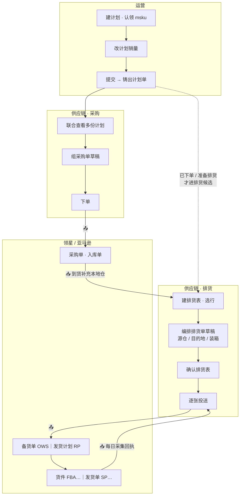
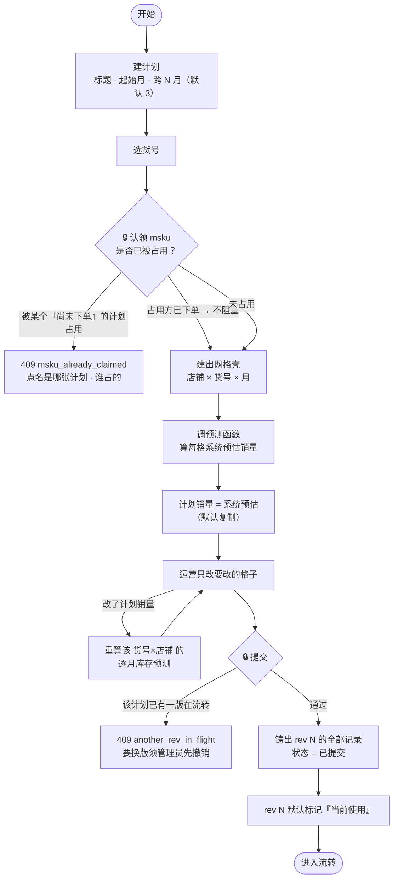
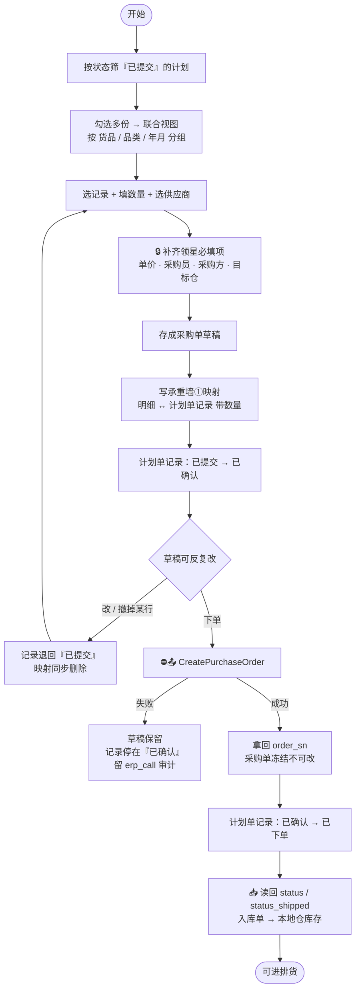
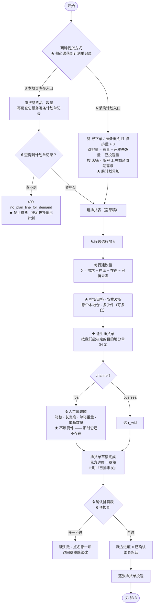
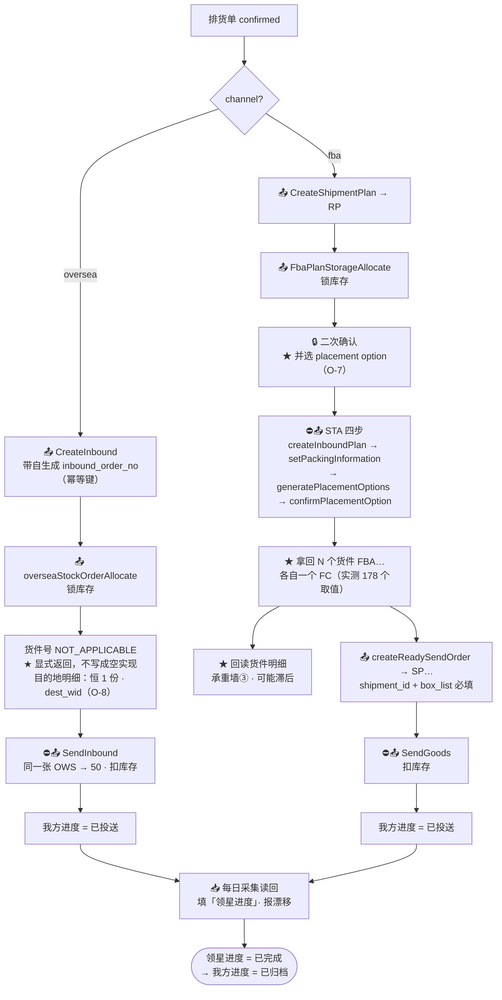
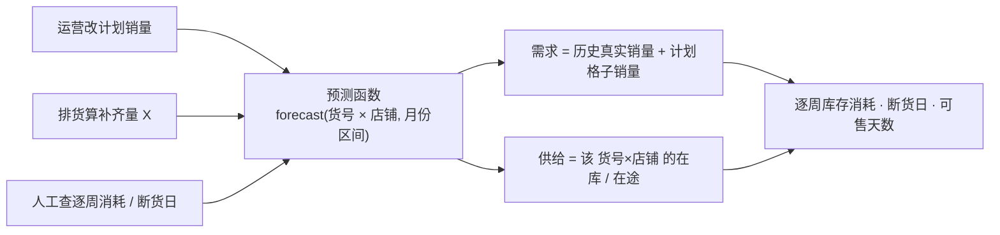

# 核心业务流程 — service_supplychain

> **这份文档要做什么**
>
> 把 `02-本体实体关系` §0 的四段流程展开成**可实现的判据**。
>
> ★ **只画主干路径的流程图没有价值。** 主干路径谁都会写，
> 系统的成败全在**闸在哪、拒了返回什么、哪一步过去就回不来了**。
> 所以本文每个流程都配三样东西：**闸 · 分支 · 不可逆点**。

| | |
|---|---|
| 版本 | v1 草案 |
| 日期 | 2026-09-16 |
| 状态 | **待确认** |
| 上游 | `02-本体实体关系`（已确认 §1~§5，裁定 A6/A8/A9/A10） |

## 阅读约定

| 记号 | 含义 |
|---|---|
| 🔒 | **闸** —— 不过就硬失败，返回明确错误码 |
| ⛔ | **不可逆点** —— 过了这一步，没有接口能退回来 |
| 📤 | **出站写** —— 调领星，必经网关，留审计 |
| 📥 | **读回** —— 从 CH 采集读回，我们不写 |

---

## 0. 全景

### 0.1 一条链，三个角色



### 0.2 ⛔ 全链路只有两处不可逆点

| # | 在哪 | 动作 | 过了之后 |
|---|---|---|---|
| ⛔1 | 采购 | `CreatePurchaseOrder` | 领星建出真单；我们的采购单**冻结不可改** |
| ⛔2a | 排货 · FBA | `confirmPlacementOption` | **产生真实亚马逊货件**；重试会建出重复货件，**无客户侧幂等键** |
| ⛔2b | 排货 · 发货 | `SendInbound` / `SendGoods` | **扣减发货仓库存**；海外仓之后**无撤销接口** |

★ 除此之外的每一步都必须可退回草稿。**设计时若发现某步退不回来，那就是漏画了一个不可逆点。**

---

## 1. 运营 · 销售计划

### 1.1 主流程



### 1.2 闸与分支

| 闸 | 判据 | 返回 |
|---|---|---|
| 🔒 认领占用 | 一个 msku 同时只被**一个尚未下单的计划**占用。**已下单的计划其占用不阻塞新认领** | `409 msku_already_claimed` + 占用方 plan_id / actor |
| 🔒 建格子 | 店铺没挂渠道 → 建不出格子 | **显式数出来并点名**，不许静默少一批 |
| 🔒 提交 · 单版流转 | 同一计划最多 1 版在流转（从「已确认」算起） | `409 another_rev_in_flight` |
| 🔒 提交 · 空格子 | 系统预估与计划销量**都没有**的格子 | 跳过并在 `skipped[]` 里**逐条列出**，不静默丢 |
| 🔒 撤销 | 仅管理员，**理由必填** | `400 reason_required` |

★ **「建不出格子」和「提交跳过」这两条都必须点名。**
静默少一批货号，运营看到的是一张「看起来正常」的计划 —— 而缺的那批正是最该被看见的。

### 1.3 两个版本标记，不是一回事

| 标记 | 含义 | 谁用 |
|---|---|---|
| **流转中** | 这一版正在走 已确认 → … → 已完结 | 采购、排货**消费**它 |
| **当前使用** | 默认最新版；运营可手动改指 | 计算需求时**读**它 |

★ **裁定（负责人 2026-09-16）**：
- **发货前** —— 按「当前使用」版本算需求
- **发货后** —— **快照冻结**，发货对应的版本不可更改

> 否则会出现：已经发货了，但运营改了「当前使用」，那笔发货的需求依据就变了。

---

## 2. 供应链 · 采购

### 2.1 主流程



### 2.2 ★ 部分下单：用「量」表达，不用「态」表达

这是承重墙① 的实际形态，也是本文**最需要你确认**的一条。

一条计划单记录（某店铺 · 某货号 · 某月）300 件，现实中会是这样：

```
A 供应商  下单 200 件   → 已有 order_sn
B 供应商  还在等报价     → 未组单
```

**不发明「部分已下单」这种状态值。** 状态按**木桶**推进，进度用**量**表达：

| 量 | 怎么来 | 例 |
|---|---|---|
| 总量 | 记录自身 | 300 |
| 已确认量 | 承重墙①求和（已组进草稿） | 200 |
| 已下单量 | 承重墙①求和（草稿已下单） | 200 |
| 未组单量 | 总量 − 已确认量 | 100 |

**状态推进判据**：
- 已确认量 = 总量 → 记录转「已确认」
- 已下单量 = 总量 → 记录转「已下单」
- 否则**停在原状态**，界面显示 `已下单 200 / 共 300`

> ★ 这样既回答了你原来担心的「7 个已下单、3 个等报价，看板上完全看不见」
> —— 看板读的是**量的分布**，不是状态值 ——
> 又不会让状态值爆炸成「部分已确认 / 部分已下单 / 部分…」。
> **能用量表达的，就不要用态表达。态只回答『到哪一步』，量回答『到什么程度』。**

### 2.3 闸与失败处置

| 闸 | 判据 | 不做的后果 |
|---|---|---|
| 🔒 单价必填 | `CreatePurchaseOrder` 的 `price` 必填 | 接口吃 500，人已经以为下完单了 |
| 🔒 采购员 / 采购方必填 | `opt_uid` / `purchaser_id` 必填 | 同上 |
| 🔒 仓库二选一 | `wid` / `sys_wid` 至少一个 | 同上 |
| 🔒 供应商二选一 | `supplier_id` / `sys_supplier_id` 至少一个 | 同上 |
| 🔒 一单一供应商 | 采购单 → 供应商是 N:1 | 混供应商的单领星建不出来 |

**失败处置**：

| 失败类型 | 判别 | 处置 |
|---|---|---|
| 连不上 | `TypeError: fetch failed`，真凶在 `e.cause.code`（`UND_ERR_CONNECT_TIMEOUT` / `ECONNRESET` / `ENOTFOUND`） | 可安全重试 —— 请求**没到达**领星 |
| 真超时 | `TimeoutError: The operation was aborted due to timeout` | ★ **必须先查重**（`PurchaseOrderList` 按 `custom_order_sn`）再决定 |
| 业务拒绝 | `code != 0` | 不重试，原样回显 `message` 给人 |

★ **两者签名互斥、处置相反。** 只看 `e.message` 会把「连不上」误读成「超时」，
进而去调大超时 —— 那是一行都不会生效的改动。

⚠️ **A2 未决**：若该租户开了采购审批流，`CreatePurchaseOrder` 建出来是 `121 待审核` 而非
`2 待到货`。那么「已下单」的语义整体错位 —— 记录转了「已下单」，货其实还没开始做。
**P0 实调必须打掉这一条。**

---

## 3. 供应链 · 排货

### 3.1 主流程



### 3.2 🔒 确认闸 —— 「搞错了不会直接发出」的真正实现

> 它是**一组可证伪检查**，不是一个状态位。
> ★ **必须在确认时硬失败，而不是发货时才炸** —— 那时已经跨过不可逆边界了。

| # | 检查 | 不做的后果 |
|---|---|---|
| G1 | 装箱数据齐全，且 `box_skus` 与 `list` 一致 | `createReadySendOrder` 吃 500，人已经以为排完了 |
| G2 | ★ FBA 排货单有店铺 `sid` —— ★ **不查货件、不查 FC**，两者投送后才有 | 要一个不存在的东西（P15）。★ 归属由**回读**落到 `consignment_split_line`，不存在事后平摊 |
| G3 | 可发量够不够 —— ★ **只读 `product_valid_num`，禁止用总量相减** | 实测 `wid=36782` 锁 3,320 / 可用 978（锁定量是可用量的 3.4 倍），按总量排**必然重复发送** |
| G4 | 没有跟别的排货表撞「已排未发」（账本水位比对） | 两张草稿先后确认 → **重复排** |
| G5 | 「疑似未关联的发货」已清零 | 在「在途」和「已排未发」各扣一次 → **少发** |
| G6 | 目的地合法（oversea 有 `r_wid`；★ fba 有 `sid`，**不含 FC**） | 建单失败，或**发错仓** |

★ G3/G4/G5 三条都是**「多扣一次」或「少扣一次」**型的错误 ——
它们的共同点是：**结果看起来完全正常**，只有对账才发现。所以必须在闸上拦，不能靠事后发现。

### 3.3 投送编排：两条链并排



**每一步都产生一行 `ext_ref`（只追加）和一行 `erp_call`（审计）。**

### 3.4 ⛔ 不可逆点与失败处置矩阵

| 步 | 可退回？ | 失败：连不上 | 失败：真超时 | 失败：业务拒绝 |
|---|---|---|---|---|
| 建单（两条链） | ✅ 可删 | 安全重试 | oversea 用 `listOrderNos` 查重；fba 查 `ShipmentPlanLists` | 回草稿，回显原因 |
| 锁库存 · oversea | ⚠️ **无释放接口**；仅 `DeleteOverSeaStockOrder`（限 10/20/30/40），是否释放锁定 **= A5 待实调** | 重试前先查当前 status | 同左 | 多为「可用库存不足」→ 回草稿 |
| 锁库存 · fba | ✅ `FbaPlanStorageRelease` | 安全重试 | 先查再重试 | 回草稿 |
| **STA 建货件** | ⛔ **不可逆** | ★ **绝不自动重试** | ★ **绝不自动重试** | ★ **绝不自动重试** |
| 建 SP 发货单 | ✅ `outboundOrderReleaseStock`（解锁 + 退回待配货） | 安全重试 | 查 `searchProcessResult` | 回草稿 |
| **发货** | ⛔ **不可逆 · 已扣库存** | 先查 status 确认是否已扣 | 同左 | 回显 |

★ **STA 那一族的处置只有一条：任何失败都转人工。**
理由：无客户侧幂等键，只能事后凭 `taskId` 轮询 `Operate`。
自动重试一次 = 多一个真货件 = 多一批真的货被安排到亚马逊仓 —— **而这没有接口能撤。**

⚠️ **A3 未决**：草稿阶段是否立即锁库存。
- 不锁 → **A 区敞口**：建了单但库存视图里看不见，任何并发排货方都认为它可用
- 锁了 → 海外仓**解不开**

**在 A5 实调出结果之前，这条不许拍板。**

### 3.5 回执

```
海外仓：  📥 OWS… → status 60 + r_wid 入库记录对上 → 完结
FBA：     📥 发货单 SP… → 货件 FBA… → FC 入库 → 完结
```

★ **判据陷阱**：
- FBA 头程发货单的送达**用 `delivery_date` 非空判断，不可用 `status`**（实测 `status=2 已完成` 从未出现）
- 亚马逊货件 `DELIVERED ≠ 已入库`（实测 220 行 4,719 件，`quantity_received` 全为 0）
- 海外仓 `status=50` 内部**混有部分收货**（`sub_status` 才分得开），不可当作「一件未收」

---

## 4. 预测：三个调用入口

★ **预测是一个被调用的函数，不是一个每天跑的批。** 没有 `run_id`、没有分区、没有保留策略。



| 入口 | 触发 | 范围 |
|---|---|---|
| 计划页 | 改了计划销量 | **该 货号 × 店铺**，一格 |
| 排货 | 算每行建议量 X | 排货表覆盖的 N 个 货号 × 店铺 |
| 查询 | 人工按日期查 | 指定的 N 个 货号 × 店铺 |

⚠️ **已知代价**：没进任何计划的货号，**没人算它，断货了系统不吭声**。
这是 2026-09-16 明确接受的取舍。

⚠️ **需求侧已知偏差（继承自旧项目，仍未修）**：订单是**滞后采集**的，
实测同一下单日首次采集只能看到最终销量的 **0.5%~62%**，1~4 天才稳定。
而指数加权把**最高权重恰好压在最不完整的那几天** → `base_rate` 系统性低估约 **23%**。
★ **用完整历史数据做的回测看不见这个偏差。**

---

## 5. 全链路状态对照

| 环节 | 计划单记录 | 排货单 「我方进度」 | 外部 「领星进度」 |
|---|---|---|---|
| 运营提交 | 已提交 | — | — |
| 组进采购单草稿（量满） | 已确认 | — | — |
| 下单成功（量满） | 已下单 | — | — |
| ★ **首次到货**（到货量 > 0） | **准备排货** | — | — |
| 加进排货表 | 准备排货 | `draft` | — |
| 确认排货表 | 准备排货 | `confirmed` | — |
| 投送成功（★ **已投送量** = 总量 才转） | **已排货** | `dispatched` | `30 → 40 → 50` |
| 回执完结 | 已完结 | `closed` | `60` / `CLOSED` |

★ **两个时点容易写错，都在这张表里纠正过：**

1. **「准备排货」的时点在「首次到货」，不在「确认排货表」。**
   ★ **不要求全部到货** —— 一张采购单会分多笔入库，到一批就能排一批。
   「准备排货」是**可长期停留的状态**，不是里程碑：排完当前这批后它仍停在这儿，等下一批。
2. **「已排货」的时点在「投送成功」，不在「确认排货表」。**
   确认只是我们的意图；投送成功才是外部事实。且要**已投送量 = 总量**才转
   —— ★ 只认已投送的，**不认还在草稿里的**（见 `04` §2.5 坑②）。

★ **排货候选** = 状态 ∈ {已下单, 准备排货} **且 待排量 > 0**
（待排量 = 总量 − 已排未发量 − 已投送量，★ 两者必须分开，见 `04` §2.5 坑②）。
物理够不够由人看**本地仓可发量**判断，最终由确认闸 G3 兜底 ——
★ **待排量与可发量不相减、不合成一个数**，它们量纲不同（见 `04` §1.2.2）。

---

## 6 悬而未决

> ★ **未决项只在 `00-待裁定清单.md` 一处维护，本文只引用。**
> 两处维护必然分叉 —— 本文曾经就出现过「已裁定但这里还写着待定」。

本文相关的未决项，**只剩 P0 实调**：C-1 · C-2 · C-3 · C-4（见 `00-待裁定清单` C 组）。

本文原先列的 B1~B4 与 C4 **已全部裁定**：

| 原编号 | 裁定 |
|---|---|
| B1 | 部分下单用**量**表达，不用态 |
| B2 | 下单失败**停在「已确认」**（= `00` 的 A-7） |
| B3 | 「已排货」时点在**投送成功** |
| B4 | 没有计划单记录的**禁止排货**，先补销售计划 |
| C4 | 到货量**不摊回**计划单记录 |
