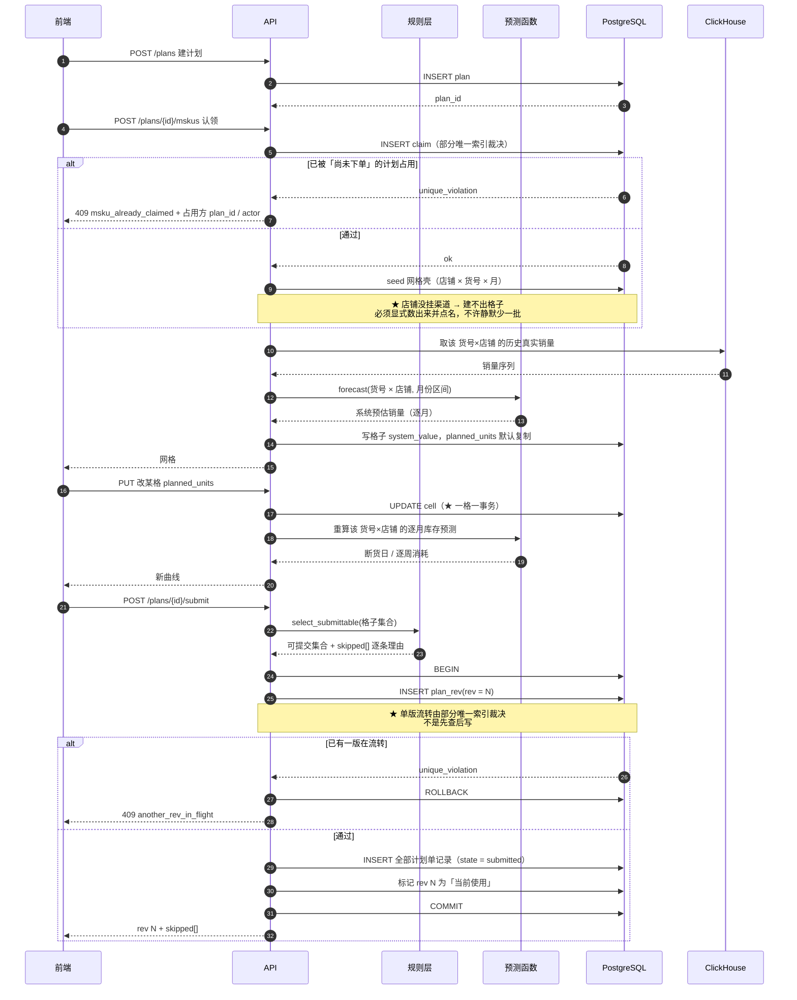
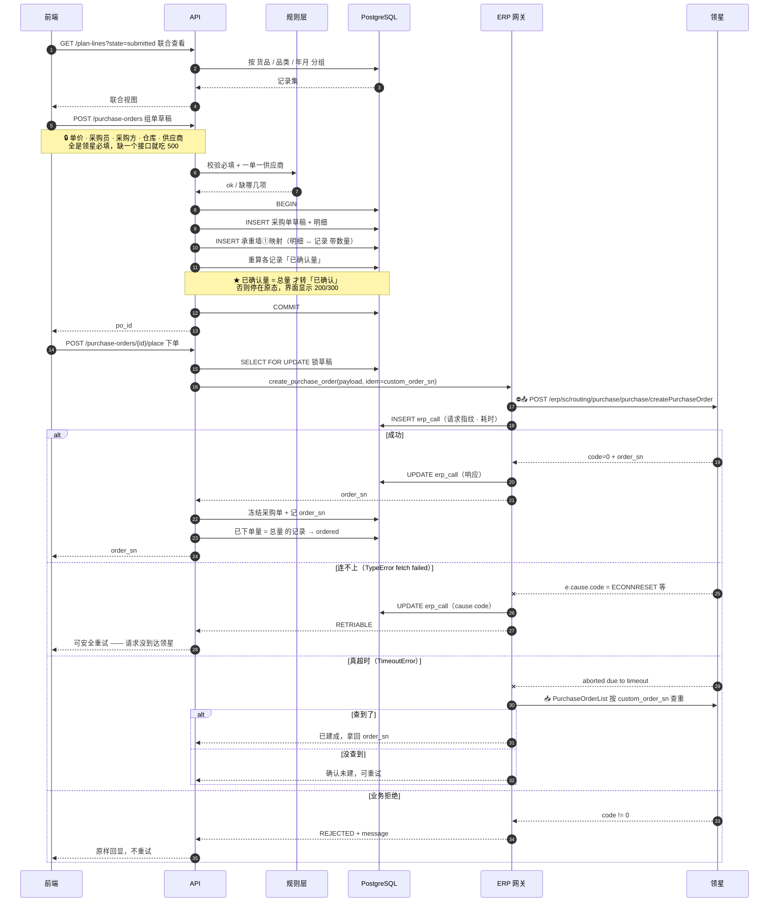
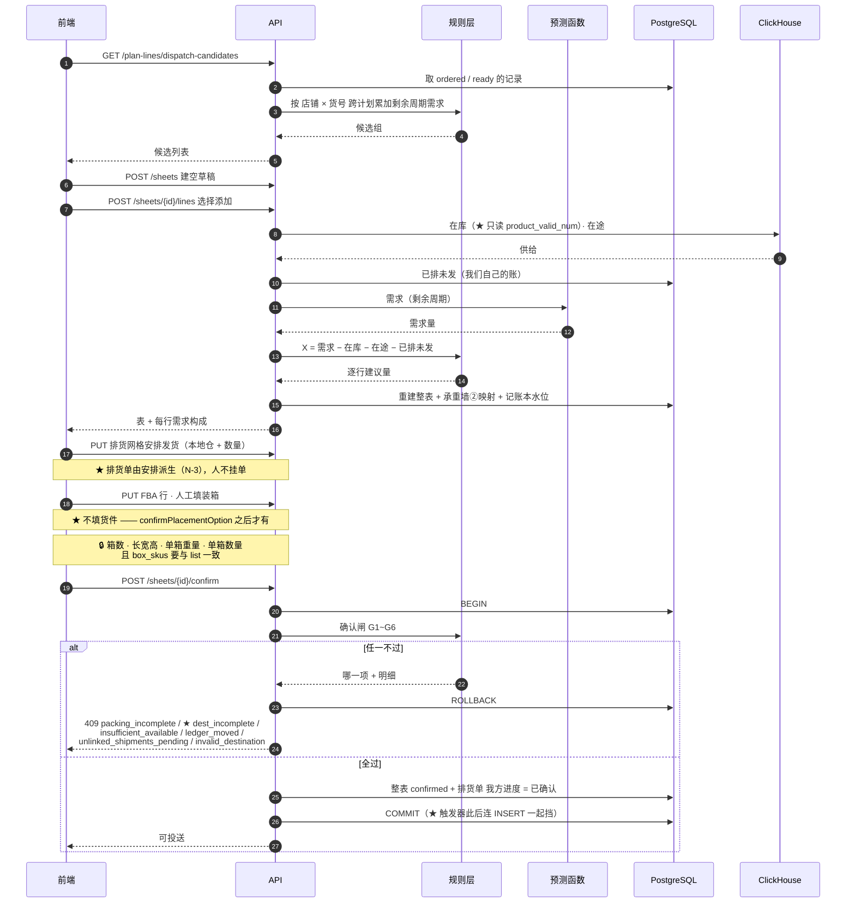
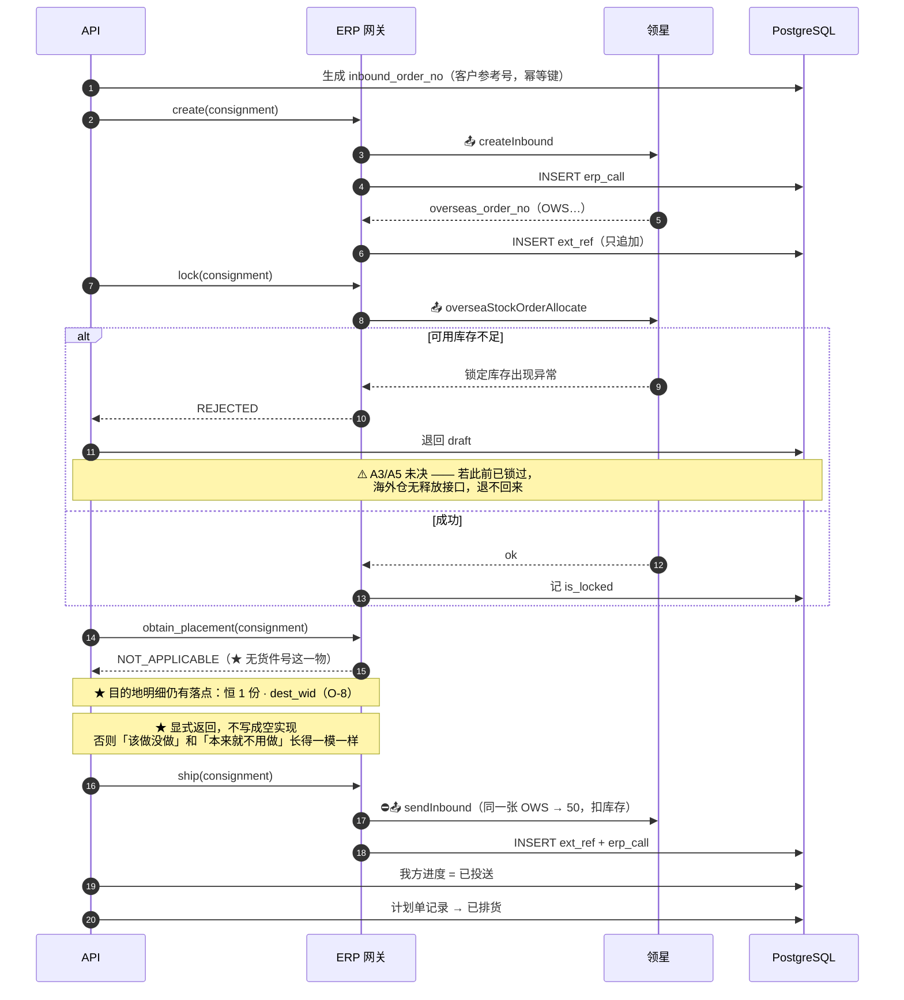
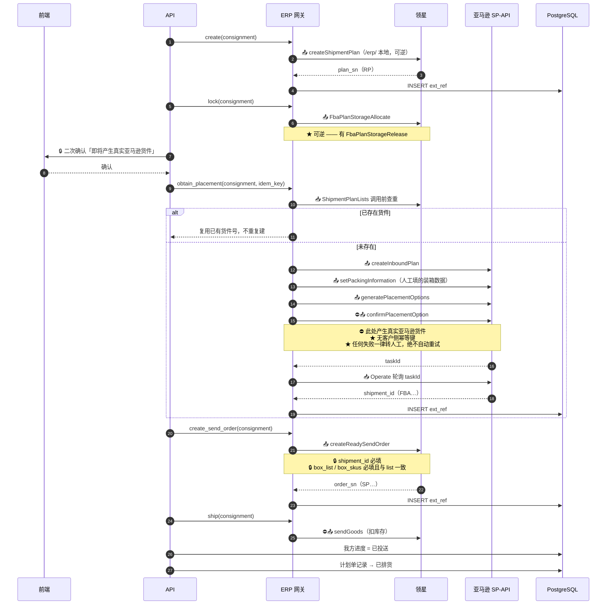
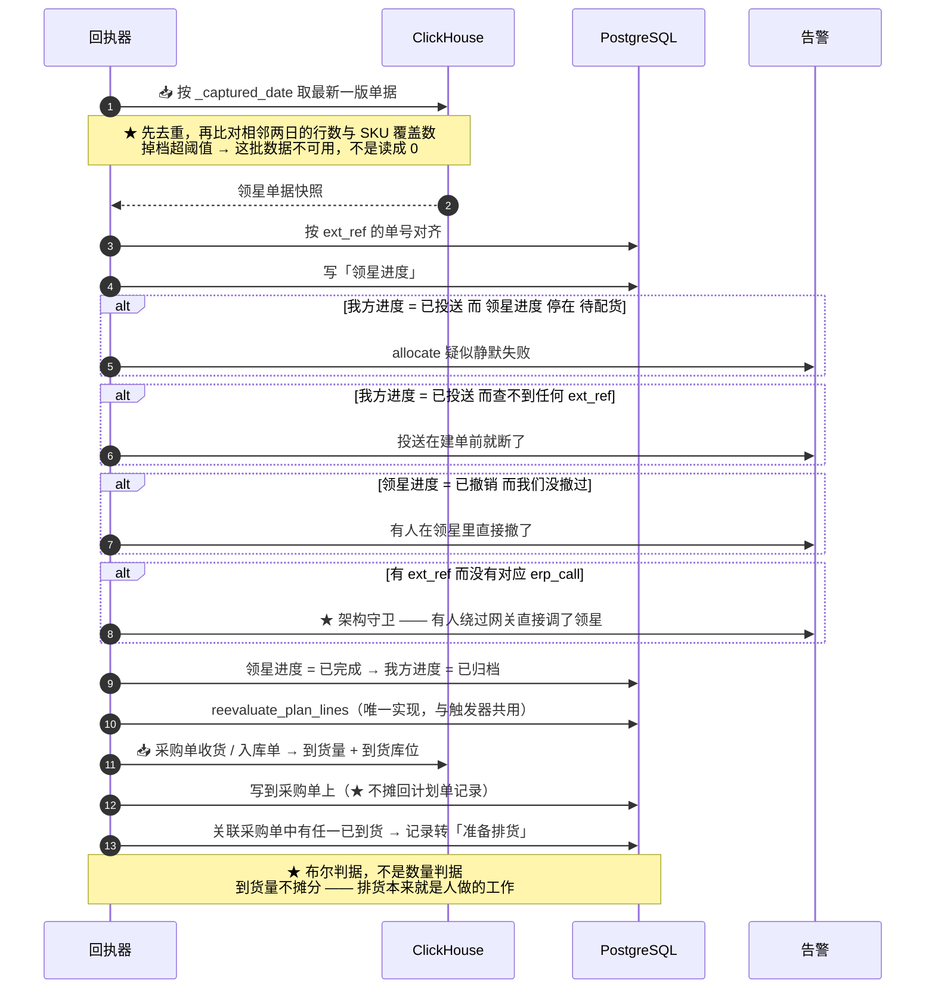
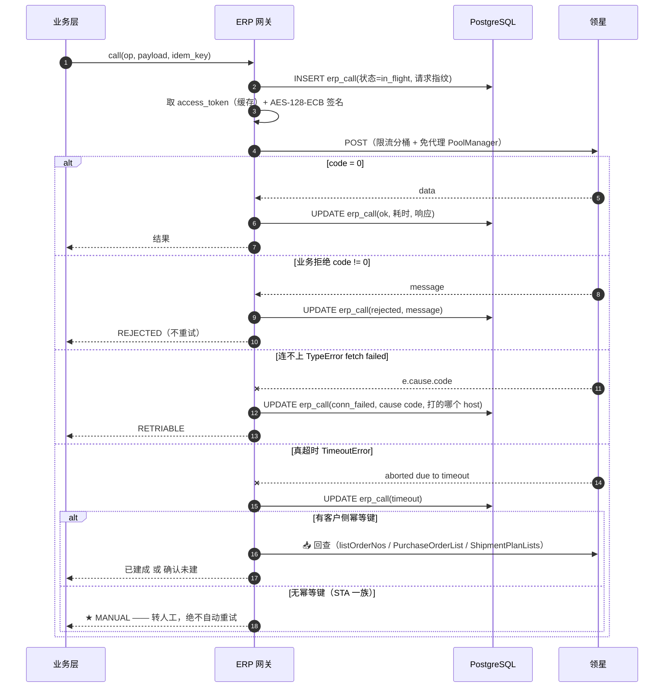

# 核心业务模块时序 — service_supplychain

> **这份文档要做什么**
>
> 把 `06-核心业务流程` 的每段落到**模块之间的调用次序**上，回答：
> **谁调谁 · 在哪个事务里 · 失败了从哪一步重来。**
>
> ★ **只画成功路径的时序图是装饰品。** 每张图都必须画出 `alt` 分支，
> 并标出**事务边界** —— 因为绝大多数难查的 bug 都长在
> 「跨了事务边界还以为没跨」这件事上。

| | |
|---|---|
| 版本 | v1 草案 |
| 日期 | 2026-09-16 |
| 状态 | **待确认** |
| 上游 | `06-核心业务流程`、`04-状态流转` |

## 参与者

| 简称 | 是什么 | 边界 |
|---|---|---|
| `UI` | ★ **本仓前端 `web/`** | ★ **在本仓**（Q-1）；打 `api/ui/` |
| `API` | 接口层 —— SQL · 事务 · 状态码 | |
| `RULE` | 规则层 —— **纯判据，只用标准库，离线可测** | ★ 不连库、不发 HTTP |
| `FCST` | 预测函数 —— **按需纯函数** | ★ 无批、无 run_id |
| `PG` | PostgreSQL `jxd_ml` · schema 独占 | 本服务全部业务数据 |
| `GW` | **ERP 网关 —— 唯一出站写入口** | ★ 业务层不许直接发 HTTP |
| `LX` | 领星 OpenAPI | |
| `CH` | ClickHouse `jxd_raw` | ★ **只读** |

---

## 1. 运营提交计划



**读这张图要看什么**

| 看点 | 为什么 |
|---|---|
| 第 5 / 26 步两处冲突**都由库层裁决** | 先查后写在并发下必然漏，而且漏的时候不报错 |
| `skipped[]` **逐条理由**回给前端 | 静默跳过 = 运营看到一张「看起来正常」的计划，而缺的那批正是最该被看见的 |
| 提交是**一个事务**铸出全部记录 | 半铸的计划单无法解释 |
| 改一格是**一格一事务**，重算在事务外 | 预测慢不该把行锁攥着 |

---

## 2. 供应链组单 → 下单



**读这张图要看什么**

★ **「连不上」与「真超时」必须分开处置，而且它们签名互斥：**

```
真超时  → TimeoutError: The operation was aborted due to timeout   → 必须先查重
连不上  → TypeError: fetch failed，真凶在 e.cause.code            → 可安全重试
```

只看 `e.message` 会把后者误读成前者，进而去调大超时 —— **那是一行都不会生效的改动**。
而反过来把真超时当连不上直接重试，就是**重复下单**。

---

## 3. 排货建表 → 确认闸



**读这张图要看什么**

★ **确认闸跑在事务里，不过就 ROLLBACK。**
G3/G4/G5 三条都是「多扣一次 / 少扣一次」型错误 —— **结果看起来完全正常，只有对账才发现**。
所以必须在闸上拦死，不能靠事后发现。

---

## 4. 投送 · 海外仓



★ **海外仓天然幂等**：`inbound_order_no` 必填且唯一，超时后用 `listOrderNos` 回查即可确定是否已建。

---

## 5. 投送 · FBA（含 STA 硬闸）



**读这张图要看什么**

| 看点 | 为什么 |
|---|---|
| 第 5 步的**二次确认在 API 之上**，不是网关内部 | 网关不该知道「人要不要点确认」 |
| 第 8 步**调用前查重**是 FBA 唯一的幂等手段 | STA 一族没有客户侧幂等键 |
| `confirmPlacementOption` 后**必须轮询 `taskId`** | 它异步返回，不轮询就不知道货件号 |
| 装箱数据从 §3 的人工填写**一路带到 `setPackingInformation` 和 `createReadySendOrder` 两处** | 两处都必填，且要一致 |

★ **副作用必须在网关里按 path 前缀硬编码**，**按接口名判断会错** ——
`CreateShipmentPlan`（`/erp/`）与 `CreateSTATask`（`/amzStaServer/`）名字长得一样像。

★★ **前缀有三类，不是两类**（`17` 实测，2026-09-22 修）：

| 前缀 | 打到哪 | 可逆 |
|---|---|---|
| `/amzStaServer/` | ★ 亚马逊 | ⛔ **不可逆** |
| `/erp/` | 领星本地 | 可逆 |
| ★ `/basicOpen/` | 领星本地，★ **里面有写接口** | 可逆，但**是写** |

★ 实测的写接口：`/basicOpen/purchase/setOrderFinish`（整单结束到货）·
`/basicOpen/inboundOrder/inbound/setInbound`（待入库 → 已完成）·
`/basicOpen/selfShipmentOrder/deliveryGoods`（★ **标记出库、扣库存**）。

⚠️ **只认两类前缀的网关会把 `/basicOpen/` 判成「未知」** ——
而未知路径要么被放过（写进去了没人知道），要么被拦死（功能不通）。两种都错。

---

## 6. 每日回执对账



★ **第 2 步那条注释是整个回执器最容易被跳过、也最贵的一条。**
库存与单据日报实测会**整天缺、会掉档、会有重复行**（某日 2,217 行 / 780 SKU，
较前一日少约 40%）。**掉档那版里有货的仓会直接不出现，看起来像出库了。**
把缺失读成 0，对账就会凭空冒出一堆假差额。

---

## 7. 横切：一次出站写的完整时序

> ★ 这张图是**每一次** 📤 都要走的，上面各图里的 `GW->>LX` 都是它的缩写。



**`erp_call` 一行必须能回答三问**：

| 问 | 字段 |
|---|---|
| **打的谁** | host + path |
| **多久** | 耗时 |
| **怎么 failed 的** | `code` / `message`，或 `e.cause.code` + 打的哪个 `IP:port` |

★ **重试「成功」的那次抖动同样要留痕** —— 否则重试成功后没有任何地方记得它抖过，
下次再抖也查不出规律。

★ **回退分支必须有声。** `try/catch` 里不留日志的回退，会让「代理挂了」和「接口本身就错」
长得一模一样 —— 这是最坏的一种。

---

## 8 悬而未决

> ★ **未决项只在 `00-待裁定清单.md` 一处维护，本文只引用。**
> 两处维护必然分叉 —— 本文曾经就出现过「已裁定但这里还写着待定」。

| # | 问题 | 状态 |
|---|---|---|
| **D2** | 回执器的运行频率与触发方式 | ★ **本轮裁定**，见下 |
| C-5 | STA 四步中途失败的**残留态**怎么清 | ★ P0 实调（有 `cancelInboundPlan`，适用状态未知） |
| C-1~C-4 | 见 `00-待裁定清单` C 组 | ★ P0 实调 |

D1（FBA 二次确认每张一次）**已裁定** = `00` 的 B-3。

### D2 裁定：回执器怎么跑

| 项 | 裁定 | 理由 |
|---|---|---|
| 频率 | **每日一次**，cron，在 CH 采集窗口之后 | CH 延迟 ≥ 1 天，跑更密没有新数据 |
| 触发 | cron；另留一个**仅运维可用**的手动触发 | 出问题时要能立刻重跑 |
| 读哪一版 | ★ **取 `max(_captured_date)` 的最新一版，不做认知时间回放** | 单据状态表是**覆盖型**的 —— `_captured_date <= X` 在覆盖型表上滤掉的恰恰是最新数据 |
| `observed_on` | 该批 CH 数据的 `_captured_date` | 观察的是「那一天采到的样子」 |
| 第一步 | ★ **先跑采集面校验**（UC-S4），掉档超阈值 → 整批不可用、不写 | 把缺失读成倒退比读成 0 更糟 |
| 失败粒度 | 按 `ext_ref` 分批，**一批失败不影响其它批** | — |
