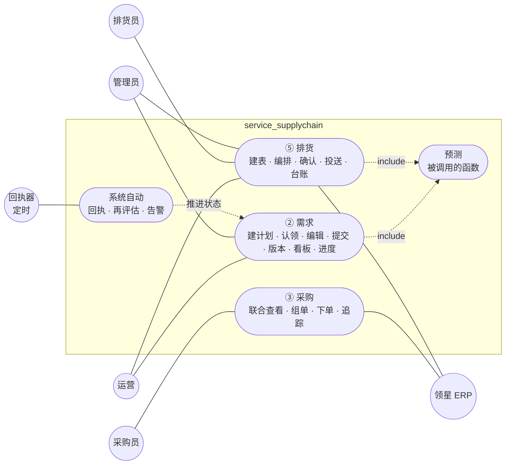
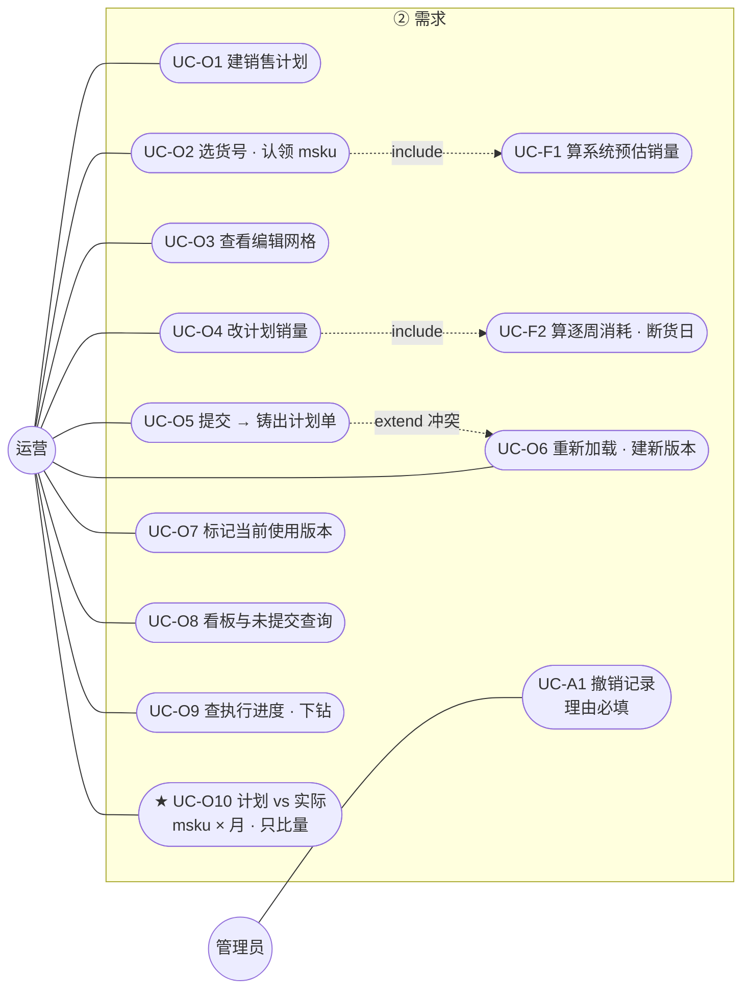
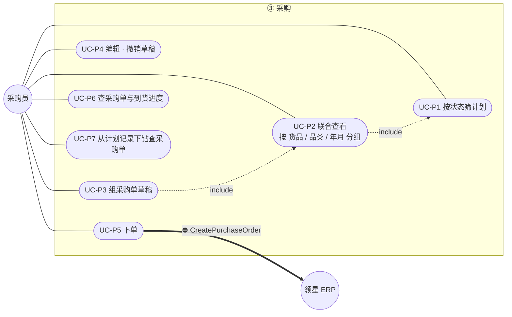
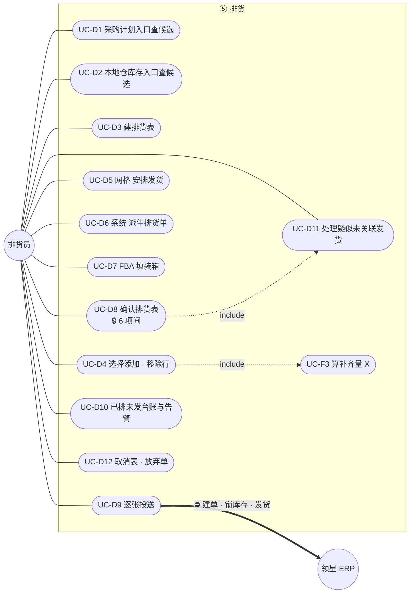
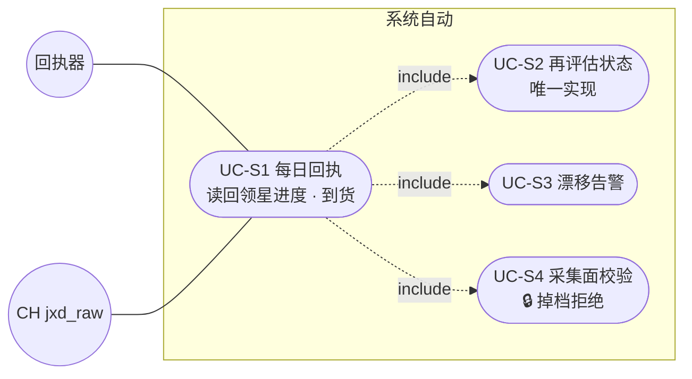

# 项目核心功能用例图 — service_supplychain

> **这份文档要做什么**
>
> 把「谁 · 要做什么 · 需要哪些数据」一次列清。
> ★ **§3 的「读什么 / 写什么」两列是给 `03-数据库表清单` 用的** ——
> 用例决定表，不是表决定用例。
>
> ★ 本文还有一个作用：**把模型里缺的东西逼出来**。
> 见 §6 —— 写用例的过程已经暴露了 5 个 `02` 里没有的数据。

| | |
|---|---|
| 版本 | v1 草案 |
| 日期 | 2026-09-16 |
| 状态 | **待确认** |
| 上游 | `02-本体实体关系`、`04-状态流转`、`06-核心业务流程` |

---

## 0. 参与者

| 参与者 | 是谁 | 边界 |
|---|---|---|
| **运营** | 提需求的人 | 只关心「我要卖多少、我的货走到哪了」 |
| **采购员** | 供应链 · 整理下单 | 把需求变成采购单 |
| **排货员** | 供应链 · 安排发货 | 把本地仓的货变成发到目的仓的单 |
| **管理员** | 有撤销权的人 | ★ 本服务**只记录不鉴权**，权限由上层控制 |
| **回执器** | 系统自身（定时） | 每日从 CH 读回，推进状态 |
| **领星 ERP** | 外部系统 | 单据真相 |

★ **「运营 / 采购员 / 排货员」是角色不是账号。** 本服务只记 `actor`，
不校验谁能做什么 —— 所以用例图上的连线表达的是**业务归属**，不是权限。

---

## 1. 用例总图



★ **运营也连到 ⑤排货**，但只是**查进度**（UC-O9），不是操作排货。
★ **预测被两处 `include`**，自己不面向任何人 —— 它没有独立入口。

---

## 2. 分域用例图

### 2.1 ② 需求域



### 2.2 ③ 采购域



### 2.3 ⑤ 排货域



★ **`UC-D8 include UC-D11`**：确认闸的 G5 要求「疑似未关联的发货」清零 ——
**所以处理未关联发货不是可选动作，是确认的前置。**

### 2.4 系统自动



★ **`UC-S1 include UC-S4`**：采集面校验是回执的**第一步**，不是可选检查。
掉档超阈值 → **整批数据不可用，不写** —— 否则会把缺失读成倒退。

---

## 3. ★ 用例 → 数据（`03-数据库表清单` 的输入）

> 「写」列里凡是**没有对应表**的，就是 `03` 必须新建的。

### 3.1 ② 需求域

| 用例 | 读 | 写 |
|---|---|---|
| UC-O1 建计划 | — | 销售计划 |
| UC-O2 认领 msku | 货号·msku·店铺（CH 镜像） | **msku 认领占用**、草稿格子（seed） |
| UC-O3 查看编辑网格 | 草稿格子、认领 | — |
| UC-O4 改计划销量 | 历史销量（CH）、在库在途（CH） | 草稿格子 |
| UC-O5 提交 | 草稿格子 | 计划单、**计划单记录**、`skipped[]` 留痕 |
| UC-O6 建新版本 | 计划单历史 | 计划单（新 rev） |
| UC-O7 标记当前使用 | 计划单 | 计划单.当前使用 |
| UC-O8 看板 | 计划单记录状态 + **承重墙①②求和** | — |
| UC-O9 查进度下钻 | ★ **承重墙①②反查**、采购单快照、排货单、外部单据引用 | — |
| UC-A1 撤销记录 | — | 计划单记录事件（理由必填） |
| ★ **UC-O10 计划 vs 实际** | 计划单记录（计划销量）+ ★ **实际销量**：FBA `amazon_sp_api_report_all_orders` · FBM `lingxing_warehouse_wms_order_list` | — ★ **只读，不回写计划** |

### 3.2 ③ 采购域

| 用例 | 读 | 写 |
|---|---|---|
| UC-P1 筛计划 | 计划单、计划单记录 | — |
| UC-P2 联合查看 | 计划单记录、**货号→品类映射** | — |
| UC-P3 组采购单草稿 | 计划单记录、供应商镜像 | 采购单、采购单明细、**承重墙①** |
| UC-P4 编辑撤销草稿 | 同上 | 同上（触发再评估） |
| UC-P5 下单 | 采购单草稿 | 采购单.order_sn、**网关调用审计** |
| UC-P6 查采购单进度 | **采购单快照**（CH）、入库单 | — |
| UC-P7 下钻查采购单 | ★ **承重墙①反查** | — |

### 3.3 ⑤ 排货域

| 用例 | 读 | 写 |
|---|---|---|
| UC-D1 采购计划入口 | 计划单记录、承重墙①② 求和 | — |
| UC-D2 本地仓入口 | 本地仓在仓量（CH）、★ **货号→计划记录反查** | — |
| UC-D3 建排货表 | — | 排货表 |
| UC-D4 选择添加行 | 在库·在途（CH）、已排未发 | 排货行、**承重墙②**、**账本水位** |
| UC-D5 网格安排 | 可发量 `product_valid_num`（CH）、★ **仓**（不是库位） | ★ `dispatch_arrangement`（人填的唯一落点） |
| UC-D6 派生排货单 | 库位·店铺 | ★ 排货单 · 排货行（**系统派生**，N-3） |
| UC-D7 装箱 | —— | ★ 排货行.**装箱信息**（★ 不含货件号 —— 那时它还不存在） |
| ★ UC-D13 回读货件明细 | 货件与其货号明细（CH） | ★ `consignment_split` / `_line`（承重墙③） |
| UC-D8 确认 🔒 | 全部闸所需数据 | 排货表.状态、排货单.我方进度、**确认时水位** |
| UC-D9 投送 | 排货单 + 行 | **外部单据引用**、**网关调用审计**、我方进度 |
| UC-D10 台账告警 | 承重墙②、外部单据引用、阶段观察 | — |
| UC-D11 未关联发货 | CH 发货单 ⊖ 我们的外部单据引用 | **未关联认领表**（只追加） |
| UC-D12 取消 · 放弃 | — | 排货表 / 排货单 事件 |

| ★ **UC-D14 发货单管理** | 头程发货单（SP / OWS）· ★ **头程收货状态**（`inboundBatchesReceipt` / `inboundCompleteReceipt` / FBA 收货）· 货件 N 份 | — 只读回执 |

### 3.4 系统与预测

| 用例 | 读 | 写 |
|---|---|---|
| UC-S1 每日回执 | CH 单据快照、采购单到货 | **阶段观察**（只追加） |
| UC-S2 再评估 | 承重墙①②求和、阶段观察 | 各状态机事件表 + 物化列 |
| UC-S3 漂移告警 | 我方进度 vs 阶段观察、外部单据引用 vs 网关审计 | **告警记录** |
| UC-S4 采集面校验 | CH 相邻两日行数 · 覆盖数 | **采集面留痕**（每轮一行） |
| UC-F1/F2/F3 预测 | 历史销量、计划格子、在库在途 | ★ **不写任何表** |

---

## 4. 关键用例的前置与后置

| 用例 | 前置（不满足就拒） | 后置 |
|---|---|---|
| UC-O2 认领 | msku 未被「尚未下单」的计划占用 | 占用 + 网格 seed；**建不出格子的要点名** |
| UC-O5 提交 | 该计划无其它版本在流转 | 铸出 rev N 全部记录；`skipped[]` 逐条列出 |
| UC-P3 组单 | 记录状态 ∈ {已提交, 已确认} | 承重墙①写入 → 触发再评估 |
| UC-P5 下单 | 单价 · 采购员 · 采购方 · 仓库 · 供应商 齐全；一单一供应商 | 拿到 `order_sn` 才冻结；**失败停在草稿** |
| UC-D4 加行 | 记录状态 ∈ {已下单, 准备排货}；★ **必须有计划记录来源** | 承重墙②写入 + 记账本水位 |
| UC-D8 确认 | 🔒 6 项闸全过 | 整表冻结；不过则 ROLLBACK 并点名 |
| UC-D9 投送 | 所属排货表 = 已确认 | 产生外部单据引用；★ **跨不可逆点后不可退回** |
| UC-A1 撤销 | 非终态；**理由必填**；已有 `order_sn` 或已投送 → 拒 | 追加事件；★ 此后不参与任何求和 |

---

## 5. 哪些用例暴露成接口

| 类别 | 是否有 HTTP 接口 | 说明 |
|---|---|---|
| UC-O* / P* / D* | ✅ | ★ **本仓前端 `web/`** 调用 `api/ui/`（Q-1）|
| **UC-F1/F2/F3 预测** | ✅ **但也被内部直接调用** | ★ 同一个纯函数，两个调用者 |
| **UC-S2 再评估** | ❌ | ★ **只由触发器与回执器调用，不暴露** —— 暴露就等于给了绕过事实的入口 |
| UC-S1/S3/S4 | ❌ | 定时任务 |

---

## 5.5 ★★ UC-O10：终端客户**不与销售计划直接关联**（R-5）

```
计划销量[msku, 月]     ←—— 计划单记录
实际销量[msku, 月]     ←—— FBA 订单报表 + FBM 销售出库单
              ★ 只在「msku × 月」这一层对齐，**不做行级归因**
```

★ **为什么不做行级归因**：货是混在池子里卖的 —— 同一批货可能来自多次采购、
多个计划。「这一单卖的是哪张计划的货」**做不出来，也无法证伪**。
降到月度汇总，是把一个假精度换成一个真结论。

★ **界面判据**：两个数**并排 + 差额**，★ **不许合成「达成率」** ——
达成率会把「卖超了」和「没进货」压成同一个数，而这两件事处置相反。

⚠️ **UC-O10 只解决「回看」。** 「前看」——预测里期望销量扣哪个库存池——
是 **M-4**，未裁定（`00` M 组）。两者不要混。

★ 数据源的两个坑（`18` 实测）：
FBM 那张表 `status` 全为「已出库」是**采集口径**（厂商接口只返回近一个月），
不是业务全貌；运费两列**币种不同**（CNY / USD），不参与本用例但别顺手相减。

---

## 6. ★ 用例暴露出的缺口（`02` 里没有的）

> 这正是先写用例再设计表的理由。

| # | 缺口 | 哪个用例暴露的 | 影响 |
|---|---|---|---|
| **U1** | **货号 → 品类 映射** | UC-P2 要「按品类分组」 | `02` §5 把「品类」列为**刻意不建**（PM 持有）。但用例需要它 → **至少要镜像一张 `货号→品类` 表**，否则联合查看做不出分组 |
| **U2** | **「未提交」的定义** | UC-O8 要查「谁的计划还没提交」 | 计划有格子但从未铸出 rev？还是最新 rev 之后又改了格子？**两种定义给出的名单不一样** |
| **U3** | **承重墙①② 的反向索引** | UC-O9 / UC-P7 要从计划记录下钻 | 承重墙是为「求和」建的（按计划记录聚合）；下钻要的是**反方向**（按采购单/排货单找回计划）→ 需要双向索引 |
| **U4** | **告警记录表** | UC-S3 | `02` 里没有任何告警对象。告警若只写日志，「昨天那条漂移后来怎么了」查不到 |
| **U5** | **采集面留痕** | UC-S4 | 掉档判断要比对**相邻两日**，就必须存住每轮的行数与覆盖数 —— `02` 里没有这张表 |

### ★ 一个需要你裁定的粒度问题

**认领是 msku 级，格子是 货号 级** —— 两者粒度不同：

```
认领：  美国店A · msku-001（旧 listing）
        美国店A · msku-002（新 listing）   ← 同一个货号 DCC1800264
格子：  美国店A · DCC1800264 · 11月       ← 只有一个
```

那么这个格子的系统预估销量 = **两个 msku 的销量之和**（同一 listing 上并存，必须求和）。

但由此产生两个问题：

| 问题 | 待定 |
|---|---|
| 只认领 msku-001、不认领 msku-002，格子该算谁的销量？ | 只算已认领的？还是该货号全部？ |
| 界面上要不要让运营看见「这个格子由哪几个 msku 撑着」？ | 不看见 → 数对不上时无从解释 |

---

## 7 悬而未决

> ★ **未决项只在 `00-待裁定清单.md` 一处维护，本文只引用。**
> 两处维护必然分叉 —— 本文曾经就出现过「已裁定但这里还写着待定」。

本文相关的未决项：★ **C-1 已被实测打掉**（审批流未开，`auditor_time` 143/143 空）·
★ **C-6 已由采集侧回答**；余 C-2 · C-3 · C-4 · C-5 · C-7 · C-8 · C-9（见 `00-待裁定清单` C 组）。

本文原先列的 U1~U6 **已全部裁定**（在 `00` 中编号为 A-1~A-6）：

| 原编号 | 裁定 |
|---|---|
| U1 | ★ 建 `货号→品类` 镜像表 + 刷新留痕 + **陈旧度守卫** |
| U2 | 「未提交」★ **两栏都显示**，第二栏按**内容哈希**判定 |
| U3 | 承重墙**两个方向都建索引** |
| U4 | 告警**先不落表**，留给后续可观测阶段 |
| U5 | 采集面**每轮落一行** |
| U6 | 格子保持**货号级**；msku 作销量归属 + 可展开明细 |
