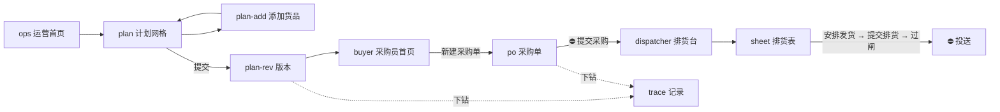

# 前端交互界面 — service_supplychain

> ★ **前端在本仓实现**（Q-1，2026-09-21 裁定）—— 前后端分离在**仓内**。
> 本文是**本仓前端的架构与交互规格**，不再是「给别人的规格」。
> jxd_ai_ops 降为下游：**数据查询分析 + AI 操作**，只消费 `api/pub/`。

| | |
|---|---|
| 版本 | v3（2026-09-21 前端并入本仓） |
| 状态 | 架构已定 · ★ 前端第一版未开工（`00d` W7） |
| 计划 | ★ `00d-前端并入本仓改造计划.md` |
| 上游 | `08` 接口 · `09` 用例 · `04` 状态流转 · `15` 排货 · `16` 边界 |
| 原型 | ★ `docs/prototype/index.html` |
| 作废 | ⚠️ `docs/html/` 是被否掉的早期设计稿，**不再维护，不要参照** |

---

## 0. ★★ 前端架构

### 0.1 栈与目录

```
web/                       React + Vite + TypeScript（Q-4）
├── src/pages/             按角色分：运营 · 采购员 · 排货员
├── src/api/               ★ 数据层：mock | api 可切换（Q-6）
├── src/styles/            ★ 墨迹设计系统 —— 纯 CSS，从原型原样带来，不重画
└── dist/                  构建产物 → FastAPI StaticFiles 托管
```

★ **不引 UI 组件库** —— 墨迹系统已成形，再引一套等于两种视觉语言（`00d` §4）。

### 0.2 ★ 数据层可切换 —— 这是「前后端同时进行」的实现手段

```
mock   内存/假数据，前端独自跑通交互
api    打 api/ui/ 的真接口
```

★ 与后端现有的 `ch | fixture` **同构**：同一套代码，换数据源。
接口逐个到位就逐个切过去 —— **不用等后端全做完才看到界面**。

### 0.3 ★ 前端不许做的三件事（`01` §3.1 的 L8~L10，由测试强制）

| # | 不许 | 否则 |
|---|---|---|
| L8 | `web/` 里出现 PG / CH / 领星的连接 | 事务边界与出站网关全部失效 |
| L9 | `web/` 打 `api/ui/` 之外的路径 | 打 `api/pub/` 会让**契约被界面改动牵着走** |
| L10 | `api/pub/` 依赖 `api/ui/` | 改个界面把 jxd_ai_ops 打挂 |

### 0.4 ★ 界面文案仍受那条铁律约束

**不要写详细冗余的功能描述或解说**（`CLAUDE.md`）。
说明一律进折叠区（`.fold`），默认收起。★ **屏幕给数据，文档给论证。**

---

## 1. 七条交互原则（从领域来，不是审美）

### 一 · 量与态分开，不合成

```
✅  已下单  200 / 共 300
❌  部分已下单              ← 300 里下了多少看不见
```

### 二 · 两轴并置，不一致要高亮

```
我方进度  已投送
领星进度  待配货  ⚠
```

★ **不一致本身就是信息**（多半是 allocate 静默失败）。合成一个字段，信号永久消失。

### 三 · 三个真实的数并排，不给「可排量」

```
待排 160     可发 220     货在：上海 180 · 深圳 40
```

★ 合成一个数 = 替人做了我们已决定不做的分摊（C-4）。

### 四 · 不可逆动作长得不一样

| 普通 | ⛔ 不可逆 |
|---|---|
| `.btn--primary`，点了就做 | `.btn--danger` + ⛔ + 二次确认，弹窗列出**将要产生什么** |

### 五 · 闸失败要点名

```
❌  确认失败
✅  确认失败：3 项没过
    · 装箱数据不齐        第 3、7 行缺单箱重量
    · FBA 行缺目的地店铺  第 5 行
    · 可发量不足          DCC1800264 需 200，上海仓可发 180
```

★ **一次列全，不是修一条报一条** —— 修五轮才过闸，人就开始绕。

### 六 · 被丢掉的东西必须看得见

| 场景 | 必须显示 |
|---|---|
| 提交时跳过的格子 | `skipped[]` 逐条 |
| 建不出格子的 msku | 点名「这 4 个店铺没挂渠道」 |
| 排货表重建后丢掉的决定 | `dropped[]` |
| 查不到计划记录的行 | ★ 标红 + 「请先补销售计划」，不静默过滤 |

### 七 · 陈旧数据要标注（`.stale`）

```
品类  宠物用品 / 猫砂盆   ⚠ 已 6 天未刷新
```

### ★ 八 · 两种「人工输入」必须一眼分得开（N-8）

| | 生产里的来源 | 界面上长什么样 |
|---|---|---|
| ① 用户的活 | 人的判断 | 正常输入框 |
| ② 外部的返回 | 领星 / 亚马逊 / 采集 | ★ 明确标成「模拟外部」，**不混进业务表单** |

★ 把②画成①，就会得到**没人填得出来的输入框**（P15 的货件号即此）。
原型里②默认由顶栏「⏩ 推进一天」喂入。

---

## 2. 页面清单（`docs/prototype/`）

| 页面 | 角色 | 干什么 | 原则 |
|---|---|---|---|
| `index.html` | — | 入口 · 角色导航 · 剧本说明 | — |
| `ops.html` | 运营 | 首页：待办 · 计划看板 | ①⑥ |
| `plan.html` | 运营 | ★ **计划网格**（店铺×货号×月） | ①⑥⑦ |
| `plan-add.html` | 运营 | 添加货品（认领） | ⑥ |
| `plan-rev.html` | 运营 | 版本编辑 / 提交 | ⑤⑥ |
| `buyer.html` | 采购员 | 首页：按店铺看、按货号组单 | ①③ |
| `po.html` | 采购员 | 采购单详情 · ⛔ 下单 | ④⑤ |
| `dispatcher.html` | 排货员 | ★ **排货台**（排货网格） | ③⑤⑥ |
| `sheet.html` | 排货员 | 排货单详情 · 装箱 · ⛔ 投送 | ④⑤⑧ |
| `trace.html` | 任意 | 记录下钻（计划单记录 → 采购 → 排货） | ②⑥ |

★ 三个角色共用**同一张网格心智模型**：`plan` / `buyer` / `dispatcher` 都是
「店铺×货号×月」，只是列不同。换页不换脑子。

★ 外壳（`shell.js`）全局提供：角色切换（运营 / 采购员 / 排货员，各自 home）·
当前模拟日 · **⏩ 推进一天** · toast · 确认弹窗。

---

## 2.5 ★★ 操作流程 —— 实现必须照这条路径

> 表里**粗体 = 原型里的按钮原文**；「去到」列的页面 = 原型里真有的跳转。
> `test_doc_flow.js` 按这张表逐个核对 —— 改了路径要同时改两边。
>
> ⚠️ **这些表记的是「冻结的老原型」的真实路径**（负责人 09-21 裁定：老原型不改、重建，
> 见 `00c` S7）。留着它并继续核对，是因为**空检查不会失败** ——
> 把它改成「新原型规格」而新原型还不存在，这条门禁就等于关掉了。
> ★ 新原型要改的地方以 **§2.6 delta** 为准。

### 运营 · 从建计划到提交

| # | 在哪 | 做什么（按钮原文） | 去到 |
|---|---|---|---|
| 1 | `ops.html` | **新建销售计划** | `plan.html?plan=` |
| 2 | `plan.html` | 网格空 → **添加货品** | `plan-add.html?plan=` |
| 3 | `plan-add.html` | 勾货品 → **添加** | 回 `plan.html` |
| 4 | `plan.html` | ★ 填期望销量（msku×月）与计划采购量（货号×月） | 原地 |
| 5 | `plan.html` | **提交** → 铸计划单记录 | `plan-rev.html?plan=` |
| 6 | `plan-rev.html` | 看版本 · **设为当前使用** | `trace.html?line=` 下钻 |

★ 第 4 步是运营**唯一**的人工编排动作。`plan.html` 上的其它数（系统预估、在途、
到货）都是**铅笔灰或石绿**，不可编辑。

### 采购员 · 看的时候分店，下单的时候合并

| # | 在哪 | 做什么 | 去到 |
|---|---|---|---|
| 1 | `buyer.html` | ★ 按店铺看候选（这是「看」的口径） | 原地 |
| 2 | `buyer.html` | **新建采购单** → 选供应商 → **创建** | `po.html?po=` |
| 3 | `po.html` | **添加** / **添加勾选的行** ★ 按货号合并（这是「下单」的口径） | 原地 |
| 4 | `po.html` | **保存草稿** 或 ⛔ **提交采购** | 原地 · 二次确认 |
| 5 | `po.html` | 到货后下钻 | `trace.html?line=` |

★ **同一批需求，两种口径**：`buyer.html` 分店铺陈列，`po.html` 按货号合并成行。
店铺归属是**被记录的人的决定**，不是从别处推出来的 —— 合并时不许丢。

### 排货员 · 网格是唯一入口

| # | 在哪 | 做什么 | 去到 |
|---|---|---|---|
| 1 | `dispatcher.html` | 排货台：看已有排货表 / 候选三数并排 | `sheet.html?sheet=` |
| 2 | `sheet.html` | 没有排货表 → **新建排货表** | 原地（`?sheet=`） |
| 3 | `sheet.html` | ★ **安排发货** —— 在网格格子上填「哪个本地仓、多少件」 | 原地 |
| — | | 填错了 → **撤回**（量退回「还能排」，格子回到没安排过） | 原地 |
| 4 | `sheet.html` | 填装箱数据（系统要不到的东西） | 原地 |
| 5 | `sheet.html` | **提交排货** → 跑 6 项闸 | 原地 |
| — | | 没过 → ★ 一次列全未过项，排货表**仍是草稿** | 原地 |
| — | | 过了 → 排货表转「已确认」，每张排货单上才出现「投送」 | 原地 |
| 6 | `sheet.html` | ⛔ **投送** + 渠道（`FBA 5 步` / `海外仓 3 步`） | 二次确认 → 逐步展示 |

★ 这条路径上的三个硬规矩：

```
① 安排发货是排货员唯一的人工编排动作 —— sheet.html 上写着「安排发货的唯一入口」
② 排货单由安排派生，人不建、不改（N-3）
③ 「投送」在过闸之前不存在 —— 不是禁用，是不渲染（禁用会让人以为该点）
```

### 整条链



## 2.6 ★★ S7 新原型必须与老原型不同的四处

> 权威定义在 `15`（排货逻辑）与 `03`（表与恒等式）。这里只列**差异**，不复述。

| # | 老原型 | ★ 新原型 | 依据 |
|---|---|---|---|
| 1 | 网格与待编排池两个入口 | ★ **网格是唯一入口**，没有池子 | N-3 · N-4 |
| 2 | 人手建排货单、还要选 FC | ★ **排货单由安排派生**；FBA 只到店铺 `sid` | N-3 · N-5 · O-1 |
| 3 | 投送一键到底 | ★ **投送中间有一道人工闸**：在 placement option 之间选（各自的货件拆法 · FC · **费用**） | ★ O-7 |
| 4 | 行上显示一个货件号 | ★ **显示 N 份货件**及各自 FC；★ 归属未知要**点名**，不许当 0 | O-2 · 承重墙③ |
| 5 | 没有 | ★ **新增「计划 vs 实际」模块**（UC-O10）：msku × 月，两个数并排 + 差额，★ **不合成达成率** | R-5 · R-6 |
| 6 | 没有 | ★ **新增「发货单管理」**（UC-D14）：发货单 → 货件 → ★ **头程收货状态** | R-6 |

★ 第 3 条是我文档里一直漏掉的**一个人**：`confirmPlacementOption` 原先被写成系统自动确认。
它带费用差异且不可逆 —— 自动选等于替人花钱，而且没人知道花了多少。

★ 第 4 条的界面判据：`gap != 0`（拆分对不上）与 `splits_seen = 0`（还没回读到）
**是两种不同的病，处置相反**，屏幕上必须分得开。

---

### ⚠️ 老原型里与本节不符的入口（冻结，S7 重建时按 §2.6）

| 位置 | 现状 | 违反 |
|---|---|---|
| `dispatcher.html` 「**新建排货单**」`doCreate()` | ★ 让人先选 **FBA 店铺 + FC**，`dest.fc` 缺了就报错 | ★ **N-5**：FC 由亚马逊动态分配，此刻**根本不存在** —— 与 P15 的货件号同病 |
| 同上 | 人**手建排货单** | ★ **N-3**：排货单 = f(安排)，应由安排派生 |
| `sheet.html` 「待编排」与**撤回** | 仍有池子语义 | ★ **N-4**：待编排池取消 |

★ 这三条是**同一个根因**：人的输入没有自己的落点，于是塞进了派生物。
`dispatch_arrangement`（`03`）已补上；老原型的 43 处池子语义**不再逐处修**，由 S7 重建。

---

## 3. 设计系统 —— 墨迹语言

### 3.1 论点

★ **把说明文字换成墨色。**

系统里到处是「这个数是什么性质」的区分 —— 事实 / 假设 / 人的意图。
这些区分以前靠说明文字写在屏幕上，结果说明比数据还多。现在用墨说：

| 墨 | token | 说的是 |
|---|---|---|
| 铅笔灰 | `--pencil` `#8B939B` | ★ 机器估的（系统预估、外推值） |
| 蓝黑墨 | `--ink` `#16293D` | ★ 人写的（期望销量、计划采购量） |
| 朱批红 | `--vermilion` `#C4342A` | ★ 要人处理的（缺口、断货、被拒） |
| 石绿 | `--jade` `#2E6B54` | ★ 已落地的事实（到货、已投送） |

★ **一个数用哪种墨，就说明了它是哪种数** —— 不用再写一句话。

纸：`--paper #F0F1ED` 冷纸（偏绿灰，**不是暖奶油**）· `--paper-hi` 抬起 · `--paper-lo` 压下 ·
`--rule` 格线 · `--rule-hard` 分区线。

### 3.2 版面三条手法

| # | 手法 | 类 |
|---|---|---|
| ① | ★ **说明折叠成一行**，默认收起 —— 信息还在，版面还给数据 | `.fold` `.fold__body` |
| ② | ★ **网格占满** —— 一行标题 + 一行元数据 + 一行参数，剩下全给数据 | `.sheet` `.sheet__scroll` |
| ③ | ★ **状态用左边条不用徽章** —— 徽章抢注意力又占位 | `.cell[data-state]` |

`data-state`：`low` 淡朱 · `out` 朱批 + 淡底 · `done` 石绿。

### 3.3 主要组件类

| 组 | 类 |
|---|---|
| 外壳 | `.shell__bar` `.shell__roles` `.shell__day` `.shell__crumb` |
| 网格 | `.sheet` `.sheet__head` `.cell` `.cell__rows` `.cell input.g` |
| 数 | `.qty` `.num`（`tabular-nums`）· `.qty-of`（200/300）· `.qty--zero` |
| 墨 | `.i-ink` `.i-pencil` `.i-red` `.i-jade` |
| 态 | `.chip` + `--ours` `--ext` `--ok` `--bad` `--warn` `--dim` |
| 闸 | `.gate__item` + `--pass` `--fail` · `.gate__detail` · `.gate__code` |
| 时间位移 | ★ `.shift` `.shift__line` `.shift__cap`（下单→完工→到货的提前期） |
| 动作 | `.btn` + `--primary` `--danger` `--ghost` `--sm` · `.irreversible` |
| 丢弃 / 陈旧 | `.dropped` `.stale` |
| 反馈 | `.toast` + `--ok` `--fail` `--warn` · `.flash` · `.modal__*` |

★ `.chip--ext` 是**领星的数据**：灰。我们改不了的东西，视觉上就该退后一层。

★ 组件类由 `shell.js` 生成，**必须在 `shell.css` 里有样式** —— `test_css.js`
按 AST 推导核对。曾有 42 个类无样式而页面照常渲染：**没有样式不会报错。**

---

## 4. 核心交互

### 4.1 ★★ 排货：网格是唯一入口

> ⚠️ 本节是 N-2~N-4 裁定后的**目标形态**；原型尚未改造（`16` §4 的 S2/S3）。

```
排货网格（店铺 × 货号 × 月）—— 和计划网格同形
┌──────────┬─────────┬─────────┬─────────┐
│ DCC1800264│ 2026-10 │ 2026-11 │ 2026-12 │
│ A4Pet-US  │ 待排 160│         │         │
│           │ [上海▾] │         │         │
│           │ [ 120 ] │         │         │
└──────────┴─────────┴─────────┴─────────┘
       ↑ 人只填这一格                     排货单在下方派生，只读
```

| 规则 | 为什么 |
|---|---|
| ★ **人只填「安排发货」的格子** | N-2：其余按流程自动完成，只有完成不了才要人 |
| ★ **排货单 = f(安排)**，只读 | N-3：改安排就重算 |
| ★ **没有「待编排池」** | N-4：它是手动编排的产物 |
| ★ 三个数并排，不合成 | 原则三 |
| ★ 装箱数据在排货单上填 | 系统要不到的东西（A-8） |
| ★ **FBA 的目的地只有店铺 `sid`，没有 FC** | N-5：FC 由亚马逊动态分配，且一计划拆 N 货件 |
| ★ 海外仓**没有**装箱那栏 —— 不是禁用，是不存在 | 禁用会让人以为该填 |

★ 「海外仓没有那栏」是这页最要紧的一处：它把**平台仓与非平台仓的差异变成看得见的形状**，
而不是一条人必须记住的规则。

### 4.2 确认闸

★ 一次列全未过项，每项点名到行，给「跳到那一行」的链接。
★ **过了的项也显示**（打勾）—— 人要知道检查过哪些，否则下次还会怀疑。

### 4.3 投送：⛔ 与 partial

```
即将投送 排货单 #2（美国 FBA）
⛔ 本次将产生真实亚马逊货件，无法撤销
将依次执行：建发货计划 → 锁库存 → STA 建货件 → 建发货单 → 发货
```

结果**必须逐步展示**（`.modal__steps`，`data-state` = `ok` / `manual` / `pending`）：

```
✅ 建发货计划   RP240917001
✅ 锁库存
✅ STA 建货件   FBA16XNMN3N4
✅ 建发货单     SP240917001
⚠ 发货         超时，需人工核实

我方进度：已确认（★ 未推进到已投送）
```

★ **不许只显示「失败」** —— 前四步真的发生了，那张单**真实存在于领星里**。
只说失败，人会以为什么都没发生，然后重投一次。

---

## 5. 老原型（★ 已冻结，只作参考）

```
docs/prototype/
├── index.html              入口 · 角色导航
├── {ops,plan,plan-add,plan-rev}.html      运营
├── {buyer,po}.html                        采购员
├── {dispatcher,sheet}.html                排货员
├── trace.html                             下钻
├── assets/shell.css        ★ 墨迹语言（唯一样式来源）
├── assets/shell.js         ★ 外壳：角色 · 推进一天 · toast · 弹窗
├── assets/store.js         ★ 领域逻辑 + localStorage（预测 / 采购 / 排货）
└── test_*.js · replay.sh   见 CLAUDE.md
```

★ **冻结，不再修**（负责人 09-21）—— 43 处池子语义分批改必然留下一半新一半旧。
★ 产品前端在 ★ `web/`（React，`00d` W7）；★ `store.js` 的**预测核心**要移植过去，
**判据：逐格对上同一组数**，否则不算完成（`00d` §2）。
★ `shell.css` 墨迹系统**原样带走**，纯 CSS，不重画。

---

## 6. 悬而未决

> ★ 未决项只在 `00-待裁定清单.md` 一处维护。

| # | 状态 |
|---|---|
| C-1~C-6 | ★ P0 领星实调，仅存的未决；**C-6 未答之前不许写行→货件的推断逻辑** |
| S2 / S3 | 原型改造成派生排货单、去掉待编排池（`16` §4） |
