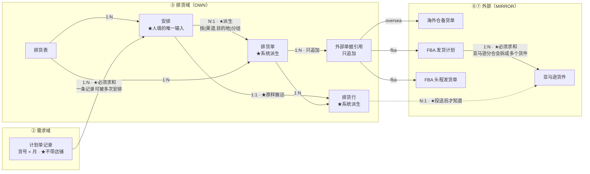
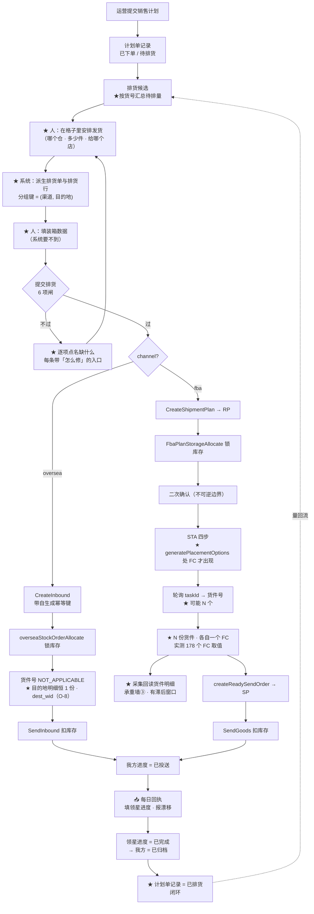

# 排货完整逻辑 — service_supplychain

> **这份文档要做什么**
>
> 负责人 2026-09-19：**「你完整的排货，从对接销售计划开始到发货的闭环，
> 对应的流程、流程图，还有领域、实体关系，都还没给我确认呢！」**
>
> ★ 这份文档把排货**从销售计划接入那一刻起、到发货完成回执为止**列全：
> 领域 → 实体关系 → 流程图 → 各环节关键点 → 分单规则 → 确认闸 → 待裁定。

| | |
|---|---|
| 版本 | v2（补全领域 / 实体 / 流程图） |
| 日期 | 2026-09-19 |
| 状态 | **待确认，未实现** |
| 上游 | `02` 本体 · `03` 表 · `04` 状态 · `06` 流程 · `07` 时序 · `16` 系统边界 |

---

## 0. ★★ 负责人定的那条线：人做什么，系统做什么

> 「做为供应链用户，**仅仅需要填写安排发货的格子**，而其他部分应该是
> **严格根据设定流程自己完成**，只有在**完成不了的部分**才需要人介入。」

| | 谁做 | 为什么 |
|---|---|---|
| **① 在格子里安排发货**（哪个仓、多少件） | ★ **人** | 这是判断，不是推导 |
| **② 分成几张排货单、每张发往哪** | ★ **系统** | 有确定规则（§5），没有判断余地 |
| **③ 每一行的店铺归属、来源仓、数量** | ★ **系统** | 就是①的原样搬运，不该重填 |
| **④ 装箱数据** | ★ **人** | ★ 系统不知道怎么装箱 —— 「完成不了的部分」 |
| **⑤ 目的地有歧义时选一个** | ★ **人** | 同上 |
| **⑥ 提交排货 / 不可逆点的二次确认** | ★ **人** | 是决定，不是操作 |
| **⑦ 投送（建单、取号、发货）** | ★ **系统** | 多步出站调用，人不该逐步点 |

★ **「待编排池」在这个模型里不存在**（裁定 N-4）。
它原先是「安排了、但还没分到哪张单」的中间态 —— 而②是自动的，这个中间态就没有了。
**页面之所以冗余，根因在这里，不在版面。**

---

## 1. 领域：排货横跨哪几个域

排货**不是一个独立的域**，它是四个域的交汇点。

| 域 | 排货从这里**读**什么 | 往这里**写**什么 |
|---|---|---|
| ② 需求 | ★ 计划单记录的**待排量** | 记录状态 → 已排货 |
| ④ 本地仓 | ★ **可发量**（`product_valid_num`） | 锁定 / 扣减（经领星） |
| ⑤ **排货**（本服务独有） | — | ★ 排货表 · 排货单 · 排货行 · 承重墙② |
| ⑥ 海外仓 | 备货单状态 | 📤 `CreateInbound` / `SendInbound` |
| ⑦ 平台仓 FBA | 发货计划 · 货件 · 发货单 | 📤 `CreateShipmentPlan` / STA 四步 / `SendGoods` |

★ **只有⑤是我们持有的**（OWN）。④是 DIM 只读，⑥⑦是 MIRROR ——
**排货的全部工作，就是把②的需求变成⑥⑦的单据，并在④上留下扣减。**

---

## 2. ★ 实体关系（本体式四层）

### 2.1 ① 对象

| 对象 | 主键 | 归属 | 谁产生 |
|---|---|---|---|
| **计划单记录** | `(plan_id, rev, sku, period)` | OWN | 运营提交时铸出 |
| **排货表** | `sheet_id` | OWN | ★ **人**（开一张作业） |
| ★ **安排** | `(sheet_id, line_id, seller_id, from_wid)` | OWN | ★ **人 —— 唯一的人工编排输入** |
| **排货单** | `consignment_id` | OWN | ★ **系统派生** |
| **排货行** | `(consignment_id, sku, seller_id, from_wid)` | OWN | ★ **系统派生** |
| **外部单据引用** | `ext_ref_id` | OWN · 只追加 | 系统（投送时） |
| **外部阶段观察** | `(ext_ref_id, observed_on)` | OWN · 只追加 | 系统（每日回执） |
| 海外仓备货单 OWS | `overseas_order_no` | MIRROR | 领星 |
| FBA 发货计划 RP | `plan_sn` | MIRROR | 领星 |
| ★ **亚马逊货件** | `shipment_id` | MIRROR | ★ **亚马逊**（`confirmPlacementOption`） |
| FBA 头程发货单 SP | `order_sn` | MIRROR | 领星 |

### 2.2 ② 关系（★ 带基数 + 聚合语义）



★ **图里没有任何动作** —— 动作在 §2.4。

| 关系 | 基数 | ★ 聚合语义 | 为什么 |
|---|---|---|---|
| 计划单记录 → 安排 | 1:N | ★ **必须求和** | 一条记录可以分几次、几个仓安排；不求和就算不出「还能排多少」 |
| 安排 → 排货单 | N:1 | ★ **派生，不可手工建** | 分组键 = (渠道, 目的地)，见 §5 |
| 安排 → 排货行 | 1:1 | ★ **原样搬运** | 店铺、来源仓、数量都不该重填一遍 |
| FBA 发货计划 → 亚马逊货件 | **1:N** | ★ **必须求和** | ★ 亚马逊分仓会把一个计划拆成多个货件 |
| ★ **排货行 → 亚马逊货件** | **N:1** | ★ **投送后才知道** | ★ 这是「关联货件」是一个**动作**而非字段的原因 |

### 2.3 ③ 状态·事实（不升格成对象）

| 事实 | 粒度 | 来源 | 关键点 |
|---|---|---|---|
| **待排量** | 计划单记录 | 计算 | `总量 − 已排 − 已投送` |
| ★ **已排未发** | 计划单记录 | 计算 | ★ 安排了但没投送的都算；不算就会**排两遍** |
| ★ **可安排量** | 货号 × 本地仓 | 计算 | ★ `valid − 已承诺未发出`；不减就会**把同一批货承诺两次** |
| **我方进度** | 排货单 | 我们写 | 草稿 / 已确认 / 已投送 / 已归档 |
| ★ **领星进度** | 排货单 | ★ **只读回，不写** | ★ 取 `rank` 最大的观察，不是最新那条 —— 结构上不可能倒退 |
| **在仓量 / 锁定量** | 货号 × 库位 | DIM 只读 | ★ 只读 `valid`，禁止用总量相减 |

★ **两轴状态的不一致本身就是信号**（漂移告警），不是要消除的噪声。

### 2.4 ④ 动作

| 动作 | 谁 | 可逆？ | 留痕 |
|---|---|---|---|
| 开排货表 | 人 | 可删 | — |
| ★ **安排 / 改 / 撤回** | ★ **人** | ★ 可逆（同一个原语，整体替换） | 日志 |
| 填装箱 | 人 | 可改 | — |
| **提交排货**（过 6 闸） | 人 | ★ 可退回草稿 | 闸结果 |
| 🔒 **二次确认**（FBA） | 人 | — | — |
| ⛔ **投送** | 系统 | ★ **不可逆** | 外部单据引用（只追加） |
| **人工核实超时投送** | 人 | — | 结论留痕 |
| 📥 每日回执 | 系统 | — | 外部阶段观察（只追加） |

---

## 3. ★★ 全链路闭环流程图



★ **闭环在最后那条虚线上**：投送完成后，计划单记录的待排量减少，
**排货候选里这条就消失或减少** —— 这才是「排完了」的唯一判据。

---

## 4. ★ 各环节关键点

| 环节 | 关键点 | 不这么做的后果 |
|---|---|---|
| 候选 | ★ **按货号汇总**，店铺在安排时才选 | 计划不带店铺（P2），按店铺汇总就无中生有 |
| 安排 | ★ 比的是**可安排量** = 仓里 − 已被别处安排未发出 | 同一批库存被承诺两次（09-18 实测） |
| 安排 | ★ 一次操作**整体决定**这一格（安排/改/撤回同一原语） | 三条路各有各的校验，迟早对不上 |
| 派生 | ★ 店铺归属**必填**，跟着货走 | 货在表里、网格上看不见（09-19 实测） |
| 派生 | ★ 重算时**不许冲掉已填的装箱**；对不上键的**逐项点名** | 人白填一遍，且不知道丢了什么 |
| 闸 | ★ 不过闸**逐项点名**，通过的也列出来，每条带「谁能修」 | 只说「1 项没过」等于让人猜；没有出路就是死胡同 |
| 投送 | ★ **断点续跑**：已拿到单号的步骤跳过 | 重投就重复建单 |
| 投送 | ★ 货件在 `confirmPlacementOption` 产生，**N:M 带数量**归属（承重墙③），**不在行上** | ★ 写成逐行归属 = 把 1:N 压成 1:1，实测货号进多货件 **414** 个 |
| 投送 | ★ 归属明细**采集回读**，存在「已投送·归属未知」窗口 —— 必须点名 | 「还没采到」被读成「没拆」 |
| 投送 | ★ **选 placement option 是人的决策**（O-7），带费用差异 | 自动选 = 替人花钱，且没人知道花了多少 |
| 投送 | ★ 超时**一律转人工，绝不自动重试** | `confirmPlacementOption` 无幂等键，重试就多一个真货件 |
| 回执 | ★ 领星进度取 `rank` **最大**的观察 | 取最新会让进度倒退 |

---

## 5. 分单规则

### 5.1 ★★ 「目的地」在两条链上**不是同一种东西**

> 负责人 2026-09-19：「**FC 的运送地并不是我们海外仓那样的固定地址，是动态安排的。
> 因此虽然都是运送地，但是与海外仓、自建仓是不同的。**」

| | 海外仓 / 自建仓 | FBA |
|---|---|---|
| 目的地是什么 | ★ **一个地址**（收货仓 `wid`） | ★ **一个店铺**（`sid`）；FC 由亚马逊分配 |
| 什么时候知道 | 建排货单时 | ★ **投送中**，`generatePlacementOptions` 之后 |
| 一张排货单 → 几个物理收货点 | **1** | ★ **N**（`02` §711） |

★ 把两者当成同一个概念，就会写出「FBA 排货单要有 `sid + fc`」——
**那是拿海外仓的形状去套 FBA**，FC 在建单那一刻根本不存在。

### 5.2 分组键

```
一张排货单 = 一个 (渠道, 目的地)
```

| 渠道 | 分单键 | 从哪来 | 收货点 |
|---|---|---|---|
| `oversea` | `wid` | 店铺的市场决定；多仓时人选一次（记在排货表上，N-6） | 1 个 |
| `fba` | ★ **`sid`** | 店铺本身 | ★ **不在键里** —— 投送后由亚马逊给，可能 N 个 |

渠道由 `seller.has_fba` 决定，不用人选。

### 5.3 一条安排如何落进排货单

```
安排 (line_id, seller_id, from_wid, units)
   ├─ seller_id → has_fba → 渠道
   ├─ seller_id → sid（fba）/ market→wid（oversea）→ 目的地
   ▼
找到或新建 (渠道, 目的地) 那张排货单 → 写一行
```

★ 同店铺同货号从两个仓各发一笔 → **两行**（来源仓不同）。
★ 两个店铺同市场同海外仓 → **同一张排货单的两行**（目的地同，店铺不同）。

---

## 6. 六项确认闸

| 闸 | 查什么 | ★ 谁能修 |
|---|---|---|
| **G1** | 装箱数据齐全，且与行一致 | 人（填装箱） |
| **G2** | ★ FBA 排货单有 `sid` —— ★ **不查 FC**，它投送后才有 | 系统（由店铺推出） |
| **G3** | 可发量够（★ 只读 `valid`，禁止总量相减） | 人（回去改安排） |
| **G4** | 没跟别的排货表撞「已排未发」 | 人（回去改安排） |
| **G5** | 「疑似未关联的发货」已清零 | 人（先去清） |
| **G6** | 目的地合法：oversea 有 `wid`；fba 有 `sid`（不含 FC） | 系统 |

★ **每一条都要能回答「谁能修、怎么修」** —— 否则闸就是死胡同（P9 的教训）。

---

## 7. 待裁定

| # | 问题 | 状态 |
|---|---|---|
| **N-2 ~ N-12** | 人机分工 · 派生 · 取消池子 · FC 不进键 · 多仓选择 · 箱规默认 … | ★ **已裁定**，见 `00` N 组 |
| ✅ **C-6** | 已答（09-21）：**不必等同步返回** —— `lingxing_fba_shipment_list_items` 实测 16,930 行 / 893 货件 / 440 货号 | ★ 代价：是**回读**，有滞后窗口；`from_wid` 可能对不回去（**C-9**） |

---

## 8. 为什么现在提交不了

> 「但是目前还是连提交排货都不行！」

★ 尚未定位。上次截图报的是 `G3 可发量够`，根因是共享池被重复承诺（已 09-18 修）。
**现在报的是哪一项？把那一行贴给我** —— 不看错误信息就去猜，只会再改错一轮。
