# 阶段 1 · 阶段 2：销售计划 → 采购订单 → 工厂交货 → 收货质检 → 本地仓入库 → 备货表

> 2026-09-21。与「国内库存出货流程」（阶段 3）「海外出货流程」（阶段 4）同一格式。
> 接口按 apidoc.lingxing.com 全站镜像（`tools/docs/LingXing-领星api文档/openapi-full-mirror-2026-09-04`）；
> 实测数字全部取自 CH `jxd_raw`（采集副本，`FINAL`）与 PG `jxd_ml`（本系统），查询日 2026-09-21。
>
> 代码路径 `models/…`、`v2/…`、`data/schema/…` 与 PG 表 `inv.*` 都属于 `jxd_model_group/model_inventory_forecast` 仓（库存预测模型）；本仓是供应链系统。
> 图上「电商平台添加货件」= 运营在本系统建销售计划、认领货品、填量；「供应链系统」= 本系统（v2 + service_supplychain）。

---

## 阶段 1 · 销售计划 → 采购订单

原理流程:
[ 销售计划表（电商运营确认，按周期）→ 采购订单（供应链下单，一旦下单不可撤销）] → 工厂 → 收货质检 → 本地仓入库 → 备货表 → 出库/调拨 → …

实际操作过程:

════════════════════════════════════════════════════════════
本系统 —— 销售计划 → 计划单记录 → 采购单草稿
════════════════════════════════════════════════════════════

【本系统，PG `jxd_ml` schema `inv`；对象与状态见 `jxd_model_group/model_inventory_forecast/docs/inventory-forecast/销售计划生命周期-实体-v2.md`】
建销售计划 + 认领货品（msku）           sales_plan · msku_assignment（一个 msku 同时只归一个「尚未下单」的计划）
  → 填期望销量（msku × 月）/ 计划采购量（货号 × 月）
                                          sales_plan_month：格子只剩 system / edited，提交就是确定（I1）
  → 提交                                  ★ 铸计划单记录 (plan_id, rev)，内容不可变；状态 submitted
  → 确认                                  submitted → confirmed（几版里挑定一版；同一计划最多 1 版在流转）
  → 组采购单草稿（按店铺挑、按货号合并）  明细 ↔ 计划单记录 带数量（承重墙①）；一单一供应商
  → 补齐领星必填项                        单价 · 采购员 opt_uid · 采购方 purchaser_id · 目标仓 sys_wid
  → ⛔ 下单                               confirmed → ordered；调下面的 CreatePurchaseOrder

计划单状态机（045 迁移）：submitted 已提交 → confirmed 已确认 → ordered 已下单 → ready 准备排货
→ scheduled 已排货 → closed 已完结；任一步可 cancelled 已撤销（理由必填）。
「部分下单」用量表达（已确认量 / 已下单量 / 未组单量），不发明状态值。

★ 今天的落差：状态流转 09-14 上线后，PG 里 5 条计划单记录全部停在 submitted（4）/ cancelled（1），
  没有一版走到 confirmed 或 ordered；`committed_units` 没有写方，承重墙①还没有任何一行。

════════════════════════════════════════════════════════════
领星侧 —— 采购计划 → 采购单
════════════════════════════════════════════════════════════

【领星侧，/erp/sc/routing/ 与 /basicOpen/】
createPurchasePlan (data/local_inventory/createPurchasePlan)
                                          （可选）建采购计划 PP… / 批次 PPG…，状态 2 待采购
                                          实测这家是 web 上「先计划再转单」：4 批 PP 建完 2 分钟内就各转成 1 张 PO
  → CreatePurchaseOrder (purchase/purchase/createPurchaseOrder)
                                          ★ 采购单诞生，拿到 order_sn PO…，直接落 2 待到货
                                          入参：sys_wid / sys_supplier_id · opt_uid · purchaser_id · qc_type（0 仓库质检 1 预检 2 免检）
                                                product_list[].sku · price · quantity_real · expect_arrive_time · plan_sn（挂回采购计划）· sid
                                          若租户开了审批流会落 121 待审核 → A2 实测已打掉：143 张单 auditor_time 全空、无 121/122/124
  → SetOrders (purchase/purchase/setOrders)
                                          待下单 1 → 待到货 2；只有 web 建单走「待提交 3 → 待下单 1」时才用得到
  → addLogistics (purchase/purchase/addLogistics)
                                          给待到货 / 已完成的单挂物流商 + 物流单号（实测 0 / 143 张填过）
  → createPurchaseChangeOrder (purchaseChangeOrder/createPurchaseChangeOrder)
                                          变更单 POC…：改量 / 改价 / 改预计到货 / 加行，建即生效
  → Cancel (purchase/purchase/cancel)     作废，reason 必填；到过货的不允许作废
  → setOrderFinish (/basicOpen/purchase/setOrderFinish)
                                          整单结束到货 → 9 完成；有未收货的收货单时拒绝

采购单状态：-1 作废 · 3 待提交 · 1 待下单（已审核）· 2 待到货（已下单）· 9 完成 · 121/122/124 审批流
到货状态 status_shipped：1 未到货 · 2 部分到货 · 3 全部到货
量：quantity_real 实际采购量 · quantity_entry 已入库量 · quantity_receive 待到货量

★ 不可逆点 = CreatePurchaseOrder：领星建出真单，本系统这张采购单冻结。
★ 采购单不动任何仓的库存；它对库存的唯一影响是 quantity_receive（采购在途，工厂 → 国内仓）。
★ 两侧的纽带：PO 明细 `plan_sn` → 采购计划 `PP…`；本系统 计划单记录 ↔ PO 明细（承重墙①，**今天没有写方**）。

════════════════════════════════════════════════════════════
数据落点与实测
════════════════════════════════════════════════════════════

本系统（PG `jxd_ml` `inv`）：
    sales_plan 4 · sales_plan_month 99（system 85 / edited 14）· sales_plan_submission 5
    sales_plan_order_state 5（submitted 4 / cancelled 1）· sales_plan_order_event 7 · sales_plan_carryover 0

CH 表（jxd_raw）：
    lingxing_purchase_plan_list            223 单（FINAL）  🟡 09-20 起采，只有 4 批
    lingxing_purchase_order_list           143 单           🟡 09-19 起按 order_sn 覆盖，无历史快照
    lingxing_purchase_order_list_items     2,434 行 / 194 货号
    lingxing_purchase_change_order_list    3 张 + _items 80 行   🟡 09-15 起
    lingxing_product_local_products        2,925 个货号      🟡 09-21 起
    lingxing_seller_list                   店铺维度（sid → 店铺名/market/platform）⚠️ 本仓从未直接查询，源名与量级见兄弟仓 model_inventory_forecast（026:11 实测 2026-09-10）；OQ-2 裁定 09-22（mirror-refresh 设计 §10）
    lingxing_product_listing               msku（seller_sku, sid）→ 货号；has_fba 由 fulfillment_channel_type='FBA' 派生（027:30）⚠️ 本仓从未直接查询；OQ-2/OQ-3 裁定 09-22（同上）
    （供应商没有独立表，只在 PO / IB 的 supplier_id / supplier_name 上）

生产实测（采购计划 223 条）：
    状态              -2 已完成 223（100%）
    批次              PPG260914001 50 条 7,016 件 → PO260914009（2 分钟后）
                      PPG260916001 14 条 2,130 件 → PO260916006
                      PPG260916002 157 条 14,550 件 → PO260916017
                      PPG260918001 2 条 900 件 → PO260918001
    创建人            1 人；目标仓按渠道仓：11-北美亚马逊东孚仓 50 条 10,831 件 / 25-德国 38 / 26-英国 37 / 61-Chewy 27 …
    sid               223 条全为 0（计划不挂店铺）
    ⚠️ PO 明细 2,426 行带 plan_sn，只有 221 行能在这张表里找到 —— 表只采了最近 4 批，不是全量

生产实测（采购单 143 张，创建 2026-03-24 ~ 09-18）：
    status            -1 作废 53（48,375 件；52 张从未下过单，order_time 空 → 作废在待下单阶段）
                      2 待到货 27：未到货 20 张 53,121 件 · 部分到货 7 张（已入 27,171 / 待到 30,102）
                      9 完成 63（110,288 件，全部到货 60 / 部分到货 2 / 未到货 1）
    待到货合计        83,223 件 / 780 行；预计到货日已过仍未到 139 行 / 17,172 件
    按预计到货月      6~8 月 5,222 · 9 月 18,760 · 10 月 19,885 · 11 月 28,206 · 12 月 11,150
    供应商            3 家：01[吉信德宠物用品] 78 张 · 02[吉信隆] 38 · SHYH[上海愉辉纺织品] 27
    qc_type           免检 102 / 仓库质检 41
    审批流            auditor_time 143/143 为空，无 121/122/124 → 未开审批流
    order_time        = create_time（中位差 0 天）→ 建单即下单
    wid               单头 55/143 是「多仓库采购」(wid=0) → 仓库只能取行上 wid
    sid               行上 1,709/2,434 为 0；带店铺的行 36 张单 / 46,490 件
    每单货号数        中位 3，最多 59（PO260330017）
    变更单            3 张全部已处理，数量 350→350 · 7,410→7,428 · 470→474（只是微调）
    本地产品          在售 438 / 清仓 486 / 停售 1,991 / 开发中 10；cg_delivery 采购交期只有 0 或 60 → 默认值，没人维护

---

## 阶段 2 · 采购订单 → 工厂 → 收货质检 → 本地仓入库 → 备货表

原理流程:
销售计划表 → 采购订单 → [ 工厂生产交货 → 收货质检 → 本地仓入库（分不同工厂对应不同仓库与库位）→ 备货表（运营确认后发货，一旦发货不可撤销）] → 出库/调拨 → 头程发货单 → …

实际操作过程:

════════════════════════════════════════════════════════════
工厂交货 → 收货 → 质检 → 入库 —— 外部世界 → 领星
════════════════════════════════════════════════════════════

【外部世界】
工厂生产、交货                            领星里只有 expect_arrive_time，没有生产进度
                                          实测 PO 下单 → 首次收货：中位 62 天，p90 94 天（n=1,062 张入库单）
                                          首次收货 vs 预计到货：中位提前 8 天，p90 晚 19 天（提前 840 / 准点 34 / 晚 535，共 1,409 行）

【领星侧，/erp/sc/routing/deliveryReceipt/ 与 /storage/】
createReceiptOrder (PurchaseReceiptOrder/createReceiptOrder)
                                          建收货单 CR…（business_order_sn = PO，order_type 1 采购单，wid，
                                          item_list[].order_item_id + notice_num_total 通知收货量）状态 10 待收货
  → Receive (PurchaseReceiptOrder/receive)
                                          收货单到货：item_list[].product_receive_num → 40 已完成，货进「待检」
  → 〔质检〕                              无写接口，只能查：
       ReceiptOrderQcList (ReceiptOrderQc/getOrderList)        质检单 QC… 列表
       qualityInspectionOrderDetail (/basicOpen/qualityInspectionOrder/detail)
                                          status 0 待质检 / 1 已质检 / 2 已免检 / 10、20 撤销
                                          qc_type 1 仓库质检 / 2 预检 / 3 免检；qc_method 1 抽检 / 2 全检
                                          结果：product_good_num → whb_code_good 可用仓位；product_bad_num → 次品仓位
  → OrderAdd (storage/storage/orderAdd)   ★ 添加入库单 IB…，type 2 采购入库，增加入库仓库存
                                          order_sn = PO 时为「采购单快捷入库」；product_list[].good_num / bad_num / good_whb_code / bad_whb_code；is_shelf 进上架暂存仓位
     或 FastReceive (PurchaseReceiptOrder/fastReceive)
                                          ★ 收货单快捷入库：收货与入库一步完成（good_num / bad_num）
     或 InboundOrderConfirm (/basicOpen/inboundOrder/inbound/setInbound)
                                          待入库 20 → 已完成 40
  → getEntryRecommendBinList (/basicOpen/warehouseConfig/warehouseBin/…)
                                          查产品仓位（可用 / 次品仓位与可用量）
  → 采购单自动推进                        quantity_entry 累加，status_shipped 1 → 2 → 3；全部到货 → 9 完成（或 setOrderFinish 手动结束）

入库单状态：10 待提交 · 20 待入库 · 40 已完成 · 50 已撤销 · 121 / 122 审批流
入库类型：1 其他 · 2 采购 · 3 调拨 · 4 赠品 · 26 退货 · 27 移除

★ 加库存时刻 = 入库单 IB 完成（OrderAdd / FastReceive / InboundOrderConfirm）。
  收货单 CR 本身不动库存，只把采购单的「待到货」变成「待检」；质检把「待检」变成「良品 / 次品」。
★ 这家实际的操作形态（三条独立证据）：
    ① 货到才补录：CR 的 create_time == receive_time 952 / 1,031，其余 79 张只差 1 秒
    ② 通知收货量 == 实收量 1,210 / 1,210 行 → 收货单是照实收填的，不是提前建的
    ③ IB 与 CR 同一秒 916 / 1,070（与 CR.create 同秒 973）→ 走的是「收货单快捷入库」，收货即入库
  质检记录晚于入库 403 / 410（365 张同一天）→ **质检是入库之后的账面动作，不是入库前的闸**；
  原理图「收货质检 → 入库」在数据里的顺序是「收货 = 入库 → 质检」。
★ 「分不同工厂对应不同仓库」在数据里长这样：仓 = 工厂 × 渠道，国内仓 38 个（仓库维表 type=1）
    吉信德宠物用品   776 张采购入库 → 15 个「…东孚仓」（11-北美亚马逊 / 25-德国亚马逊 / 61-北美Chewy / 32-tiktok …）
    吉信隆           153 张          → 10 个「…东孚仓」
    上海愉辉纺织品   143 张          → 11 个「…上海愉辉仓」（64-北美亚马逊 / 68-Chewy / 69-德国亚马逊 …）
  「库位」实测只有暂存位：质检单落「可用暂存(N)」「次品暂存(0)」，没有 A-1-1 式实体库位；
  入库明细的 product_onshelf_num / product_shelf_num 全为 0 → 没有上架动作。

════════════════════════════════════════════════════════════
备货表 —— 本系统（领星里没有这张单）
════════════════════════════════════════════════════════════

【本系统，PG `inv`；`jxd_model_group/model_inventory_forecast/docs/inventory-forecast/功能与链路-v2.md` C · 同目录 `环节与单据链-v2.md` §5】
开备货表 replenishment_sheet(from_date, to_date, stock_date)
  → 读国内仓在仓（inventory_local.day_end_count 按 (sku, sys_wid) 求和）· 区间需求（A 计划）· 断货风险（B 预测）
  → 逐行 verdict / need_units / drawable_units → 人填 decided_units（replenishment_line）
  → 确认 sheet：draft → confirmed                         ★ 「运营确认后发货，一旦发货不可撤销」的确认点
  → 排货单 replenishment_dispatch：draft → confirmed；行归属 dispatch_leg；去向 replenishment_shipment_leg(dest_node)
  → 下游 = 领星 SP 发货单 / OWS 海外仓备货单 / TF 调拨单（阶段 3 的三条分叉）
     ⚠️ 今天确认后**不推送**领星，也不回读；「已排未发」无人扣减

★ 海外仓、FBA、WFS 要分开备货，不能混：目的仓不同 → 领星开的单不同（OWS / SP / TF），装箱、标签、申报要求也不同。
★ 领星侧没有「备货表」：lingxing_fba_shipment_plan_list 全表 1 条（RP260104001，01-04 建）。
  领星自己的对应物是「FBA 发货计划」CreateShipmentPlan → R… / RP…（可带 purchase_plan_sn 挂回采购计划）
  + FbaPlanStorageAllocate 锁库存（有 Release 可解）—— 那已经是阶段 3 的入口，本系统未接。

════════════════════════════════════════════════════════════
数据落点与实测
════════════════════════════════════════════════════════════

CH 表（jxd_raw）：
    lingxing_warehouse_receipt_list         1,031 单   🟢 08-19 起日采（19 天）
    lingxing_warehouse_receipt_list_items   1,210 行 / 156 货号
    lingxing_warehouse_receipt_qc_list      444 单     🟡 09-07 起采，create 08-06 起 → 只覆盖近 6 周
    lingxing_warehouse_inbound_list         3,826 单   🟢 08-19 起日采（31 天）；采购入库 1,076
    lingxing_warehouse_inbound_list_items   14,573 行；采购入库 1,214 行
    lingxing_warehouse_batch_detail_list    6,845 批次 🟡 09-07 起采；purchase_in_time 2022-02 起，41 仓
    lingxing_warehouse_batch_statement_list 9,896 行   批次流水
    lingxing_inventory_local                国内仓日报（阶段 3 用它取在仓；规则见 model_inventory_forecast 仓 CLAUDE.md）
    lingxing_inventory_warehouses           118 仓：国内 38（type=1）· 自建海外 14（3/1）· 第三方海外 7（3/2）

本系统（PG `inv`）：
    replenishment_sheet 5（confirmed 3 / draft 2）· replenishment_line 3,085 · replenishment_pool 2,480
    replenishment_exclusion 510 · replenishment_dispatch 4（draft 3 / confirmed 1）· dispatch_leg 1 · shipment_leg 2

生产实测（收货单 1,031 张，创建 2025-12-02 ~ 2026-09-19）：
    status              40 已完成 1,031（100%）；10 待收货一张都没有 —— 与「收货即入库」一致（采集是否只拉 40 未核）
    来源                business_order_sn 前缀 PO 1,031（100%）；order_type 1 采购单 100%
    qc_type             免检 742 / 仓库质检 286 / 预检 3
    通知 = 实收         1,210 / 1,210 行，134,847 件
    质检进度            已检 134,545 · 待检 302（11 行 quality_examine_status=0）
    logistics_order_no  0 / 1,031；expect_arrival_time 2 / 1,031 → 收货单不带物流也不带预计到货
    inbound_order_sns   1,031 / 1,031 有入库单；33 张对 2~3 张 IB
    每张 PO 的 CR 数    中位 4.5，最多 119（PO 分批交货，一批一张 CR）
    CR → PO             1,023 / 1,031（8 张指向 03-24 前的旧 PO，不在 PO 表里）
    PO（非作废）→ CR    69 / 90 有收货单（21 张一件未到）

生产实测（质检单 444 张）：
    status × 方式       已质检 316：仓库质检 抽检 38 张 2,010 件 · 全检 278 张 23,773 件
                        已免检 128：免检 126 张 11,842 件 + 仓库质检标免检 2 张 200 件
    次品                qc_bad_num / product_bad_num 全为 0
    仓位                whb_code_good 可用暂存(N) · whb_code_bad 次品暂存(0)
    收货 → 质检         同日 398 / 444，p90 1 天
    QC → CR             443 / 444；QC 与入库：晚于入库 403 / 410

生产实测（采购入库单 1,076 张，创建 2025-12-02 ~ 2026-09-19）：
    status              40 已完成 1,074 · 50 已撤销 2
    purchase_order_sn   1,070 / 1,076；receipt_order_sn 1,070 / 1,076
    opt_time == create_time  1,071 / 1,076 → 建单即入库
    IB（≥03-24）→ PO    1,062 / 1,062；IB → CR 1,070 / 1,070
    明细                1,214 行 135,187 件 = 良品 134,885 + 待检 302 + 次品 0；onshelf / shelf 全 0
    wid 头部            11-北美亚马逊东孚仓 225 · 25-德国 127 · 61-Chewy 117 · 26-英国 108 · 32-tiktok 95 · 13-日本 61 · 07-独立站 58 · 59-Walmart 52 · 04-公共仓 42 · 64-北美亚马逊上海愉辉仓 34
    批次                采购入库批次 396 / 27,620 件；每条批次带 purchase_order_sns + delivery_order_sns + plan_sn 列表
                        → 从批次可以一路追回 PP → PO → CR → IB；批次流水里「采购入库」262 行与「采购质检」262 行成对

★ 采购 → 入库这一段的连接键（补 `jxd_model_group/model_inventory_forecast/docs/inventory-forecast/环节与单据链-v2.md` §3）：
    PP.plan_sn ← PO_items.plan_sn                 1 : N（一张 PO 收多条 PP）  221 / 223 的 PP 找得到 PO
    PO.order_sn ← CR.business_order_sn            1 : N（分批交货）          中位 4.5，最多 119
    CR.order_sn ← QC.delivery_order_sn            1 : N（一行一张 QC）        443 / 444
    CR.order_sn ← IB.receipt_order_sn             1 : 1，偶有 1 : 3           1,070 / 1,070
    PO.order_sn ← IB.purchase_order_sn            1 : N                       1,062 / 1,062（≥03-24）
    CR_items.order_item_id = PO_items.item_id     行级键；IB_items.purchase_item_id 同（4 行为 0）

---

## 全链路流程图（阶段 1 ~ 4，按泳道图，含预测模型）

> 列 = 阶段（与用户 2026-09-10 的「电商采购生产备货销售环节」图同序），列内再按系统分泳道；
> 阶段 1 最左加了一条「预测模型」泳道，两个预测量从这里喂给销售计划表与备货表。
> 颜色：蓝 = 供应链系统（本系统）· 紫 = 预测模型 · 橙 = 领星 ERP · 灰 = 外部世界（工厂 / 货运 / 海外仓 / 客户）· 红 = 亚马逊 · 虚线框 = 占位未启用。
> 实线 = 单据 / 实物流转；虚线 = 回写、引用或**今天没接上**的一步。⛔ 不可逆点，★ 动库存的那一步。

```mermaid
flowchart LR
  classDef ours fill:#e8f1fb,stroke:#2f6db3,color:#111
  classDef model fill:#efe6fb,stroke:#6f3fb5,color:#111
  classDef lx fill:#fff4e0,stroke:#d08a12,color:#111
  classDef ext fill:#f2f2f2,stroke:#777,color:#111
  classDef amz fill:#fde9e7,stroke:#c0392b,color:#111
  classDef off fill:#fafafa,stroke:#bbb,color:#888,stroke-dasharray:4 4

  subgraph S1["阶段 1 · 预测 → 销售计划 → 采购订单"]
    subgraph S1M["预测模型（供应链系统）"]
      HIST["历史销量 sales_hist[sku, node, date]<br/>amazon_sp_api_report_all_orders（FBA）<br/>warehouse_wms_order_list（FBM / 多平台）"]
      ABA["ABA 特征 aba[asin, week]<br/>jimore_aba_keyword_search · aba_asin_by_keyword<br/>search_frequency_rank · click_share · conversion_share"]
      HOL["节假日日历 holiday[market, date]<br/>Prime Day · BFCM · 圣诞 · 春节停产<br/><i>⚠️ 无表，需新建维表</i>"]
      FD["预测销量 D̂[sku, node, t]<br/>日：demand (N×H) → LedgerInput.demand<br/>月：system_value[sku, channel, month] → sales_plan_month<br/>━━━━━━━━━━━━━━━━━━━━<br/>v1 现行：base_rate = 削峰 p95 → EWMA(halflife 14d) → 收缩 n/(n+prior)<br/>　suggested_value = base_rate × 天数 × seasonal[m]<br/>v1 规划：base_rate × holiday_factor + ABA 特征回归<br/>v2：LightGBM（同一特征矩阵）<br/>v3：深度学习序列模型"]
      FB["预测库存 B̂[sku, node, t]（梦倩算法 · ledger.project）<br/>B(t) = max(0, B(t−1) + A(t) − D(t))，B(a) = O<br/>u(t) = max(0, D(t) − B(t−1) − A(t))　lost_sales<br/>断货日 = min{t : u(t) > 0}<br/>━━━━━━━━━━━━━━━━━━━━<br/>入：onhand0 · arrivals · departures · demand<br/>出：available · daily_unmet · cum_unmet · signed_position<br/>→ v2_projection_daily · v2_stockout_summary · v2_coverage_monthly"]
    end
    subgraph S1A["供应链系统"]
      SPL["销售计划表<br/>msku×月 期望销量 · 货号×月 计划采购量<br/>格子 = planned_units ?? system_value<br/><i>运营确认 · 按周期</i>"]
      REC["计划单记录 (plan_id, rev)<br/>submitted → confirmed → ordered<br/>→ ready → scheduled → closed"]
      PODRAFT["采购单草稿<br/>按店铺挑 · 按货号合并 · 一单一供应商<br/>明细 ↔ 计划单记录 带数量（承重墙①）"]
    end
    subgraph S1B["领星 ERP"]
      PP["采购计划 PP / 批次 PPG<br/>createPurchasePlan<br/><i>实测 4 批，2 分钟内各转 1 张 PO</i>"]
      PO["采购单 PO<br/>⛔ CreatePurchaseOrder → 2 待到货<br/>quantity_receive = 采购在途<br/><i>143 张 · 待到货 83,223 件 · 未开审批流</i>"]
      POC["变更单 POC / 作废 Cancel<br/>setOrderFinish 整单结束"]
    end
  end

  subgraph S2["阶段 2 · 工厂交货 → 收货质检 → 本地仓入库 → 备货表"]
    subgraph S2A["工厂（外部）"]
      F["工厂生产 · 实物交货<br/>吉信德 / 吉信隆 → …东孚仓<br/>上海愉辉 → …上海愉辉仓<br/><i>下单→首次收货 中位 62 天 · p90 94 天</i>"]
    end
    subgraph S2B["领星 ERP · 本地仓"]
      CR["收货单 CR<br/>createReceiptOrder → Receive<br/><i>货到才补录 · 通知量 = 实收量</i>"]
      IB["入库单 IB（采购入库）<br/>★ OrderAdd / FastReceive 加库存<br/><i>与 CR 同一秒 916/1,070</i>"]
      QC["质检单 QC<br/>仓库质检 / 预检 / 免检 · 抽检 / 全检<br/>良品 → 可用暂存 · 次品 → 次品暂存<br/><i>晚于入库 403/410</i>"]
      STK["本地仓在仓<br/>inventory_local.day_end_count<br/>仓 = 工厂 × 渠道（38 个国内仓）<br/>按 (sku, sys_wid) 求和"]
    end
    subgraph S2C["供应链系统"]
      RS["备货表 replenishment_sheet<br/>need_units = window_demand − onhand − intransit<br/>risk_tier / days_left / stockout_date<br/><i>运营确认 · 发货不可撤销</i>"]
      DSP["排货单 replenishment_dispatch<br/>去向 SP / OWS / TF<br/>海外仓 · FBA · WFS 分开备货"]
    end
  end

  subgraph S3["阶段 3 · 出库 → 发货单 / 备货单 / 调拨单 → 头程"]
    subgraph S3A["领星 ERP"]
      HL["头程货运 · 比价<br/>ChannelList 头程物流渠道<br/>FL 头程物流单（只有运费）"]
      OB["出库单 OB<br/>FBA出库 / 调拨出库"]
      SP["发货单 SP → FBA<br/>createReadySendOrder<br/>★ SendGoods 扣发货仓库存"]
      OWS["海外仓备货单 OWS → 第三方海外仓<br/>CreateInbound → Allocate → packing<br/>★ SendInbound 扣发货仓库存（→50）"]
      TF["调拨单 TF → 自建仓<br/>国内仓 → 30-LA / CHI-CA 系"]
    end
    subgraph S3B["亚马逊 SP-API（领星透传）"]
      STA["STA 任务<br/>createInboundPlan → setPackingInformation<br/>→ generatePlacementOptions<br/>⛔ confirmPlacementOption → shipment_id + FC"]
      FBAS["亚马逊货件 FBA…<br/>WORKING → SHIPPED → IN_TRANSIT → DELIVERED<br/>→ CHECKED_IN → RECEIVING → CLOSED"]
    end
    subgraph S3C["货运物流（头程）"]
      WB1["运单 / 跟踪号<br/>UpdateShipmentTrack (SPD / LTL)<br/>OWS 状态 50 · TF 已出未入 = 头程在途"]
    end
  end

  subgraph S4["阶段 4 · 海外仓 / 平台仓 → 终端客户"]
    subgraph S4A["海外仓"]
      OS3["第三方海外仓<br/>易境通 · 金仓 · 魔方云仓 · 领星WMS<br/>inboundBatchesReceipt → inboundCompleteReceipt（→60）"]
      OS1["自建仓 CHI-CA 系<br/>30-LA 自有 + Tiktok / Chewy / Walmart… 分区<br/>调拨入库 IB"]
    end
    subgraph S4B["仓库货运物流（二程）"]
      WB2["运单<br/>二程发货单 SP（源仓 = 自建仓）<br/><i>只有 30-LA 出过</i>"]
    end
    subgraph S4C["领星 ERP · 自发货"]
      WO["销售出库单 WO<br/>PreShipment → ★ BatchReview 扣海外仓库存<br/>setTrackingNo → 拣货 / 打包 / 交运 → 3 已出库"]
    end
    subgraph S4D["平台仓"]
      FBA["FBA<br/>afn_fulfillable / afn_inbound_*<br/>亚马逊自动履约"]
      WFS["WFS（占位 · 未启用）"]
    end
    subgraph S4E["终端客户"]
      C["客户"]
    end
  end

  %% ---- 预测模型
  HIST --> FD
  ABA --> FD
  HOL --> FD
  FD -->|"system_value 预填格子"| SPL
  FD -->|"demand[sku, node, t]"| FB
  FD -->|"window_demand 区间需求"| RS
  FB -->|"days_to_stockout · coverage_ratio<br/>断货风险 → risk_tier"| RS
  FBA -.->|"onhand0（FBA 在仓）"| FB
  OS1 -.->|"onhand0（FBM 池 · 海外仓在仓）"| FB
  FBAS -.->|"arrivals（在途货件 · 上架延迟后）"| FB
  C -.->|"实际销量回填 sales_actual"| HIST

  %% ---- 阶段 1
  SPL --> REC
  REC -->|"确认 confirmed"| PODRAFT
  PODRAFT -->|"⛔ 下单 → ordered<br/><i>今天无写方</i>"| PO
  PP -->|"plan_sn"| PO
  PO --> POC

  %% ---- 阶段 2
  PO -->|"expect_arrive_time"| F
  F -->|"实物交货"| CR
  CR -->|"receipt_order_sn"| IB
  IB -->|"待检 → 良品 / 次品"| QC
  IB -.->|"quantity_entry 回填<br/>status_shipped 1→2→3 · 全到 → 9"| PO
  IB -->|"day_end_count"| STK
  STK -->|"国内仓在仓 drawable_units"| RS
  REC -.->|"ordered / ready<br/>才进排货候选"| RS
  RS -->|"confirmed"| DSP

  %% ---- 阶段 3
  DSP -.->|"⚠️ 未接：不推送 · 不回读"| OB
  STK -->|"★ 出库扣国内仓"| OB
  OB -->|"source_sn"| SP
  OB -->|"source_sn"| OWS
  OB -->|"outbound_order_sn"| TF
  HL -.->|"ref_order_no"| SP
  HL -.->|"ref_order_no"| OWS
  STA -->|"shipment_id + FC"| FBAS
  SP -->|"shipment_id 392/392"| FBAS
  SP -->|"★ SendGoods"| WB1
  OWS -->|"★ SendInbound"| WB1
  TF -->|"已出库未入库"| WB1

  %% ---- 阶段 4
  WB1 -->|"FC 收货<br/>CHECKED_IN → CLOSED"| FBA
  FBAS -.->|"状态回流"| FBA
  WB1 -->|"到货上架（→60）"| OS3
  WB1 -->|"调拨入库 IB"| OS1
  OS1 -->|"二程发货单 SP"| WB2
  WB2 --> FBA
  OS1 -.-> WFS
  OS3 -->|"FBM 自发货"| WO
  OS1 -->|"FBM 自发货"| WO
  WO -->|"waybill_no / tracking_no"| C
  FBA -->|"亚马逊代发<br/>无领星写接口"| C
  WFS -.-> C

  class SPL,REC,PODRAFT,RS,DSP ours
  class HIST,ABA,HOL,FD,FB model
  class PP,PO,POC,CR,IB,QC,STK,HL,OB,SP,OWS,TF,WO lx
  class F,WB1,WB2,OS3,OS1,C ext
  class STA,FBAS,FBA amz
  class WFS off
```



### 预测模型：变量名与算法（图里那两个紫色节点的展开）

| 量 | 变量名 | 粒度 | 算法 / 来源 | 落点 |
|---|---|---|---|---|
| 历史销量 | `sales_hist[sku, node, date]`（代码里叫 `history`：sku · node · date · units） | 日 | FBA：`amazon_sp_api_report_all_orders`；FBM / 多平台：`warehouse_wms_order_list(_items)`（⚠️ 今天没进需求）；断货日按 `censor` 剔除 | v2 取数 `v2/data/` |
| ABA 特征 | `aba[asin, week]`：`search_frequency_rank` · `click_share` · `conversion_share`（ABA 三列）；聚到货号靠 `msku_sku_bridge` | 周 → 货号 | CH 已有：`jimore_aba_keyword_search` 2,542 行 · `jimore_aba_asin_by_keyword` 35 行 · `jimore_aba_similarity_asin` 32,497 行 | 待建特征表 |
| 节假日 | `holiday[market, date]` → `holiday_factor[market, date]` | 日 × 市场 | Prime Day · BFCM · 圣诞 · 春节停产（供给侧）。**CH 无此表**，要建维表 | 待建 `inv.holiday_calendar` |
| **预测销量** | 日：`demand[sku, node, t]`（`LedgerInput.demand`，N×H）；月：`system_value[sku, channel, month]`（`sales_plan_month.system_value`，向上取整；`baseline_30d` 同表） | 日 / 月 | 见下表三代 | `inv.sales_plan_month` · `inv.demand_override.suggested_value` |
| **预测库存** | `available[sku, node, t]`（截断后可售）· `signed_position`（未截断，= Excel 的数）· `daily_unmet` · `cum_unmet` · `open_balance` | 日 | 梦倩算法，`models/inventory_forecast/ledger.py::project`，policy `lost_sales`；228/228 对账门禁证明 == 她的 Excel | `inv.v2_projection_daily` |
| 断货结论 | `will_stockout` · `stockout_date` · `days_to_stockout` · `min_available` | 序列 | `LedgerResult.first_stockout()` | `inv.v2_stockout_summary` |
| 月覆盖 | `coverage_ratio` · `open_units` · `arrivals_units` · `demand_units` · `close_available` · `status` | 月 | 日曲线按月汇总 | `inv.v2_coverage_monthly` |
| 台账输入 | `onhand0[sku, node]`（锚点日收盘在库）· `arrivals[sku, node, t]`（含上架延迟）· `departures[sku, node, t]` | 日 | FBA 在仓 `inventory_fba_detail`；FBM 池 `inventory_overseas.day_end_count`；在途 = SP 发货单 + FBA 货件（`[supply_events]`） | `inv.v2_supply_series` · `inv.v2_supply_daily` |

预测库存的公式（梦倩 Excel 的复刻，`jxd_model_group/model_inventory_forecast/docs/inventory-forecast/formulas.md` §一）：

```
B_i(t) = max(0, B_i(t−1) + A_i(t) − D_i(t))      B_i(a) = O_i         ← available
u_i(t) = max(0, D_i(t) − B_i(t−1) − A_i(t))                            ← daily_unmet（lost_sales：不滚到次日）
预计断货日 = min{ t : u_i(t) > 0 }                                      ← stockout_date
signed_position = available − cum_unmet                                 ← 恒等式，check_identity() 每轮校验
```

预测销量的三代（同一个输出接口 `demand[sku, node, t]` / `system_value`，只换算法）：

| 代 | 算法 | 输入 | 代码 |
|---|---|---|---|
| **v1 现行** | `base_rate` = 日销 densify → 剔断货日 → 削峰 p95 → 指数加权均值（halflife 14 天）→ 向自身长窗均值收缩 n/(n+prior)；`suggested_value = base_rate × 天数 × seasonal[m]`（季节指数暂停用）；月内形状按星期效应 `daily_weights` | 历史销量 | `models/inventory_forecast/demand.py::baseline_rate` · `monthly_suggestion`；v2 版 `v2/models/inventory_msku/maturity.py::baseline_rate_v2` · `monthly_suggestion_v2` |
| **v1 规划**（先做） | 在 `base_rate` 上乘 `holiday_factor[market, date]`，再用 ABA 三列做回归修正：`D̂ = base_rate × holiday_factor × f(aba_rank_Δ, click_share, conversion_share)` | 历史销量 + ABA + 节假日 | 待写；特征表待建 |
| **v2** | LightGBM：同一特征矩阵（滞后销量、滚动均值、ABA、节假日、价格 / 广告可后加），目标 = 未来 t 日销量，按货号 × 节点训练 | 同上 | 待写 |
| **v3** | 深度学习序列模型（候选 DeepAR / TFT，待定） | 同上 + 更长历史 | 待写 |

⚠️ 三代都只换「预测销量」这一格，**预测库存不动**：它是台账恒等式，不是学出来的。
